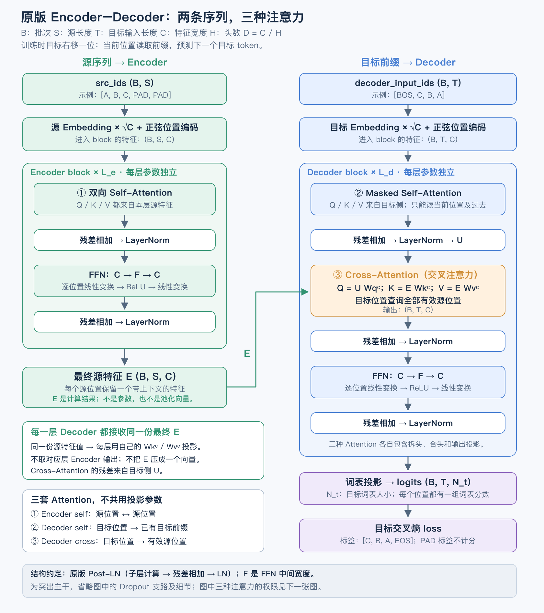

# 017：原版 Encoder–Decoder——教师完整导读版

主任务：输入 `A B C`，逐步生成 `C B A EOS`。代码已补齐，并配有逐步注释；阅读目标是能解释：
源序列怎样成为 `E`，每个 Decoder Block 怎样用自己的参数把 `E` 变成 K/V，
以及同一个目标前缀为什么能随源输入不同而产生不同预测。

这是正在学习的**原版 Encoder–Decoder**，对应源/目标角色、Cross Attention、
正弦位置编码和完整模型组合。最近讨论的 CED 是扩展：它处理同一条增长序列，
通过改变上层全局 KV 的来源节省部分 prefill 计算。本题采用固定源序列和独立
目标前缀，不把 CED 的后半段跳算机制混入原版结构。

[讲义与整体结构图](../../notes/original-encoder-decoder.md)



## 按这条路线读代码

先看 `MiniTransformer.forward` 的两行主干：`encode` 产生 E，`decode` 用目标前缀读取 E。
再读 **步骤 4 → 5**，看 Cross Attention 怎样嵌在 Decoder Block 内部；
随后读 **步骤 1 → 2 → 6 → 7 → 8**，把数据、位置、模型与生成完整串起来。
步骤 3 的源权限函数已讲过，可随 Cross Attention 一起回看。当前没有待填的 TODO。

| 步骤 | 文件 / 函数 | 注释解释的核心逻辑 |
|---|---|---|
| 3 | [model.py](model.py) `source_allowed` | 源有效性变成 Encoder / cross 的读取权限 |
| 4 | [model.py](model.py) `CrossAttention.forward` | 目标状态产生 Q，源特征产生 K/V；复用通用 MHA |
| 5 | [model.py](model.py) `DecoderBlock.forward` | 目标因果 self → cross → ReLU FFN，三条 Post-LN 残差 |
| 1 | [data.py](data.py) `make_teacher_forcing_batch` | 两侧独立补齐、目标右移，分别生成输入权限与 loss 范围 |
| 2 | [positions.py](positions.py) `sinusoidal_positions` | 用实际位置编号生成固定的 sin/cos 向量 |
| 6 | [model.py](model.py) `MiniTransformer.encode` | 源 embedding + PE，经过全部 Encoder 层，返回 E |
| 7 | [model.py](model.py) `MiniTransformer.decode` | 目标 embedding + PE，每层读取 E，再接目标词表头 |
| 8 | [generation.py](generation.py) `greedy_generate` | 源只编码一次，从 BOS 开始用自己的预测延长目标前缀 |

## 两份输入为什么都要传进 Decoder Block

统一符号：`B` 是 batch，`S` 是补齐后的源长度，`T` 是当前目标输入长度，
`C` 是特征宽度，`H` 是头数，`D=C/H`，`Nt` 是目标词表大小。

在某一层 `DecoderBlock.forward(x, memory, src_valid, tgt_input_valid)` 中：

- `x(B,T,C)` 是这一层目标输入，来自目标 embedding 或上一层 Decoder。
- `memory(B,S,C)` 就是最终 Encoder 输出 E。每一层 Decoder 都读取这份 E。
- `src_valid(B,S)`、`tgt_input_valid(B,T)` 分别决定两侧哪些位置能作为 key。
- 当前层先对 x 做目标因果 self-attention、残差与 norm1，得到 U。
- 当前层的 `cross_attn` 使用 U 产生 Q，使用 memory 产生 K/V；四份投影属于当前层。

因此，**产生 KV 的代码仍然可以在 Block 内部，提供 KV 输入特征的是源 Encoder**。
目标各层不共用投影参数，也不把自己的输出拿去替换 memory。
Cross Attention 的输出仍是 `(B,T,C)`，加回的是 U；源长度 S 不必等于 T。

| Attention 位置 | Q 的上游 | K/V 的上游 | `True=可读` 的权限 |
|---|---|---|---|
| Encoder self | 本层源输入 | 本层源输入 | 有效源 key，允许双向读取 |
| Decoder self | 本层目标输入 | 本层目标输入 | 有效目标 key，且 key 位置不晚于 query |
| Decoder cross | 本层 self 残差/LN 后的 U | 最终源特征 E | 全部有效源 key，没有目标侧三角限制 |

`source_allowed` 同时服务第一行和第三行，只是 query 长度分别为 S 和 T。
PAD query 行不要清空；它仍可读有效 key，避免整行无可读位置。PAD 标签由 loss mask 排除。
模型入口以显式 valid 为准：测试会在无效位置放其他合法 ID，不能在模型内重新按 ID 猜权限。

## 目标输入和标签怎么错开

ID 约定：`PAD=0、BOS=1、EOS=2`，内容 ID 从 3 开始。
源序列不添加 BOS/EOS。目标先组成完整记录，再补齐、错一位拆开：

| 样本 | 源序列 | 完整目标记录（补齐后） | 目标输入 | 监督标签 |
|---|---|---|---|---|
| 甲 | A B C | BOS C B A EOS | BOS C B A | C B A EOS |
| 乙 | D PAD PAD | BOS D EOS PAD PAD | BOS D EOS PAD | D EOS PAD PAD |

样本乙的目标输入有效性是 `[1,1,1,0]`，标签计分范围是 `[1,1,0,0]`。
输入 EOS 是真实 token，但它后面的 PAD 标签不计分。EOS 标签本身必须计分。
测试还会给一般的源/目标对，两侧内容长度未必相等；不要在 batch 函数里硬编码反转。

训练入口会提供真实的目标前缀，并通过因果权限并行训练每个位置；生成入口没有真实答案，
只从 BOS 开始，把上一步选出的 token 接回目标输入。真实答案只在生成结束后参与评分。

## 正弦位置的短说明

这里沿用你已理解的“内容向量加位置向量”，把可学习位置表换成按公式计算的固定向量。
位置每增加 1，一对 sin/cos 的角度增加 `frequency_i`；不同特征对采用不同频率，
使每个位置同时拥有变化快、变化慢的特征。`i` 是从 0 开始的特征对编号：

```text
frequency_i = 10000 ** (-2*i/C)
PE[p, 2*i]   = sin(p * frequency_i)
PE[p, 2*i+1] = cos(p * frequency_i)
```

例如 `C=4`，位置 p 的向量是 `[sin(p), cos(p), sin(0.01p), cos(0.01p)]`。
`positions=[3,4]` 就计算位置 3、4，不能当成第 0、1 行重置位置。奇数 C 的最后一维只留 sin。
可以使用 `torch.arange` 创建编号，用广播形成“位置 × 频率”，再调用 `torch.sin/cos`。

模型两侧都在输入处使用 `sqrt(C) * token_embedding + PE`，再过各自的输入 Dropout。
源侧位置是 `0..S-1`，目标侧独立从 `0..T-1` 开始；不是 RoPE，不在每个 Block 重复加 PE。
这里的 `sqrt(C)` 调节输入内容和位置的相对幅度，不是 Attention 内的 `/sqrt(D)`。
公式可以计算更长位置，不保证模型能可靠处理训练长度之外的序列。

## 实现范围与复用组件

复用 [ex007 通用 MHA](../ex007_multi_head_attention/attention.py)、
[ex008 基础组件](../ex008_transformer_block/block.py) 和
[ex005 masked CE](../ex005_training_loop/loss.py)。通用 MHA 接收已经投影的 Q/K/V，
返回 `(output, weights)`，output 已乘 Wo。因果 self wrapper 不能代替 cross。

数据整理、位置编码、三处 Attention、两种 Block、整模型与生成循环均已实现。
[训练与评估入口](../../examples/original_transformer_demo.py) 可以直接运行；无需重写 Adam 或旧组件。
实现使用基础 Tensor 运算及上述已验收组件，没有调用 `nn.Transformer`、
`nn.MultiheadAttention`、融合 Attention 或测试参照来代做模型计算。
这是教师导读材料；可以看代码与测试对照，不把阅读或教师实现通过测试当作独立编程证据。

默认训练配置：CPU float32，`C=32、H=4、FFN=64`，Encoder/Decoder 各 2 层。
局部对照用 CPU float64；函数应保留 dtype，支持契约列出的非连续 Tensor。
浮点输入与参数同 dtype；保持前向梯度、参数身份、已有梯度和输入不变。
完整异常约定见各函数 docstring，不要求额外做通用校验框架。

与原论文的边界：采用 Post-LN、ReLU、正弦位置、输入 sqrt(C)、三处 Attention；
两侧 embedding 与词表头使用独立参数，Attention 投影省略偏置，采用 Adam、普通 CE、
贪心生成，不复现原训练配方。保留输入及残差分支输出 Dropout；未加入其他内部 Dropout，
首次训练设 p=0。没有 BERT 的 embedding LN、MLM、pool，也不额外加 final LN。

`greedy_generate` 先支持一个请求（`B=1`），返回不含 BOS、包含生成 EOS 的 ID 列表。
为了看清流程，每步重算目标前缀；固定 E 只编码一次。这里先不新增 self/cross KV 缓存接口。
函数负责 eval/no_grad，并在正常返回时恢复调用前的统一 train/eval 模式。

## 分步运行

在仓库根目录运行。先验证源权限与 Cross Attention（步骤 3、4）：

```bash
.venv/bin/python -B -m unittest tests.exercises.test_encoder_decoder_model.SourceAllowedTest tests.exercises.test_encoder_decoder_model.CrossAttentionTest -v
```

验证一层 Decoder 的三个子层（步骤 5）：

```bash
.venv/bin/python -B -m unittest tests.exercises.test_encoder_decoder_model.DecoderBlockTest -v
```

验证数据与位置（步骤 1、2）：

```bash
.venv/bin/python -B -m unittest tests.exercises.test_encoder_decoder_data -v
```

验证完整模型（步骤 6、7），再验证生成（步骤 8）：

```bash
.venv/bin/python -B -m unittest tests.exercises.test_encoder_decoder_model.MiniTransformerTest -v
.venv/bin/python -B -m unittest tests.exercises.test_encoder_decoder_generation -v
```

完整练习测试和 CPU 反转实验：

```bash
.venv/bin/python -B -m unittest tests.exercises.test_encoder_decoder_data tests.exercises.test_encoder_decoder_model tests.exercises.test_encoder_decoder_generation -v
.venv/bin/python -B -m examples.original_transformer_demo --steps 600
```

训练入口的 `--help` 列出可调参数；`--steps 0` 只评估初始化模型，不执行参数更新。
可用 `--task copy` 排查基础接线，主任务仍是 reverse。`--seed`、`--lr`、`--train-size`、
`--valid-size` 和 `--batch-size` 可调整；不要求 GPU，不自动写检查点或学习进度。

测试直接调用仓库中的实际实现；期望三组行为测试全部通过、没有跳过。
这些检查验证代码行为，不自动改变学习者的掌握状态。

## 阅读与运行时关注什么

1. 三组测试通过：源/目标长度不同时数值正确；cross 没有误用因果限制；源 PAD 和目标未来
   不影响不该受影响的输出；目标 loss 的梯度能回到源 Encoder。
2. 能在代码中指出每层 Q/K/V 的具体输入和参数归属，说明 E 为何是本次源输入的激活，
   以及为什么目标生成不把新 token 追加进源序列。
3. 跑反转实验，查看训练/验证 teacher-forced token 准确率，以及只给源输入时的验证集
   整句生成准确率（含 EOS）。数据按完整源序列去重后切分，无重叠。训练 loss 下降不是最终证据；
   生成未达标时保留结果，继续定位，不把增加训练步数当作接线正确的证明。
4. 后续若要练习独立排错，可以自行选择一种接线错误，设计一个能把它抓出来的检查；
   这是可选延伸，不要求为了阅读本导读版再独立重写一遍模型。

本练习覆盖 `architecture.sequence-roles`、`attention.source-types`、
`text-input.sinusoidal-position`、`architecture.encoder-decoder`、
`implementation.original-transformer`。教师补全代码不自动改变这些节点的掌握状态。
