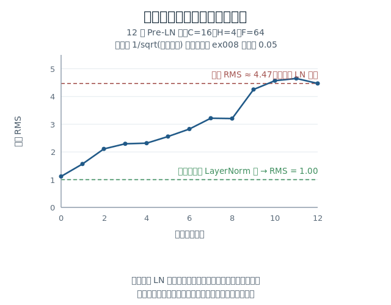

# 从 Block 到 mini-GPT：把上下文表示变成下一 token 的预测

你的 `TransformerBlock` 已经通过验收：给它 `(B,T,C)` 的特征和 `input_valid`，
它返回同形的 `(B,T,C)`。它的文档字符串里写着一句话，正是这一课的起点：

> 本层不加 embedding、位置编码或词表投影。

所以现在的状况是：有一个能反复堆叠的加工单元，但**没有模型**。
输入端还没接上文字，输出端还不是 token 预测，中间也还没决定堆几层、层之间要不要补什么。
这一课把这三头接起来。

本页数值均在仓库环境（PyTorch 2.14.0、CPU float64）实跑核对，并直接调用你的
`exercises/ex008_transformer_block/block.py`。教师核对不代表你的实现已通过新的验收。

## 1. 堆两层就能跑，那还缺什么？

先确认最容易被误解的一点：堆叠本身不需要新机制。

```python
Y1 = blk1(X, input_valid)      # (1,4,8)
Y2 = blk2(Y1, input_valid)     # (1,4,8)
```

实跑通过。因为块的输入输出同形，第二个块可以把 `Y1` 当作自己的 `X`。
两个块用各自独立的参数，不共享。

但把 `Y2` 拿去预测 token 就不行了：

```text
Y2 的最后一维 = 8       这是 C，特征数
要预测 token 需要的最后一维 = N，词表大小
```

`Y2[0,t,:]` 是位置 t 读过上下文、加工过的特征向量。
它不是「下一个 token 是谁」的答案，也不是概率 —— 你在 ex005 里已经区分过表示与 logits。
缺的是一次 `C → N` 的投影。

于是这一课要决定的是三件具体的事：

| 位置 | 要决定什么 |
|---|---|
| 输入端 | 文字 → ID → 向量，位置信息怎么加进去 |
| 堆栈两端 | 堆几层，层与层之间/最后需不需要补东西 |
| 输出端 | `C → N` 的投影用什么参数，训练时怎样一次得到多个监督信号 |

## 2. 输出端：这个投影矩阵可以不是新参数

最直接的做法是新建一个 `W_vocab`，shape `(C,N)`，这就是 ex005 用过的形式：

```text
logits = h @ W_vocab        (B,T,C) @ (C,N) -> (B,T,N)
```

但你已经有一张 `(N,C)` 的表：输入端的 embedding 表 `E`，第 n 行 `E[n]` 是 token n 的向量。
把它转置就能当投影用：

```text
logits = h @ E.t()          (B,T,C) @ (C,N) -> (B,T,N)
```

两种写法 shape 相同，实跑数值不同（因为是两组不同的参数）。差别在于：

| | 额外参数量 | 每个 logit 的含义 |
|---|---:|---|
| 独立 `W_vocab` | `C*N`，示例 C=16、N=50 时为 800 | `h` 与 W_vocab 第 n 列的点积 |
| 复用 `E.t()` | 0 | `h` 与 **token n 的输入向量** `E[n]` 的点积 |

复用 `E` 叫**权重共享（weight tying）**。它把「输出 token n 的倾向」定义成
`logit[n] = h · E[n]` —— 当前表示与那个 token 输入向量的匹配程度。
这不只是省参数：它让同一个向量同时承担「读进来时代表什么」和「输出时如何被识别」两个角色。

代价也在这里：两个角色被强制绑定，训练时的梯度会同时从这两条路径汇到 `E` 的同一行。
本课的 mini-GPT 采用共享，因为词表小、参数省得明显；
但这是一个**结构选择**，不是「共享一定更好」。原版 Transformer 共享，
也有模型不共享；这一点在实现时应当作为可配置项声明清楚，而不是当成定律。

## 3. 训练时一次前向能拿到多少监督信号？

这一步你在 ex005 已经做过，这里只确认它在有上下文的模型里同样成立。

给定完整序列，错位一格构造输入与目标：

```text
完整序列  [1, 5, 9, 4, 2]
输入      [1, 5, 9, 4]      去掉最后一个
目标      [5, 9, 4, 2]      去掉第一个
```

一次前向得到 `logits` 为 `(1,4,20)` —— **4 个位置各自有一个预测目标**。
位置 t 的输入是 `输入[t]`，要预测 `目标[t]`。

实跑这个玩具例子（词表 N=20、单个块、已含位置编码、参数为随机初始值），
交叉熵为 `3.014379`，而 `ln(20) = 2.995732` 是完全随机的水平。
未训练的模型接近随机，符合预期；这个数字只说明起点正常，不代表任何学习能力。

关键在于**为什么可以并行**：位置 0 的预测不能看见位置 1 的输入，否则就是抄答案。
保证这一点的正是块内的因果 mask。用你的块实跑验证：

```text
只改变位置 4 的输入后，各位置输出的最大变化：
  位置 0: 0.000e+00
  位置 1: 0.000e+00
  位置 2: 0.000e+00
  位置 3: 0.000e+00
  位置 4: 9.246e+00   ← 被改动的位置
```

位置 0–3 的变化严格为 0。所以一次前向算 T 个位置的损失，与「逐个位置分别算」在数学上一致，
只是把 T 次计算合并了。这是训练能高效的原因，也是 `learning-mechanics.next-token` 里
你已经解释过的「并行训练不泄漏答案」在完整模型上的体现。

同一性质还有一个更强的形式，实跑确认：

```text
只喂前 3 个 token 时，位置 2 的 logits
与喂 4 个 token 时的位置 2 的 logits ——  完全相同
追加一个 token 后，已有位置的 logits 最大变化 = 1.39e-17
```

「追加内容不改变已有位置的输出」是后面 KV Cache 能成立的前提。
本课只验证这个性质，不实现缓存。

## 4. 位置信息：一个不报错但会改变预测的错误

输入端要把 ID 变向量，再加上位置。你已实现过：

```text
token_vectors    = E[input_ids]      (B,T,C)
position_vectors = P[:T]             (T,C)   沿 batch 广播
X                = 两者相加           (B,T,C)
```

放进完整模型后，这里出现一个新的出错机会。生成时序列在增长，
`P` 的切片必须与当前这批 token 的**真实位置**对齐。看两种都能运行的写法：

```text
前缀 [3,7,2]，正确取 P[0:3]  → 最后位置 logits[:4] = [-0.0097, 0.01521, 0.04071, -0.00417]
同一前缀，误取 P[1:4]        → 最后位置 logits[:4] = [-0.02344, 0.06629, 0.05883, 0.01778]

贪心预测的 token： 2   vs   1
```

shape 相同、不报错、loss 也算得出来，但**预测的 token 变了**。
这类错误在训练时可能被掩盖（如果训练也一致地偏移，模型会去适应那个偏移），
到生成时位置对不上就暴露出来。

所以完整输入管线要明确的不只是「相加」，还有：

- `P` 的行数 L 是这张表支持的最大位置数；`T > L` 时切片会出错，需要显式检查。
- 生成时若一次只送入新 token，位置偏移必须由调用方正确传入，而不是默认从 0 开始。
- `input_valid` 和 `target_valid` 不能互换 —— 前者管哪些位置可作为 key 被读取，
  后者管哪些预测计入损失。这是你在 ex005 已经区分过的。

## 5. 堆栈末尾：Pre-LN 少了一次归一化

现在把块堆起来。这里有一个纯结构性的问题，值得实测。

回看你的块：`U = X + drop1(A)`，`Y = U + drop2(D)`。
两个 LayerNorm 都在**支路入口**，直接残差路不经过它们。
所以每一层都在往表示上**累加**东西，而块的输出本身从未被归一化。

堆 12 层，用 `1/sqrt(输入宽度)` 量级的权重初始化（不是 ex008 里固定的 0.05），
实测每层输出的均方根：

```text
输入      1.118
第 1 层   1.567
第 4 层   2.317
第 8 层   3.204
第 12 层  4.471
```



尺度单调上升，第 12 层约为第 1 层的 2.85 倍。
这是**单次随机初始化下的观察**，不同配置、不同初始化的倍率会不同，
也不是说尺度大就一定训练失败。可编辑图源：[preln-scale-growth.svg](assets/block-to-gpt/preln-scale-growth.svg)。

问题在于紧接着要做的事：`logits = h @ E.t()`。
如果 `h` 的尺度随层数漂移，那么 logits 的尺度也跟着漂移，
而 logits 的尺度直接决定 Softmax 的尖锐程度 —— 你在块讲义第 3 节已经见过这个机制：
分数放大会让读取从混合塌成几乎独占。这里换成了词表分布，道理相同。

实测在堆栈末尾补一个 LayerNorm：

```text
末层输出 RMS = 4.471，逐 token 均值绝对值最大 = 1.3946
补一个 final LayerNorm 后 RMS = 1.000，逐 token 均值 = 6.94e-17
```

所以 Pre-LN 堆栈通常在最后一个块之后、词表投影之前，再放一个 LayerNorm，
习惯叫 **final LayerNorm**（`ln_f`）。它有自己的 `gamma/beta`，不与任何块共享。

这解释了一个容易被当成「惯例」的细节：Post-LN 的每个子层输出都过了 LN，
末尾不缺这一次；Pre-LN 缺，所以要补。两种排列的差别不止于「LN 放前面还是后面」，
还包括**堆栈末端的状态**。

## 6. 现在把模型接出来

到这里三头都定了。完整数据流：

```text
input_ids                    (B,T)          整数 token ID
  ↓ E[input_ids]                            E: (N,C)
  ↓ + P[:T]                                 P: (L,C)，沿 batch 广播
X                            (B,T,C)
  ↓ blk_0(X, input_valid)
  ↓ blk_1(...)                              各层参数独立
  ↓ ...  共 n_layer 层
H                            (B,T,C)
  ↓ ln_f(H)                                 final LayerNorm
Hn                           (B,T,C)
  ↓ @ E.t()                                 权重共享；或独立 W_vocab
logits                       (B,T,N)
```

对象清单，都在第一次使用前给出：

| 对象 | 来源 | shape |
|---|---|---|
| N、C、L、n_layer | 词表大小、特征宽度、位置表行数、层数；都是整数 | 非 Tensor |
| input_ids | 输入 token 编号 | (B,T) |
| input_valid | 该位置是否为真实 token，True=有效；不是 target_valid | (B,T) |
| E | 内容表，兼作输出投影 | (N,C) |
| P | 位置表 | (L,C) |
| H | 最后一个块的输出 | (B,T,C) |
| logits | 每个位置对下一 token 的原始分数 | (B,T,N) |

两种使用方式共用这一条前向，区别只在外层：

**训练**：错位构造输入与目标 → 一次前向得到 `(B,T,N)` → 在 `target_valid` 为真的位置算交叉熵 → 反向 → 更新。

**生成**：固定参数，取 `logits[:, -1, :]` 选出下一个 ID → 追加到前缀 → 再次前向。
生成时要切到推理态并关闭求导（`model.eval()` 与 `torch.no_grad()` 各管一件事，
见[模块组织讲义](dropout-and-module-organization.md)第 4 节）。

这条链上除 `ln_f` 和堆叠方式外，没有你没实现过的数学。
真正的新内容是**参数怎么组织**：`E`、`P`、n_layer 个块、`ln_f` 都要被同一个
`nn.Module` 容器登记，才能统一更新和保存。`nn.ModuleList` 用来持有一串子模块 ——
把块放进普通 Python list 赋给属性，它们**不会**被登记，这正是你在模块组织讲义
第 3 节见过的那类静默故障，只是换成了列表形式。

## 7. 三个理解检查

题面自包含，不依赖上文临时命名。可以看完后一起回答，或在后续实现中用等价测试核验。

### 检查 A：末尾那次归一化去掉会怎样

某模型为 12 层 Pre-LN 堆栈，每块内部两个 LayerNorm 都在支路入口，
残差为 `U = X + 支路(LN(X))`。输出层为 `logits = H @ E.t()`，其中 H 是第 12 块的输出。
现在**删掉** `ln_f`，其余不变，参数与输入都固定。

logits 的整体尺度会受什么影响？这如何改变 Softmax 后的词表概率分布形态？
块内已有 24 个 LayerNorm，为什么它们不能替代末尾这一次？
只需从「哪个量没有被归一化」说明，不必推导反向公式。

### 检查 B：一个位置对不上的生成 bug

某生成循环每步把已生成的完整前缀重新送入模型，位置向量固定取 `P[0:T]`，
其中 T 是当前前缀长度。这一步是正确的。

但另一份实现为了省算力，每步只把**新的那一个 token** 送入模型，
位置仍取 `P[0:1]`。两份实现都不报错，也都能生成出序列。

第二份的位置信息错在哪？第 5 个生成步骤时，那个 token 实际应当使用 `P` 的哪一行？
如果不修位置、只在别处打补丁，模型会把什么当成「第 0 个位置」？

### 检查 C：ModuleList 与普通 list

某模型这样持有 4 个块（`TransformerBlock` 是 `nn.Module` 子类）：

```python
self.blocks = [TransformerBlock(C, H, F) for _ in range(4)]
```

前向里依次调用它们，能算出正确的 logits，训练时 loss 也会下降。

`model.parameters()` 会包含这 4 个块的参数吗？
`torch.save(model.state_dict(), ...)` 保存的内容里有它们吗？
loss 下降是否足以说明这 4 个块正在被训练？最小修改是什么？

## 工程边界与后续衔接

- 本文是新准备的讲义。新内容是：输出投影的权重共享选择、完整输入管线在模型中的
  位置对齐要求、Pre-LN 堆栈末尾的 final LayerNorm，以及把这些接成一条前向。
  错位标签、因果 mask、`no_grad`/`eval` 区分、参数注册都已学过，本文只在新语境中复用。
- 本文覆盖 `text-input.complete-pipeline`、`architecture.decoder`、
  `architecture.decoder-only` 与 `modern.pre-post-ln` 的讲解部分。
  按 map 的验收标准，`modern.pre-post-ln` 还要求**在相同子层上实际切换两种排列**，
  `architecture.decoder-only` 要求给出各模块接口并与 mini-GPT 同一份实现验收 ——
  这些留给后续练习，本文不代做。
- 仓库中**尚不存在** mini-GPT 的实现代码。本文第 6 节的数据流是可理解的组合方案，
  不冒充已完成工程。第 1、3 节的堆叠与因果验证是直接调用你的 ex008 实跑得到的。
- 尚未展开：Adam/AdamW 及其状态、梯度裁剪、参数初始化策略、验证集划分与
  记忆/泛化对照、`systems.cost-model` 的参数与激活账本。按 roadmap 属于 G3 后续。
- 第 5 节的尺度增长是单次随机初始化下的观察，用于解释 final LayerNorm 要处理什么，
  不构成「多少层一定会出问题」的结论，也未做训练收益对比。
- 读过本文不构成任何节点的掌握证据；掌握需要独立解释、实现、测试或排错的可观察表现。
  实际状态以 `learning/progress.json` 为准。本次不修改知识地图依赖，
  不切换 `currentNodeId`，不新增已掌握记录。
