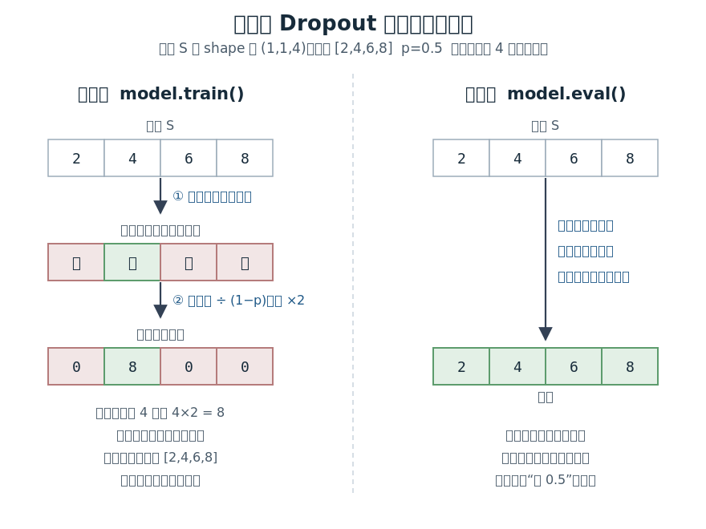
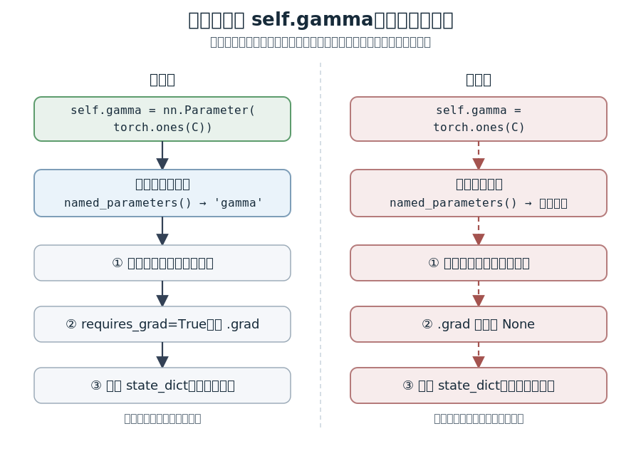

# Dropout 与模块组织：随机失活、参数注册与两种开关

前置：Pre-LN 主干的残差、LayerNorm 与 FFN 已在[块讲义](transformer-block.md)讲过，
完整多头 Attention 的原理与实现均已验收。本节补齐 `block.complete` 还缺的最后一块
（Dropout），以及把这些散装函数变成可训练、可保存模型所需的组织机制。

这是一份可直接学习的讲义，不是已经通过的能力记录。
以下 Dropout、`nn.Module`/`nn.Parameter` 参数注册、`train()`/`eval()` 与 `no_grad()`
的区分都是新内容；残差、LayerNorm、FFN、MHA、手写 SGD 和 `no_grad` 的已有理解直接复用。

讲义中所有数值、输出和「会/不会报错」的断言，均已在本仓库 CPU 环境
（torch 2.14.0+cpu）实跑核对，不是推算。

## 1. 为什么块里还要放一个「随机丢弃」

到目前为止，你的每个计算都是确定的：同一份输入和参数，前向必然给出同一个结果。
Dropout 打破这一点，而且只在训练时打破。

先说它想解决的问题。你已经在 `ex005` 观察过：训练损失可以降到 0.0034，
但那是「每个 token 都有确定后继」的玩具数据。当模型参数很多而数据有限时，
模型可以把训练集的特定组合背下来，而不是学到可推广的规律。
这种「训练集损失很低、没见过的数据上表现差」的现象叫**过拟合**。

Dropout 是应对过拟合的一种手段：训练时随机让一部分中间数值变成 0，
使模型不能依赖某几个固定分量总是存在。
它不是唯一手段，也不保证在所有任务上都提升效果 —— 本课只要求你准确掌握它的计算和两阶段行为。

### 精确定义

**Dropout** 有一个超参数 p，表示丢弃概率，取值在 `[0,1)` 常用区间（PyTorch 允许 `p=1`）。
p 是人为设定的配置，不是训练参数，没有梯度。

固定一个输入张量 S，Dropout 在**训练态**这样计算：

```text
对 S 的每一个元素位置，独立采样一个伯努利随机变量：
  以概率 p     丢弃 → 该位置输出 0
  以概率 1-p   保留 → 该位置输出 S[...] / (1-p)
```

关键在保留位置**要除以 (1-p)**。这一步叫**倒置 Dropout（inverted dropout）**。
在**推理态**，Dropout 什么都不做：

```text
输出 = 输入          逐元素完全相等，不采样、不置零、也不缩放
```



图中固定 S 的 shape 为 (1,1,4)、值为 `[2,4,6,8]`、p=0.5，只画这 4 个特征分量。
左右两侧输入完全相同，唯一区别是模块处于哪个模式。
被丢位置显示为 0；保留的 4 显示为 8，因为 `4 / (1-0.5) = 8`。
可编辑图源：[dropout-two-modes.svg](assets/dropout-module/dropout-two-modes.svg)。

### 那个 1/(1-p) 到底在补什么

这是本节最容易含糊的一点，用实测数字说清。

仍取 `S = [2,4,6,8]`、p=0.5。训练态每次采样不同，所以单次输出没有意义，
要看**多次的平均**。实跑 200000 次求平均：

```text
原始 S            : [2, 4, 6, 8]
倒置 Dropout 均值 : [2.0016, 4.0068, 6.0058, 8.0222]   ← 回到原值
只丢弃、不缩放的均值: [1.0034, 2.0012, 3.0086, 3.9989]   ← 系统性减半
```

所以 `1/(1-p)` 补的是**被丢弃造成的期望损失**：
每个位置有 `1-p` 的概率贡献 `S/(1-p)`，有 p 的概率贡献 0，因此期望恰好是 S。

这件事为什么重要：推理态是恒等映射，输出期望就是 S。
如果训练态的期望是 `S` 的一半，那么训练时后续层看到的数值尺度
和推理时看到的尺度差一倍，模型在两个阶段面对的输入分布不一致。
倒置缩放让两个阶段的**期望**对齐，代价是训练时每次的实际值有波动。

必须区分清楚三句话：

| 说法 | 是否成立 |
|---|---|
| 训练态输出的**期望**等于输入 | 成立，上面 200000 次平均已验证 |
| 训练态**每一次**输出等于输入 | 不成立，单次是 `[0,8,0,0]` 这样的稀疏结果 |
| 推理态输出等于输入 | 成立，且是逐元素严格相等 |

第二行是常见误解。期望相等不代表任何一次前向的数值相等，
也不代表方差不变 —— 训练态引入了额外的波动，这正是它起作用的方式。

### 两个边界

实跑确认：

```text
p=0.0 训练态输出: [1.0, 2.0, 3.0, 4.0]     全部保留，除以 1，等于恒等
p=1.0 训练态输出: [0.0, 0.0, 0.0, 0.0]     全部丢弃
```

`p=0` 时训练态也退化成恒等映射，但这是「p 取了 0」而不是「切到了推理态」，
两件事的原因不同，不要混说。`p=1` 在 PyTorch 中合法且输出全零；
本课的块不使用这个配置，它只用来构造后面的验证例子。

## 2. Dropout 放在块里的哪个位置

位置错了会破坏你已经建立的残差性质，这是有实际后果的选择。

在 Pre-LN 主干里，Dropout 作用在**支路的输出上**，然后才与残差相加：

```text
正确：  U = X + Dropout(A)
错误：  U = Dropout(X + A)
```

用 `p=1.0` 让支路必然全丢，就能看出区别（实跑，X 为全 1、A 为全 9）：

```text
正确写法 U = X + Dropout(A) = [1, 1, 1, 1]    支路贡献归零，退回 X，X 的信息完整保留
错误写法 U = Dropout(X + A) = [0, 0, 0, 0]    整个块的输出被清零，X 也没了
```

这与你已经掌握的残差语义一致：残差的作用是提供一条**直接路径**，
让子层只需学习「在已有表示上加什么」。
把 Dropout 套在相加结果外面，等于连那条直接路径一起丢弃，
残差就不再保证「支路无贡献时退回输入」。

所以本课的块结构是：

```text
N1 = LN1(X)
A  = MHA(N1, ...)
U  = X + Dropout(A)          ← Dropout 在支路上

N2 = LN2(U)
D  = FFN(N2)
Y  = U + Dropout(D)          ← 同理
```

两条支路各有自己的 Dropout 模块。它们可以共用同一个 p 配置，
但作为模块实例是两个对象；这一点在下一节讲参数注册时会再用到。

原版 Transformer 还在其他位置（如注意力权重上、输入表示相加后）放 Dropout。
本课主干只在两条支路输出上放，这是一个明确的简化配置，
不是「Dropout 只能放这一处」，也不是某个 GPT 版本的完整复刻。

## 3. 从散装函数到模块：参数注册

到目前为止你的所有参数都是手动管理的：`ex005` 里把 `E`、`W` 作为函数外部的变量传进去，
自己写 `E.grad = None`，自己在 `no_grad()` 里更新。

一个完整模型有多少参数？光是一个块就有
`Wq/Wk/Wv/Wo` 四个投影、`LN1/LN2` 各一组 `gamma/beta`、FFN 的 `W1/b1/W2/b2`，
共 12 个张量。堆叠 6 层就是 72 个，再加上 `E`、`P` 和词表投影。
手动维护这样一份名单，每加一层就要改四处代码，很快就会出错。

`nn.Module` 解决的就是这件事。它是 PyTorch 提供的容器基类，
职责是**自动收集**属于这个模型的可训练张量，并递归地包含所有子模块的张量。

### nn.Parameter 决定「算不算这个模型的参数」

规则很简单：赋值给模块属性的张量，只有用 `nn.Parameter` 包装过的，
才会被登记进模块的参数名册。

```python
import torch
import torch.nn as nn

class Bad(nn.Module):
    def __init__(self, C):
        super().__init__()
        self.gamma = torch.ones(C)              # 普通 Tensor，不会被登记
        self.beta  = nn.Parameter(torch.zeros(C))

class Good(nn.Module):
    def __init__(self, C):
        super().__init__()
        self.gamma = nn.Parameter(torch.ones(C))
        self.beta  = nn.Parameter(torch.zeros(C))
```

`super().__init__()` 是调用父类 `nn.Module` 的初始化，
它会建立那份内部名册；忘记这一行会直接报错，不是静默问题。

实跑两个类，名册内容如下：

```text
Bad :  named_parameters() = ['beta']            个数 1
       state_dict keys    = ['beta']
Good:  named_parameters() = ['gamma', 'beta']   个数 2
       state_dict keys    = ['gamma', 'beta']
```



图中两侧都能算出正确的前向结果，差别只在是否登记进名册。
虚线表示这条路径实际上断开了。
可编辑图源：[parameter-registration.svg](assets/dropout-module/parameter-registration.svg)。

### 未注册会带来三个静默故障

这里的每一条都用 `Bad` 类实跑验证过。「静默」是关键 —— 前向计算完全正常，不报错。

**① 优化器拿不到它，永不更新。**
`torch.optim.SGD(model.parameters(), lr=0.1)` 接收的正是名册里的张量：

```text
优化器管理的张量元素数: 4          （只有 beta 的 4 个）
gamma 是否在其中: False
```

模型会训练，损失会下降，但 `gamma` 从头到尾是初始值。

**② 它没有梯度。**
`nn.Parameter` 默认 `requires_grad=True`；普通 `torch.ones(C)` 默认是 `False`：

```text
gamma.requires_grad = False
backward() 之后 gamma.grad = None      而 beta.grad 存在
```

注意这条和上一条是**两个独立的原因**。即使你手动设 `gamma.requires_grad_(True)`
让它有了梯度，它仍然不在 `model.parameters()` 里，优化器依然不会更新它。
反过来，注册解决了两件事。

**③ 保存和恢复会静默丢失它。**
`state_dict()` 返回模型的参数字典，用于保存到磁盘和之后恢复。实跑一次完整的存取：

```text
训练中 gamma 被改成 3，beta 被改成 0.5
保存下来的键: ['beta']                       ← gamma 根本没进去

新建模型后 load_state_dict(sd, strict=True)：
  返回 <All keys matched successfully>       ← 没有任何报错
  恢复后 beta  = [0.5, 0.5, 0.5, 0.5]        正确
  恢复后 gamma = [1.0, 1.0, 1.0, 1.0]        回到初始 1，不是 3
```

即使用了 `strict=True`，也不会报错：从 `state_dict` 的角度看，
所有键都匹配上了，它不知道你还有一个张量没登记。
这是最危险的一条 —— 训练日志看起来正常，模型存下来、加载回来，行为却变了。

### 模块树是递归的

`nn.Module` 的收集是递归的：把子模块赋值给属性，父模块自动包含它的全部参数。
实跑一个两层结构：

```python
class Block(nn.Module):
    def __init__(self, C=4):
        super().__init__()
        self.Wq = nn.Parameter(torch.randn(C, C))
        self.drop1 = nn.Dropout(0.5)
        self.drop2 = nn.Dropout(0.1)

class Model(nn.Module):
    def __init__(self):
        super().__init__()
        self.b0 = Block()
        self.b1 = Block()
```

```text
named_parameters(): ['b0.Wq', 'b1.Wq']
state_dict keys   : ['b0.Wq', 'b1.Wq']
```

名字自动带上了路径前缀 `b0.` / `b1.`，两个块的参数互不混淆。
这正是你堆叠多层时需要的：不必手写参数清单，容器按属性结构生成。

`nn.Dropout` 本身没有可训练参数，所以名册里没有它 ——
但它仍然是模块树的一部分，下一节的模式切换靠的就是这层结构。

## 4. train() / eval() 与 no_grad()：两个正交的开关

`ex005` 的作业说明里写过「`nn.Module` 与 `eval()` 尚未引入，
不能把 eval 当成 no_grad 的别名」。现在把这句话讲清。

这两个开关控制的是完全不同的事：

| 开关 | 控制什么 | 影响 Dropout 吗 | 影响梯度记录吗 |
|---|---|---|---|
| `model.train()` / `model.eval()` | 模块处于训练态还是推理态 | 是 | 否 |
| `with torch.no_grad():` | 这段计算是否记录到求导图 | 否 | 是 |

实跑验证它们互不代替：

```text
train() 态 + no_grad()   : 有随机丢弃 = True    requires_grad = False
eval()  态 + 求导开启     : 有随机丢弃 = False   requires_grad = True
```

第一行说明：`no_grad()` 关掉了梯度，但**没有**关掉随机性 ——
如果你在生成时只写了 `no_grad()` 而忘了 `eval()`，Dropout 照样在随机丢弃，
每次生成结果都不同。这是一个真实且难查的 bug。

第二行说明：`eval()` 关掉了随机性，但**没有**关掉梯度。
所以在验证集上算损失时，若只写 `eval()` 不写 `no_grad()`，
计算图仍会被构建，白白占用内存（虽然结果数值是对的）。

正确的推理写法是**两个都要**：

```python
model.eval()
with torch.no_grad():
    logits = model(input_ids, input_valid)
```

### 模式切换递归作用于整棵树

沿用上一节的 `Model`（含 4 个 Dropout，分布在两个 Block 里）：

```text
构造后默认 training = True          nn.Module 默认处于训练态

m.eval()  之后:  {b0.drop1: False, b0.drop2: False, b1.drop1: False, b1.drop2: False}
m.train() 之后:  {b0.drop1: True,  b0.drop2: True,  b1.drop1: True,  b1.drop2: True}
```

一次调用递归设置所有子模块，不需要逐个 Dropout 手动切换。
也可以只切一个子模块：

```text
m.train() 后再 m.b0.drop1.eval():
  {b0.drop1: False, b0.drop2: True, b1.drop1: True, b1.drop2: True}
```

这说明 `training` 是**每个模块自己的一个布尔状态**，
`train()`/`eval()` 只是批量设置它的便捷方法。默认是训练态这一点值得记住：
新建模型后如果不显式调用 `eval()`，它就在训练态。

### 一个可直接观察的后果

同一份输入、同一组参数，训练态下重复前向，损失会变：

```text
train() 态同一输入 5 次 loss: [10.0, 10.0, 8.0, 8.0, 12.0]
eval()  态同一输入 5 次 loss: [8.0,  8.0,  8.0, 8.0, 8.0]
```

训练态的抖动来自每次不同的丢弃采样，不是参数变了（这几次前向之间没有做任何更新）。
以后调试时看到「同一 batch 两次前向 loss 不同」，
第一个要排查的就是模块处于哪个模式，而不是怀疑数据或参数出了问题。

这也给你一条实用的验证手段：**要做确定性对比时先切 `eval()`**。
后续 KV Cache 关卡要求「逐位置比较全量与增量 logits」，
前提就是关闭随机失活 —— 否则两次前向本来就不同，对齐无从谈起。

## 5. 三个理解检查

这三题随讲义准备好，尚未作答。可以看完整节后一起回答，
或在后续的块实现作业中用等价测试验收。题目条件自包含，不依赖上面某段的临时命名。

### 检查 A：残差路上的 Dropout 位置

已知 X 是 CPU float32 张量，shape (1,1,4)，值为 `[1,1,1,1]`，该位置有效。
A 是某条支路算出的张量，shape 同为 (1,1,4)，值为 `[9,9,9,9]`。
`drop` 是一个 `nn.Dropout(p=1.0)` 模块，处于**训练态**，因此对所有输入必然全部丢弃。

两种写法都能运行：

```text
写法甲：U = X + drop(A)
写法乙：U = drop(X + A)
```

分别给出 U 的具体数值。哪一种保留了本课要求的残差语义？
请用「支路无贡献时块应该退回什么」来说明，不需要推导 Dropout 的反向公式。

### 检查 B：一个不报错的参数注册错误

已知下面这个模块，C=4，它要实现你已经学过的 LayerNorm 的缩放平移部分：

```python
class MyNorm(nn.Module):
    def __init__(self, C):
        super().__init__()
        self.gamma = torch.ones(C)
        self.beta  = nn.Parameter(torch.zeros(C))
```

用它组成模型并正常训练若干步，训练损失确实下降了，过程中没有任何报错。

请回答三问：训练结束时 `gamma` 的数值是否可能已被优化器更新？
`torch.save(model.state_dict(), ...)` 保存再用 `strict=True` 加载到一个新建的
`MyNorm` 上，`gamma` 会得到什么值，`load_state_dict` 会不会报错？
最小修改是什么？

### 检查 C：只关了一个开关

某段生成代码这样写（`model` 刚构造完，之后没有调用过 `train()` 或 `eval()`）：

```python
with torch.no_grad():
    for _ in range(max_new_tokens):
        logits = model(prefix, prefix_valid)
        next_id = logits[:, -1, :].argmax(dim=-1, keepdim=True)
        prefix = torch.cat([prefix, next_id], dim=1)
```

模型内部含有 `p=0.1` 的 Dropout 模块。
用同一个前缀连续调用这段代码两次，两次生成的 token 序列是否一定相同？
`no_grad()` 是否已经足够保证确定性？如果不够，缺的是哪一步，为什么这两个开关不能互相代替？

## 工程边界与后续衔接

- 本文是**新准备的讲义**，覆盖 Dropout 的两阶段计算、块内位置、
  `nn.Module`/`nn.Parameter` 参数注册与 `train()`/`eval()` 对 `no_grad()` 的区分。
  已有的残差、LayerNorm、FFN、MHA、链式法则和手写 SGD 直接复用，不在此重考。
- 讲义中的全部数值、输出与报错行为均在本仓库 CPU 环境实跑核对；
  期望还原一项用 200000 次采样平均验证。这不代表学习者已获得任何掌握证据。
- 仓库中**尚不存在**完整 Transformer 块的实现代码。本文给出的块结构
  （含 Dropout 位置）是可理解的组合方案，不冒充已完成的工程。
- 尚未展开的内容：`torch.optim` 的更复杂优化器（Adam/AdamW）及其状态、
  梯度裁剪、参数初始化策略、完整模型的训练与验证集划分。
  这些按 roadmap 属于 G3 的后续部分，本文只把 `parameters()` 与优化器的接口关系讲到够用。
- 读过本文不构成 `block.dropout`、`block.complete` 或
  `implementation.transformer-block` 的掌握证据。
  按项目约定，掌握需要独立解释、实现、测试或排错的可观察表现；
  实际状态以 `learning/progress.json` 为准。
- 本次只准备材料：不修改知识地图依赖，不切换 `currentNodeId`，不新增已掌握记录。
