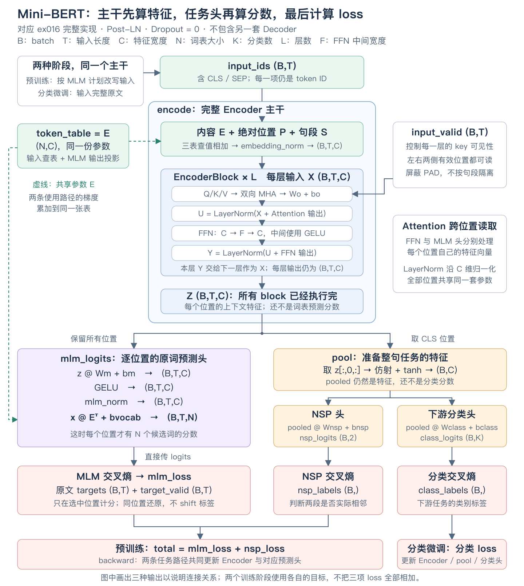
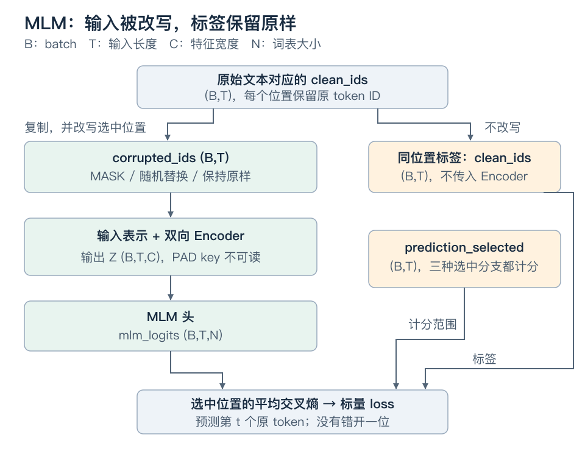

# 从生成到读取完整输入：Encoder 与 BERT

你已经会写一个根据前缀预测后续 token 的模型。这一课保留 Attention、FFN、残差和归一化这些积木，改变一件更根本的事：**这次任务在预测时，究竟已经拿到了哪些信息？**

沿着这个问题，我们会得到双向 Encoder；再解决“让它从没有人工标签的文本中学什么”，得到 BERT 的遮盖预测；最后把同一个主干接到分类任务。这是同一套系统的三步推进，不是三个独立模型的目录介绍。

## 整体架构：输入 → Encoder → 任务头 → loss

先用这张图定位整套模型，再往下看局部机制。它对应本仓库的 Mini-BERT 实现：Post-LN、双向 MHA、GELU，Dropout 固定为 0。B 是 batch，T 是输入长度，C 是特征宽度，N 是词表大小，K 是下游类别数，L 是 Encoder 层数，F 是 FFN 中间宽度。



[打开可放大的 SVG 原图](assets/encoder-and-bert/bert-architecture.svg) · [按函数阅读完整代码导读](../exercises/ex016_mini_bert/WALKTHROUGH.md)

从上往下看图，抓住三个连接点：

1. **蓝色 `encode` 主干已经完成全部 Attention 和 FFN。** 输出 `Z(B,T,C)` 是每个位置的上下文特征，和 Decoder 跑完所有 block 得到的隐藏表示处在相对应的阶段；此时还没有每个候选词的分数。
2. **紫色 `mlm_logits` 把特征变成词表分数。** 仿射、GELU、LayerNorm 都保持 C 维，最后用共享内容表投影到 N 维，得到 `(B,T,N)`。MLM loss 使用这些 logits、原文同位置标签与选中位置；不先做 argmax 或手动 softmax。预测头对各位置分别运算，跨位置的信息已由主干的 Attention 带入。
3. **橙色 `pool` 取 CLS 并变换，输出仍是 `(B,C)` 特征。** 后续 NSP 头或分类头才产生类别分数，再分别计算交叉熵。预训练用 MLM + NSP；分类微调输入完整原文，只使用分类 loss。

图中虚线表示输入查表和 MLM 输出投影共享同一份内容表参数，不是再运行一次 Encoder。三个任务头共用主干，但不会在所有训练阶段都把三项 loss 相加。

## 1. 输入已经完整，为什么还要禁止读取右侧？

考虑一个工单系统，用户把完整句子提交后，我们才判断状态。为避免混入分词细节，下面每个空格分开的项暂定为一个 token：

```text
样本甲：[CLS] 缓存 命中率 恢复 [SEP]    状态标签：正常
样本乙：[CLS] 缓存 命中率 下降 [SEP]    状态标签：异常
```

`[CLS]` 和 `[SEP]` 是词表中的特殊 ID：前者放在开头，稍后用其输出表示承接整句分类；后者标记文本段结束。它们各有自己的可学习 embedding，不是 Python 语法，也不是人为算好的句子摘要。

先看你熟悉的因果模型。在两条输入的“缓存”位置，token、位置以及左侧内容完全相同。固定参数、关闭 Dropout 后，这个位置在每层都读不到“恢复/下降”，所以两条输入在这里的最终表示相同。

问题不在矩阵乘法不够强，而在**读取路径被规则禁止了**。对完整文本的逐位置理解，这会丢掉已经拿到的线索。如果允许“缓存”位置也读取右侧，表示就有机会随“恢复/下降”改变。

注意两个限定：

- 允许读取不保证训练后的模型一定有效利用它；也不保证任意参数下两个表示必然不同。
- GPT 不是不能分类。它的末尾位置已经读过整个前缀，可以接分类头。区别是：双向结构让**每一个位置**都能结合两侧，而不只让末尾位置拥有完整上下文。

此前生成时，右侧内容尚不存在，所以不能偷看；现在输入文本已经提交，读取右侧本身并不是泄漏。是否泄漏，要看它是不是任务不允许提供的答案，而不是看位置编号大不大。

## 2. Encoder 改的是信息路径，不是发明另一种 Attention

先只看主干，不接任何预测头。输入 `X` 来自内容和位置表示，shape 为 `(B,T,C)`：B 是样本数，T 是补齐后的长度，C 是每个位置的特征宽度。

同一层内，Q、K、V 仍然由同一份 X 分别投影得到；这仍叫 **self-attention（自注意力）**。self 说明它们的数据来源，并不说明有没有因果限制。

设 H 为头数、Dh 为每头宽度，沿用 `C=H*Dh`：

| 计算对象 | shape | 此处是否改变 |
|---|---|---|
| Q/K/V 投影 | `(B,T,C)` | 不因“双向”而改变投影数学 |
| 拆头后的 Q/K/V | `(B,H,T,Dh)` | 不变 |
| 分数与权重 | `(B,H,T,T)` | shape 不变，允许非零的范围变了 |
| 合头并经过 Wo 的更新量 | `(B,T,C)` | 不变 |

`input_valid[b,j]` 表示第 b 条输入的第 j 个位置是真实输入、可以作为 key 被读取，shape 为 `(B,T)`。`allowed[b,i,j]` 则表示第 i 个 query 能不能读取第 j 个 key，shape 为 `(B,T,T)`。

```text
因果读取：allowed[b,i,j] = input_valid[b,j] AND (j <= i)
双向读取：allowed[b,i,j] = input_valid[b,j]
```

固定一个样本，假设 token 为 `[a,b,c,PAD]`，下表的行是 query、列是 key。1 表示允许、0 表示禁止；所有 head 共用这份权限。

| query | 因果：读 a / b / c / PAD | 双向：读 a / b / c / PAD |
|---|---|---|
| a | 1 / 0 / 0 / 0 | 1 / 1 / 1 / 0 |
| b | 1 / 1 / 0 / 0 | 1 / 1 / 1 / 0 |
| c | 1 / 1 / 1 / 0 | 1 / 1 / 1 / 0 |
| PAD | 1 / 1 / 1 / 0 | 1 / 1 / 1 / 0 |

因此双向不是“删除所有 mask”。PAD key 仍然不能被读取。这里沿用旧作业约定：不清空 PAD query 的整行，其输出之后不用于有效标签；否则会制造全是负无穷的 Softmax 行。每条输入至少有一个有效 key，例如 `[CLS]`。

### 让差异真的发生一次

为只观察权限，不混入模型学习效果，取一个 head，令 Q/K 全零，V 等于 X，Wo 为单位矩阵。这时每行在可读位置上均匀分配权重。只看 Attention 的读取结果，不加残差、LN 或 FFN：

```text
X[0,:,:] = [[1,0], [0,1], [2,0], [99,99]]
第四个位置是 PAD。

第 0 个 query：
因果读取 = [1,0]
双向读取 = ([1,0] + [0,1] + [2,0]) / 3 = [1, 1/3]

只把右侧第 2 个位置从 [2,0] 改成 [5,0]：
因果读取仍为 [1,0]
双向读取变成 [2, 1/3]
```

不是换了一种 Attention 公式，而是同一个 query 新增了能够读取的信息。把 PAD 的 `[99,99]` 改成其他有限值，两种读取都不应受影响。

这组对照可以运行，后文提供入口。固定 Q/K 是教师设计的观测条件，不代表真实 Encoder 使用零投影。

### 从读取到 Encoder

将双向 MHA 放回熟悉的块中。下面选 Post-LN；`Drop` 是 Dropout，`LN1/LN2` 是各自独立的 LayerNorm，FFN 逐 token 工作：

```text
输入 X                                      (B,T,C)
U = LN1(X + Drop(MHA_bidirectional(X)))      (B,T,C)
Y = LN2(U + Drop(FFN(U)))                    (B,T,C)
```

堆叠 L 层后，最终输出记作 **Z，shape `(B,T,C)`**。`Z[b,t,:]` 是原来第 t 个输入位置经过上下文处理后的表示；不是词表概率，也不是另一个 token ID。

这样的堆栈就是这里的 **Transformer Encoder**：把输入序列编码成上下文表示。它不要求压成一个向量，也不是 Decoder 的数学逆运算。Encoder 可以采用其他归一化排列；此处选 Post-LN 是为了衔接原版 BERT，而不是“双向”强迫我们选 Post-LN。

当模型用这套 Encoder 主干，再接一个任务输出模块，而没有另一个逐步生成目标序列的主干时，我们称它为 **Encoder-only**。“only”不表示没有输出层、loss 或训练。

## 3. 有了双向表示，还缺一个能教它学习的任务

只有结构不会自动学会“恢复”和“下降”的含义。我们需要告诉模型哪些输出值得奖励。

如果沿用 GPT 的目标：在位置 t 预测原输入的 t+1，而同时允许读取右侧，正确答案就已经在可见输入里。模型可能学会读取答案，而不是我们想要的预测能力。

另一种看似省事的办法是：在原位置预测原 token。但输入不变时，原 token 已经沿 embedding 和残差进入该位置，又容易退化为抄写。

所以我们改变数据：**把一部分原 token 换掉，让模型在原位置还原它。**

```text
原始文本： [CLS] 缓存 命中率 恢复   [SEP]
模型输入： [CLS] 缓存 [MASK] 恢复   [SEP]
监督位置：              ↑
该位置标签：           命中率
```

`[MASK]` 也是有自己 embedding 的特殊 ID，意思是“这里的内容需要还原”。它不是把 Attention 权重设为零的操作。

模型可以用左侧“缓存”和右侧“恢复”推断缺失内容，但从输入的这个位置直接查到的只是 `[MASK]` 的向量。真实标签“命中率”单独交给 loss，不传进 Encoder。

这就是 **MLM，Masked Language Modeling，遮盖语言建模**。它在同位置还原，不把标签错开一位。训练目标直接从原文本构造，通常叫自监督：不需要人逐条标注“这个空应该是什么”。

原版 BERT 用双向 Encoder 配合 MLM 等目标做预训练，再面向具体任务微调。[BERT 论文 §3](https://aclanthology.org/N19-1423.pdf)

### 三种容易混淆的“mask”，现在分别服务什么？

| 对象 | 数据意义 | `[MASK]` 所在真实位置是什么值？ |
|---|---|---|
| `input_valid (B,T)` | 是否是可读取的真实输入位置 | True；它不是 PAD |
| `allowed (B,T,T)` | query i 能否读取 key j | 双向时仍允许读取 `[MASK]` 位置 |
| `prediction_selected (B,T)` | 原位置的还原标签是否参与 MLM loss | 被选为预测目标时是 True |

为什么 `[MASK]` 位置仍可作为 key？它保留了位置和“内容缺失”的标记；经过前层之后，该位置还可能携带别处读来的上下文。我们删除的是原内容，不是删除整个序列位置。

从输入构造到 loss，完整关系如下。图中 `clean_ids` 是未改写的原 token ID，`corrupted_ids` 是替换后的输入，两者 shape 都是 `(B,T)`。



如果只是不让位置 t 读取自己的 key，却保留原 token，也不能实现遮盖：残差路径仍保留它，其他位置也可能读到它并在后层传回来。改变 Attention 权限，不能替代构造受损输入。

## 4. 为什么“选来预测”不等于“替换成 MASK”？

刚才为了说明动机，把选中的 token 全部换成 `[MASK]`。这能建立一个清楚的训练任务，但会产生新的差异：预训练时常见 `[MASK]`，实际分类输入却是正常文本。

原版 BERT 因此把两步分开：先选预测位置，再决定如何改写这些位置。约 15% 的 token 被选来预测；在选中的位置中，80% 换成 `[MASK]`，10% 随机换一个词表 token，10% 保持原样。特殊边界 token 和 PAD 不作为普通遮盖候选。具体采样数量会有整数取整和上限，不是每个短句精确选中 15%。[原始数据构造实现](https://github.com/google-research/bert/blob/master/create_pretraining_data.py)

下面故意用一个小型、人工指定的选择结果来同时展示三种分支，**不是在模拟 15% 的随机比例**：

| 位置 | 原 token | 是否选中预测 | 改写策略 | 模型看到 | loss 的标签 |
|---|---|---|---|---|---|
| 0 | `[CLS]` | 否 | 不改 | `[CLS]` | 不计入 |
| 1 | 缓存 | 是 | MASK | `[MASK]` | 缓存 |
| 2 | 命中率 | 是 | 随机替换 | 磁盘 | 命中率 |
| 3 | 恢复 | 是 | 保持原样 | 恢复 | 恢复 |
| 4 | `[SEP]` | 否 | 不改 | `[SEP]` | 不计入 |
| 5 | `[PAD]` | 否 | 不改 | `[PAD]` | 不计入 |

三类被选中的位置都计入 loss，标签永远是原 token。因此：

```text
prediction_selected 不能通过 corrupted_ids == MASK_ID 重建。
```

“保持原样”的一部分位置确实提供了可复制的答案，这是配方有意保留的条件，不应声称每个受监督位置都严格看不到原 token。但是，复制输入无法解决其他被 MASK 或随机替换的位置，所以不能靠复制完成整个目标。

随机替换也不保证抽到的 ID 一定不同于原 ID。模型没有收到“哪些普通词被换错了”的额外标记，需要结合上下文处理。80/10/10 是具体训练选择，不是由 Attention 数学推导出的唯一比例，也不保证任意任务都最优。

### 损失直接复用你已经写过的数学

先把“预测头”定义清楚：它是接在主干输出之后、把表示转成某个任务分数的模块；与 Attention 的多头不是同一个概念。

设词表大小为 N，MLM 预测头将 `Z(B,T,C)` 转成 `mlm_logits(B,T,N)`。为说明目标，我们先假设这个头是一个共享线性映射；BERT 的具体头在后面补齐。

```python
# 三个输入的定义：
# mlm_logits:         (B,T,N)，受损输入经过 Encoder 和 MLM 头得到
# clean_ids:          (B,T)，原始 ID，没有错位
# prediction_selected:(B,T)，bool，三类选中位置都为 True
loss = masked_cross_entropy(
    mlm_logits, clean_ids, prediction_selected
)
```

这就是 ex005 的已有函数。有效位置逐项计算稳定交叉熵，再按选中位置总数平均，不按整个 B*T 平均，也不先按每句话平均。

有两个重要的接口后果：

- 旧函数先对所有 targets 做 `gather`，之后才筛选。因此所有 ID 都必须合法，包括不监督的位置；不能直接塞其他框架常用的 `-100` 忽略标签。保留完整 `clean_ids` 最简单。
- 全 batch 没有任何选中位置时，旧函数会拒绝计算。数据构造应保证至少一个候选被选中，或由训练调用方明确跳过这个 batch。

只监督选中的位置，不等于其他位置完全没有梯度：它们的 **logits** 不直接计入这项 loss，但它们在 Encoder 内的表示可以被选中位置读取，因此仍可能通过上下文路径收到梯度。

## 5. 两段文本如何进入同一个 Encoder？

工单里还可能要判断两段文字的关系，例如“现象描述”和“处理记录”是否匹配。我们暂时把这两段叫 A、B，区别于 batch 大小 B 的符号；下面用 `segment_ids` 明确表示句段编号，避免混淆。

```text
token：      [CLS] 缓存 命中率 下降 [SEP] 扩容 后 恢复 [SEP]
segment_id：    0    0    0    0     0    1   1   1     1
position_id：   0    1    2    3     4    5   6   7     8
```

两段被拼成**同一条输入序列**；position 不在第二段重新从零开始。`[SEP]` 告诉模型边界在哪里，句段编号告诉每一个位置属于哪一侧。

BERT 使用三个可学习表：内容表 `E(N,C)`、位置表 `P(Tmax,C)`、句段表 `S(2,C)`。`Tmax` 是模型支持的位置表长度，不是当前输入 T。它们共同构造每个位置的初始表示：

```text
X0[b,t,:] = E[input_ids[b,t],:]
          + P[t,:]
          + S[segment_ids[b,t],:]
X = Dropout(LayerNorm(X0))                     (B,T,C)
```

这里 LayerNorm 仍然只沿 C 轴，随后 X 才进入第一层。单段输入全部使用句段 0。

句段 embedding 是一个可学习的身份提示，不是 Attention 权限。段 0 和段 1 的有效位置可以互相读取。这仍是 self-attention，因为本层 Q/K/V 都来自同一份拼接后的 X。它不是“一个 Encoder 加一个 Decoder”，也不是两条序列之间的 cross-attention。

原版 BERT 使用 WordPiece，把文本拆成词或子词片段后映射为 ID；本课示例使用人工小词表，先验证结构与目标，不把词表示例冒充真实分词器。[BERT 输入约定与模型实现](https://github.com/google-research/bert/blob/master/modeling.py)

## 6. 同一个 Z，为什么能同时做填空和整句判断？

MLM 在每个被选中的位置取表示，所以它监督“局部位置该还原什么”。但如果要判断整句话或两段话之间的关系，需要一个固定位置承接这项输出。

这就是先前放入 `[CLS]` 的用途。它位于位置 0，但 Encoder 没有因果限制，因此它每层都可以读取所有有效位置。经过 L 层，取：

```text
c = Z[:,0,:]                                  (B,C)
```

Python 切片中，第一个 `:` 保留全部 batch，`0` 选定位置轴的第 0 项并去掉该轴，最后一个 `:` 保留全部特征。因此这里是 `(B,C)`，不是 `(B,1,C)`。

`c` 并非天然优质的句向量。相关训练损失必须通过它反向更新主干，才会促使这个位置聚合任务需要的内容。选择 `[CLS]` 是一种组织方式，并不证明平均池化等其他方式不能用。

### 原版 BERT 怎样为整句位置提供预训练信号？

原版还有 **NSP，Next Sentence Prediction，下一句预测**：给两段文本，判断第二段是否真的是第一段在语料中的后续片段，而不是生成第二段的 token。

正例取实际相邻片段；负例取随机配对片段，原配方大约各一半。例如“缓存命中率下降 / 扩容后恢复”可以是语料中的相邻正例，但标签必须来自数据构造关系，不能只靠“看起来有因果关系”来定义。

NSP 是二分类；MLM 是每个选中位置上的 N 类分类。它们共用一个 Encoder，在预训练阶段将两项平均损失相加。NSP 鼓励句对相关的学习，但不保证模型学会真正的逻辑推理，也不是所有 Encoder 模型都必须有的目标。[BERT 论文 §3.1](https://aclanthology.org/N19-1423.pdf)

原始实现先把 c 做一层 pooler 变换，再接二分类：

```text
pooler：p = tanh(c @ Wpool + bpool)             (B,C)
NSP：   nsp_logits = p @ Wnsp + bnsp            (B,2)
```

`Wpool(C,C)`、`bpool(C,)`、`Wnsp(C,2)`、`bnsp(2,)` 都是参数。pooler 是这里“将固定位置的表示整理成整句任务表示”的模块名，不是把所有 token 做平均。`tanh` 是逐元素平滑非线性，值在 -1 到 1 之间；公式为 `(exp(x)-exp(-x))/(exp(x)+exp(-x))`，实现使用数值更稳妥的 `torch.tanh`，不要按指数式手算大数。[pooler 原始实现](https://github.com/google-research/bert/blob/master/modeling.py)

### 怎么接回最初的工单分类？

预训练之后，保留学到的内容表、位置/句段表和 Encoder 参数；不重新随机初始化它们。换上一个工单分类头，用带“正常/异常”标签的完整文本继续训练，这叫 **微调（fine-tuning）**。

设类别数为 K，采用 pooler 时：

```text
完整、未做 MLM 改写的工单 → 同一个 Encoder → p(B,C)
class_logits = Dropout(p) @ Wclass + bclass     (B,K)
class_labels                                  (B,)
```

分类 loss 回传到分类头和 Encoder，通常一起更新；如果人为冻结 Encoder、只训练头，则是另一种训练选择。普通分类时不需要插入 `[MASK]`，也不需要跑 MLM 头。

三个阶段要连着理解：

| 阶段 | 模型看到什么 | 监督信号来自哪里 | 输出服务什么 |
|---|---|---|---|
| MLM/NSP 预训练 | 被改写的文本对 | 原 token、片段是否相邻 | 学习可迁移的表示 |
| 工单分类微调 | 完整工单文本 | 人工或业务产生的类别标签 | 适配这个分类任务 |
| 工单分类推理 | 新的完整工单 | 没有标签，不更新参数 | 返回类别分数/预测 |

小型合成数据实验能验证这些连接，不足以证明预训练一定提高业务泛化；要证明收益，需要固定数据划分和条件，与从随机初始化训练的基线比较。

## 7. 从双向块到 BERT：还要明确哪些结构选择？

到这里已经知道“为什么要双向”和“拿什么训练”，再补 BERT 的组件选择才不会变成背配置。

本课对照原版 BERT 的结构；缩小宽度/层数不改变这些数据职责：

| 部件 | 本课 BERT 结构约定 | 不要直接沿用的旧配置 |
|---|---|---|
| 输入 | 内容 + 可学习绝对位置 + 句段；embedding LN/Dropout | LLaMA 的仅内容输入 + RoPE |
| 每层注意力 | 双向 MHA，屏蔽 PAD key；原版投影带偏置 | 因果 wrapper 或默认 GQA |
| 每层排列 | 两个 Post-LN 子层 | 以为双向等于 Pre/Post 某一种 |
| FFN | 两层带偏置线性映射，中间 GELU | 旧 ReLU FFN 或 SwiGLU |
| 主干输出 | `(B,T,C)`，分别交给任务头 | 直接复用 MiniGPT 的 `(B,T,N)` 返回值 |
| MLM 头 | 变换后在词表上分类，输出权重与内容表共享 | 旧独立线性词表头 |
| 预训练任务 | MLM + NSP | 把普通句对分类直接叫 NSP |

原版还在注意力权重等位置使用 Dropout；本课的固定数值对照全部关闭随机失活，旧 `multi_head_attention` 本身也没有权重 Dropout。复用其读取数学，不等于已经复制原版全部训练配置。

### GELU 在这里做什么？

你已知道 FFN 需要非线性。GELU 是另一种逐元素激活：不像 ReLU 在零处硬切掉全部负数，它通过随输入平滑变化的系数调节输入。它没有 SwiGLU 那条独立、带参数的 up 分支。

原始 BERT 代码采用如下近似。令 a 是 FFN 第一层输出，shape 为 `(B,T,F)`；F 是中间特征宽度。所有乘法和幂在这里都逐元素进行：

```python
gate = 0.5 * (1.0 + torch.tanh(
    math.sqrt(2.0 / math.pi) * (a + 0.044715 * a**3)
))
h = a * gate
```

`a**3` 是逐元素三次方，不是矩阵乘方；`math.pi` 是圆周率常数。随后用 `Wdown(F,C)` 把 h 投影回 `(B,T,C)`。门值来自 a 自身，没有额外的可学习门控矩阵。[GELU 的 BERT 实现](https://github.com/google-research/bert/blob/master/modeling.py)

### MLM 头为什么不是“再生成一个 token 的 Decoder”？

定义 `Wm(C,C)`、`bm(C,)`、`bvocab(N,)` 为头部参数，E 仍是内容 embedding 表 `(N,C)`。原始头部的计算结构是：

```text
R = LayerNorm(GELU(Z @ Wm + bm))              (B,T,C)
mlm_logits = R @ Eᵀ + bvocab                  (B,T,N)
```

前面的变换允许把主干表示适配到词表预测；这是一种结构选择，不是声称没有它就无法计算 loss。最后乘 `Eᵀ` 意味着同一张表既负责输入查表，也负责输出匹配，称为 **权重共享 / weight tying**。必须引用同一份参数，而不是初始化时复制出两个以后分别更新的表；反向时两条使用路径的梯度会累加到 E。

它只是一个逐位置的词表预测头，没有逐步生成的目标序列，也没有另一叠 Decoder Block。完整输出 `(B,T,N)` 便于复用现有 loss；原实现也可只抽取选中位置的表示后执行头部，避免给不计损失的位置做词表投影。[MLM/NSP 头与联合损失实现](https://github.com/google-research/bert/blob/master/run_pretraining.py)

如果实现阶段省略 NSP、简化词表、关闭 Dropout，或者省掉投影偏置，都应列清差异，称为 **BERT 风格教学模型**，不宣称原版完整复现或官方 checkpoint 兼容。理解 Encoder-only 不要求先复制 BERT-Base 的训练规模。

## 8. 为什么已有的生成缓存不能直接搬过来？

因果模型可以追加 KV，是因为追加右侧 token 不改变旧位置的各层表示。

双向 Encoder 则不同：向已有输入追加一个有效 token，相当于给旧位置开放了新 key。第一层旧位置的输出就可能改变；第二层从这些输出投影出的旧 K/V 也可能改变。于是“只算新 token，然后一直复用所有层的旧 K/V”通常不再与整段重算等价。

需要说准确：固定旧 token、绝对位置和参数时，第一层旧 K/V 仍可能直接来自未变的初始表示；不能笼统说每一层旧 K/V 都必变。但第一层旧 query 的读取结果已可能变化，**整个多层 Encoder 不满足原先的追加不变量**。

对一份完全不变的输入缓存最终编码结果，是另一种可行的复用。将来在 Encoder–Decoder 中复用固定源序列表示，也不等于给双向 Encoder 做 GPT 式增量追加。

BERT 的填空能力也不等于已经定义了 GPT 那种从左到右的生成分布：MLM 预测受损输入的原位置，GPT 预测已有前缀后的下一位置。可以设计额外流程让遮盖模型生成，但不能直接复用旧 greedy 循环就当成同一任务。

## 9. 对照仓库：复用数学，替换任务边界

| 已有实现 | 迁移到本课的用法 |
|---|---|
| `ex007/attention.py::multi_head_attention` | 复用；传入完整 `(B,T,T)` 双向权限，内部会补 head 轴 |
| 同文件 `multi_head_self_attention` | 不能直接用：内部始终调用 `make_causal_allowed` |
| `ex008` 的 LayerNorm / Dropout | 复用基础实现；FFN 的 ReLU 需要按新配置换成 GELU |
| `ex009::PostLNBlock` | 复用排列知识，不能原样复用类：其内部仍调用因果 wrapper |
| `ex005::masked_cross_entropy` | 原数学可用于 MLM，标签保持同位置，监督由 selected 给出 |
| `ex010::make_supervised_batch` | 不复用错位切片：它服务 next-token，而非 MLM |
| ex010 的训练、保存与恢复 | 模式/优化器/存档原则继续用；旧构造器和数据入口绑定 MiniGPT，需要适配 |

完整路径现在是：内容/位置/句段输入 → 双向 Post-LN 堆栈 → Z；Z 的选中位置供 MLM 头，Z 的首位置供整句头。已有模型和旧作业保持原样，不为新课把已验收的因果路径全局改成双向。

### 教师提供的最小对照

在仓库根目录运行：

```bash
.venv/bin/python -B -m examples.encoder_bert_probe
```

它复用你已经实现的 MHA 和 loss，只演示：右侧有效 token 与 PAD 扰动的不同作用；以及 `[MASK]`、随机替换、保持原样三类选中位置如何共同参与 loss 和 logits 梯度。

脚本不是 Mini-BERT 的答案，没有实现 Encoder 堆栈、MLM 头、NSP 或分类训练，也不会把演示通过记成你的新掌握证据。

## 10. 只保留两个有区分力的检查

不再考你会不会拆 head，也不让你重算 Softmax。读完后，可以先回答以下两项，再进入一份综合实现。

**检查 A：只看 loss 的接口是否会漏掉一个实现问题？**

已有未改写 ID `clean_ids(1,6)`，位置 1、2、3 被选中：位置 1 换 MASK，位置 2 随机替换，位置 3 保持原样；其余位置不监督。两个实现都调用相同的 `masked_cross_entropy(logits, clean_ids, selected)`，但甲的 Encoder 输入是 `corrupted_ids`，乙不小心传了 `clean_ids`。

测试只验证 loss 只读取 selected 的三个位置，并且能下降。它能排除乙吗？若不能，你会在数据构造或模型调用边界补什么检查？说明这个检查捕获的错误，不要求写测试代码。

**检查 B：模型级的“右侧能影响左侧”测试够不够？**

一个两层模型声称是双向 Encoder。实际第一层用了双向权限，第二层误用了因果权限。两层都保留残差；模型输出 `Z(B,T,C)`，取 `Z[:,0,:]` 作为 CLS 表示。固定参数、关闭 Dropout，测试只改右侧有效 token，观察到最终 CLS 表示确实变化，于是宣布“两层都已改成双向”。

为什么这个现象仍可能出现在有缺陷的模型中？请沿第一层到第二层的信息路径解释，并说出要补什么逐层检查，才能排除第二层的错误。无需推导 LN 或重新计算注意力权重。

---

本课合并覆盖 `architecture.encoder`、`architecture.encoder-only`，为 `implementation.bert` 的综合实现准备必要目标与接口。材料已准备、教师演示可运行，不代表这三个节点已经验收；原版 Encoder–Decoder 的跨序列 Attention 与 T5 留在后续分支。
