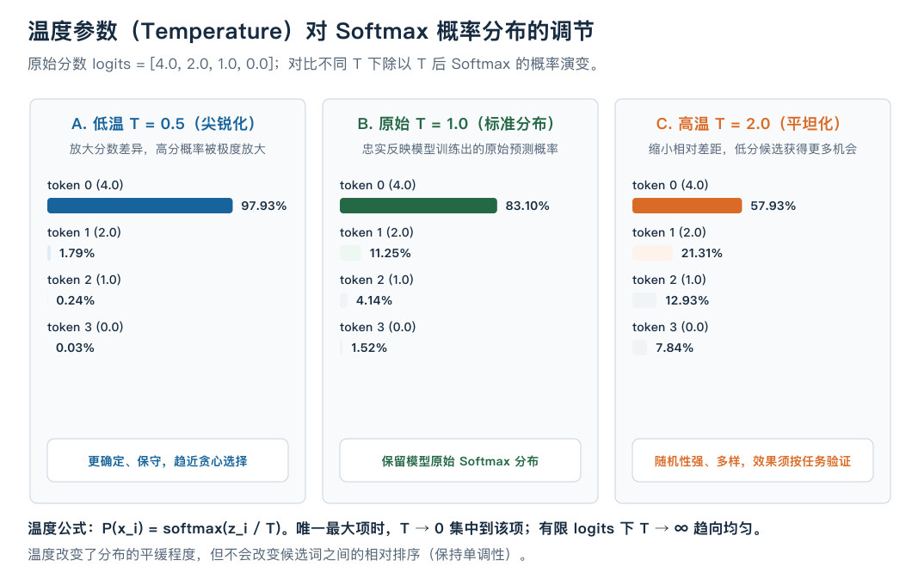
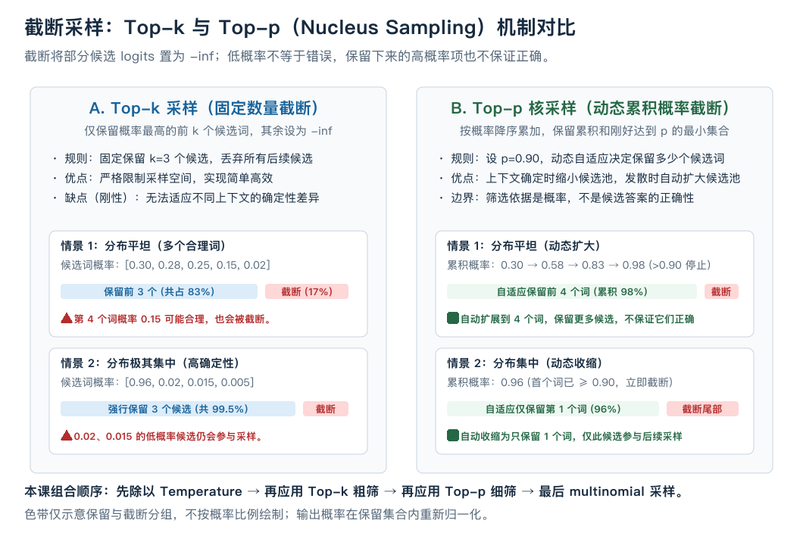

# 生成采样策略：贪心、温度、Top-k 与 Top-p（核采样）

在前面的自回归模型生成中（如 mini-GPT 的 `greedy_generate` 与 LLaMA 的增量解码），每次拿到模型输出的最后一个位置 logits 后，我们都做了一件最简单的事：

```python
next_token = logits[0, -1].argmax(dim=-1).item()
```

这种每次只挑最高分 token 的策略叫做**贪心解码（Greedy Search）**。

虽然贪心选择在局部是“最可能”的，但当模型用于长文本生成时，贪心解码可能重复使用高概率续写，降低输出多样性。是否出现重复还取决于模型、上下文和任务，并非必然。

自回归语言模型本质上输出的是下一个 token 的**条件概率分布 $P(x_t \mid x_{<t})$**。这一课我们将探讨：**如何从概率分布中选取下一个 token？怎样平衡文本的“确定性与质量”和“多样性与创造力”？**

---

## 1. 从贪心到采样：为什么概率最大的词不一定最好？

设当前词表大小 $N=5$，最后一个位置的未归一化 logits 为 $z = [4.0, 2.0, 1.0, 0.0, -1.0]$。

经过标准 Softmax 后，候选词的概率分布为：
$$P = \text{Softmax}(z) \approx [0.8263, 0.1118, 0.0411, 0.0151, 0.0056]$$

- **贪心策略（Greedy）**：对于这组固定 logits，token 0 会被选中。完整生成的确定性还要求固定模型、执行条件以及并列分数的处理规则。
- **纯随机采样（Random Sampling）**：把 $P$ 作为多项分布（Multinomial Distribution），按概率随机抽取一个 token。此时 token 0 约有 82.63% 的概率被选中，token 1 约有 11.18% 的概率被选中。

### 贪心的局限性：局部最优 vs 全局最优
贪心搜索只看当前单步的最优选择（短视），但最优的完整句子序列不一定是由每一步最高概率的词组成的（搜索树剪枝过早）。

纯随机采样也可能抽中不合适的低概率候选。但低概率不等于错误，高概率也不保证正确。只有在“每一步出现某类错误的条件概率都固定为 1%”这个假设下，500 步至少出现一次的概率才是 `1-(1-0.01)^500 ≈ 99.3%`；真实生成的分布会随前缀变化，不能直接套用这个数值。
因此，我们需要对概率分布进行**控制与截断**。

---

## 2. 温度调节（Temperature）：控制分布的平缓程度

在热力学中，温度越高，分子的随机热运动越剧烈。在生成中，我们引入超参数 **$T > 0$（Temperature，温度）**：

$$P(x_i) = \frac{\exp(z_i / T)}{\sum_j \exp(z_j / T)}$$



### 2.1 温度参数的作用机制

固定一组原始 logits $z = [4.0, 2.0, 1.0, 0.0]$：

| 温度设置 $T$ | 对 Logits 的缩放 | Softmax 后的概率分布 | 特点与适用场景 |
| :--- | :--- | :--- | :--- |
| **$T = 0.5$（低温）** | 除以 0.5 相当于乘以 2：$[8.0, 4.0, 2.0, 0.0]$ | $[97.93\%, 1.79\%, 0.24\%, 0.03\%]$ | 更集中于最高分候选，随机性降低；不因此保证答案正确。 |
| **$T = 1.0$（标准）** | 保持不变 | $[83.10\%, 11.25\%, 4.14\%, 1.52\%]$ | 保留模型原始 Softmax 分布；是否准确校准仍需要评估。 |
| **$T = 2.0$（高温）** | 除以 2：$[2.0, 1.0, 0.5, 0.0]$ | $[57.93\%, 21.31\%, 12.93\%, 7.84\%]$ | 分布变平，低分候选获得更多机会；不直接等于更有创造力。 |

### 2.2 两个极限行为
- **当 $T \to 0$ 时**：若存在唯一最大分数，概率趋于集中到它；若多个分数并列最大，极限在这些项之间均分，不能等同于某个固定 argmax 的并列选择规则。
- **当 $T \to \infty$ 时**：所有 $z_i / T \to 0$，$\exp(0) = 1$，概率分布退化为**均匀分布（Uniform Distribution）**，每个词被抽中的概率完全相等（这里假定所有候选 logits 有限）。

> **注意**：温度调节是单调变换，它改变了概率分布的熵（Entropy）和平缓度，但**绝不会改变候选词之间的相对大小排序**（若 $z_a > z_b$，则对任意 $T>0$，恒有 $z_a/T > z_b/T$）。

---

## 3. 截断采样：过滤不可靠的尾部噪声

即使调低了温度，整个词表（通常包含 32,000 到 100,000 个 token）的低概率“长尾”依然存在。可以对候选池进行**截断（Filtering）**，排除一部分低分候选。截断无法保证剩下的词正确，也可能排除合理的低概率词。



### 3.1 Top-k 采样（固定数量截断）
**规则**：只保留 logits 最大的前 $k$ 个候选 token，将其余所有 token 的 logits 强制设置为 $-\infty$（即概率清零），然后在剩下的 $k$ 个候选上重新做 Softmax。

```python
# Top-k 逻辑
topk_logits, topk_indices = torch.topk(logits, k)
# 将第 k 项之后的所有位置设为 -inf
```

#### Top-k 的致命短板（刚性限制）：
- **平坦分布时（发散场景）**：若有 5 个词都很合理（如“今天天气真[好/晴朗/热/冷/差]”），若设 $k=3$，后两个非常合理的词会被硬性截断。
- **尖锐分布时（高确定性场景）**：若只有 1 个词是唯一正确的（如“法国的首都是[巴黎]”，概率 98%），若设 $k=3$，尾部概率只有 0.5% 的离谱词会被强行拉入采样池，仍有概率被抽中。

---

### 3.2 Top-p 核采样（Nucleus Sampling，动态自适应截断）
针对 Top-k 的刚性问题，Holtzman 等人在 2019 年的论文中提出 **Top-p（核采样）**，按累计概率决定候选集合。[原论文](https://arxiv.org/abs/1904.09751)

**核心思想**：不固定候选词数量，而是**固定累积概率阈值 $p \in (0, 1]$**（例如 $p = 0.9$）。
1. 将所有 token 按 logits/概率从大到小降序排列。
2. 从头累加概率，直到累积概率刚好**大于等于 $p$** 时停止。
3. 仅保留这个最小的候选集合（称为 Nucleus，核心集），集合外的所有 token logits 置为 $-\infty$。
4. 在核心集上重新做 Softmax 并采样。

#### Top-p 的自适应优势：
- 当模型对当前预测**非常确定**时（概率集中），只需保留 1~2 个词累积概率就达到了 90%，候选池**自动收缩**，减少候选数量。
- 当模型处于**开放发散**的语境时（多个合理候选），需要保留 10~20 个词累积概率才达到 90%，候选池**自动扩大**，保留更多选择。

---

## 4. 把温度与截断组合起来

下面采用一种明确的组合顺序。不同系统的执行顺序可能不同，尤其 Top-p 依赖当时已经变换过的概率，交换顺序可能改变保留集合：

```text
原始 Logits (1, N)
       ↓
① 除以温度 Temperature (z / T)
       ↓
② Top-k 过滤 (保留前 k 个，其余设为 -inf)
       ↓
③ Top-p 核过滤 (按累积概率保留核集合，其余设为 -inf)
       ↓
④ Softmax 重新归一化 -> 得到最终采样概率分布 P
       ↓
⑤ torch.multinomial(P, 1) -> 抽样得出 next_token
```

### 完整自包含 PyTorch 实现

```python
import torch
import torch.nn.functional as F
import math

def sample_next_token(
    logits: torch.Tensor,
    temperature: float = 1.0,
    top_k: int = 0,
    top_p: float = 1.0,
) -> int:
    """根据温度、top-k 和 top-p 对单个位置的 logits (N,) 进行采样。

    参数：
        logits: (N,) 或 (1, N) 的 CPU/GPU float 张量
        temperature: 标量浮点数，必须 > 0。若为 0 建议由外层走 argmax
        top_k: 正整数，保留的最大候选词数；0 表示不启用
        top_p: 浮点数 (0, 1.0]，累积概率阈值；1.0 表示不启用
    """
    if logits.ndim not in (1, 2) or (logits.ndim == 2 and logits.shape[0] != 1):
        raise ValueError("只接收一个位置的 (N,) 或 (1,N) logits")
    if logits.numel() == 0 or not torch.isfinite(logits).all():
        raise ValueError("本例要求非空且有限的 logits")
    if not isinstance(top_k, int) or top_k < 0:
        raise ValueError("top_k 必须是非负整数")
    if not 0 < top_p <= 1:
        raise ValueError("top_p 必须在 (0,1] 内")
    logits = logits.clone().reshape(-1) # 展平成 (N,)

    # 1. 温度缩放
    if not math.isfinite(temperature) or temperature <= 0:
        raise ValueError("Temperature 必须大于 0；若要贪心选择请直接使用 argmax")
    if temperature != 1.0:
        logits = logits / temperature

    # 2. Top-k 截断
    if top_k > 0 and top_k < logits.shape[0]:
        # 按索引恰好保留 k 项；并列时 topk 选哪些索引由实现决定。
        values, indices = torch.topk(logits, top_k)
        logits = torch.full_like(logits, float("-inf")).scatter(0, indices, values)

    # 3. Top-p (Nucleus) 截断
    if top_p < 1.0:
        # 降序排序
        sorted_logits, sorted_indices = torch.sort(logits, descending=True)
        sorted_probs = F.softmax(sorted_logits, dim=-1)

        # 累积概率
        cumulative_probs = torch.cumsum(sorted_probs, dim=-1)

        # 若此前的累计概率已经达到 p，就不再需要当前项。
        # 达到阈值的那一项仍保留；与前文“最小集合”定义一致。
        sorted_indices_to_remove = torch.zeros_like(sorted_logits, dtype=torch.bool)
        sorted_indices_to_remove[1:] = cumulative_probs[:-1] >= top_p
        sorted_indices_to_remove[0] = False # 至少保留概率最高的第 1 个词

        # 将被移除位置对应的原始索引处填为 -inf
        indices_to_remove = sorted_indices[sorted_indices_to_remove]
        logits[indices_to_remove] = float("-inf")

    # 4. 在保留集合上重新归一化
    probs = F.softmax(logits, dim=-1)

    # 5. 多项分布采样
    next_token = torch.multinomial(probs, num_samples=1).item()
    return int(next_token)
```

---

## 5. 核心总结与策略速查表

| 采样策略 | 核心超参数 | 主要优势 | 主要风险 / 缺点 | 典型应用场景 |
| :--- | :--- | :--- | :--- | :--- |
| **贪心搜索 (Greedy)** | 无 ($T \to 0$) | 结果可复现，确定性高 | 容易陷入复读机、局部死循环 | 代码生成、数学推理、格式化 JSON |
| **纯温度调节** | $T \in (0.2, 0.8)$ | 调节整体风格与随机性 | 仍有极小概率抽中长尾离谱词 | 通用对话、问答 |
| **Top-k 采样** | $k \in [20, 50]$ | 严格控制词汇空间边界 | 无法自适应平坦与集中分布 | 传统文本生成 |
| **Top-p 核采样** | $p \in [0.8, 0.95]$ | 动态自适应确定性与发散性 | 计算需要额外排序开销 | 需要按分布动态调整候选数量的生成任务 |
| **Top-k + Top-p 组合** | $T=0.7, k=40, p=0.9$ | 同时限制候选数量与累计概率 | 需要调节的超参数较多 | 创意写作、头脑风暴、角色扮演 |

表中超参数只是可尝试的例子，不是通用最优值或任何模型的默认承诺。生成质量需要在目标任务上评估。
