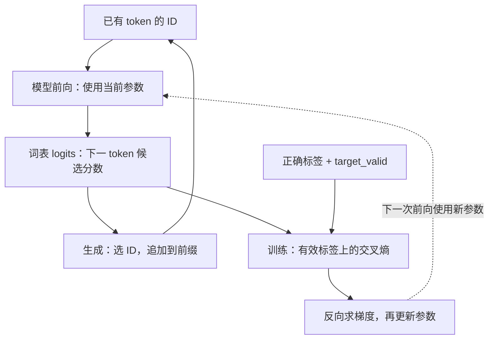

# 全局复习：从 token 到预测，从错误到上下文读取

这份讲义把已经学过的内容按一个模型的数据流重新组织，不按知识地图节点逐条复述。
它不是新作业，不替代实现验收，也不因完成一次复习而升级掌握状态。

## 先定位：我们已经造出了什么

- 输入积木：编号、补齐、内容查表、绝对位置相加。
- 训练积木：词表分数、稳定交叉熵、自动求导、手写 SGD、清梯度、梯度检查。
- 可运行基线：只根据当前 token 预测下一 token，训练后能迭代生成玩具序列。
- 上下文积木：完整的因果单头 Attention，已有前向、梯度和屏蔽性质测试。
- 正在连接的部分：多头的动机、拆合头与存储布局；完整多头尚未实现和验收。

真实代码边界必须保留：

| 代码 | 已实现的职责 | 不能据此声称完成 |
|---|---|---|
| `ex002`、`ex003` | 补齐、有效标记、内容和位置表示 | 完整文字到模型的全部工程管线 |
| `ex004` | 稳定的末轴 Softmax | 完整 Attention |
| `ex005` | `E[input_ids] @ W` 的训练、排错、贪心生成 | 位置表示或上下文 Attention 已接入此基线 |
| `ex006` | `X` 到单头读取表示及权重 | 词表预测、语言训练、残差或完整 Transformer |

后文将组件接起来的部分是**现在可以理解的组合草图**，不是已完成的端到端模型。

## 一、总问题只有一个：根据已有内容预测下一 token

一次前向计算，是用本次输入和当前参数算出预测。训练在前向之外增加：
用正确标签评判预测、计算梯度、更新参数。生成则固定参数，将预测出的 ID 追加到输入。



图中训练与生成是两种使用方式，不是每次预测后都同时更新参数和生成文本。
这里的“模型”是一个有参数的计算过程，不必先是一整个 Transformer。

统一符号：

| 符号 | 含义 |
|---|---|
| `B` | 本批序列数 |
| `T` | 输入中的位置数，包含补齐位置 |
| `N` | 词表大小 |
| `C` | 每个位置的输入特征数 |
| `Dk` | 一个 Q/K 向量的分量数，是整数 |
| `Dv` | 一个 V 向量的分量数，是整数 |
| `H`、`Dh` | 头数、当前等宽多头设计的每头维度 |

轴的长度相同，不代表轴的意义相同。词表候选、序列位置和特征是不同对象。

## 二、输入管线：把预测任务变成明确的数据接口

### 编号与表示不是同一层东西

token 是切分后的文本单位；ID 是它在词表中的固定编号，不是语义大小。
内容表 `E: (N,C)` 的一行提供该 token 的可学习向量。

```text
input_ids:          (B,T)
E:                  (N,C)
E[input_ids]:       (B,T,C)
```

ID 是查表索引，不能把 ID 数值大小当成语义距离。重新编号时要同步相关映射；
输入查表要重排 E 的行，完整预测任务还要一致地重排标签和词表输出列。

### 用同一行数据区分输入与答案

假设这一批补齐后的长度是 5，示例这一行最后一格是 PAD：

```text
原序列：       [BOS, A, X, EOS, PAD]
valid：        [  1, 1, 1,   1,   0]

input_ids：    [BOS, A, X, EOS]
targets：      [  A, X, EOS, PAD]
input_valid：  [  1, 1, 1,   1]
target_valid： [  1, 1, 1,   0]
```

`BOS` 是开始标记，`EOS` 是结束标记，`PAD` 是为了组成矩形批次的占位。
这里 1/0 表示 True/False，不是 token ID。

具体对应关系：

```python
input_ids = ids[:, :-1]
targets = ids[:, 1:]
input_valid = valid[:, :-1]
target_valid = valid[:, 1:]
```

这些切片此前已经实现过：冒号选所有 batch；`:-1` 去掉最后一个位置；`1:` 去掉第一个位置。
ex005 的准备函数返回 input_ids、targets 及 target_valid；input_valid 可由同一 valid 单独切出。

位置 2 的 X 预测 EOS，应该计入损失。位置 3 的 EOS 是真实输入，但其目标是 PAD，
不计损失。因此 **input_valid 与 target_valid 不能互换**。

### 位置表示补充“在哪里”，不负责读取前文

已实现的绝对位置形式是：

```text
token_vectors = E[input_ids]     (B,T,C)
position_vectors = P[:T]         (T,C)
X = token_vectors + position_vectors
                                (B,T,C)
```

`P: (L,C)` 中 L 是这张表支持的位置数；相加时 `(T,C)` 沿 batch 轴广播。
广播规定同一个位置向量用于每条序列的对应位置，并不要求手动复制 B 张参数表。

位置索引由当前位置决定；选择可学习位置表时，P 中向量的数值是可训练参数。
“位置是客观的”和“位置向量可学习”不冲突。
相加是保持 C 维、将两类信息送入后续计算的一种设计，不是唯一可行的聚合方式，
也不保证能从任意一份和向量无损拆回两个来源。

## 三、最小模型：从特征产生词表分数

ex005 实际使用的是：

```text
X = E[input_ids]        (B,T,C)
W                       (C,N)
logits = X @ W          (B,T,N)
```

它**没有**使用 P 或 Attention。复习时提到 `E[input_ids] + P[:T]` 是复用另一个已学积木，
不能把它当成 ex005 已有代码。

`logits[b,t,n]` 是第 b 条序列、第 t 个位置对“下一 token 是词表 ID n”的原始分数。
它可以为负，不要求总和为 1；沿 N 做 Softmax 后才得到词表候选概率。

`@` 在这里对每个位置的 C 维向量使用同一个 W。它混合这个位置内部的特征，
没有把别的位置的向量拿过来。batch 轴和位置轴没有因为这次共享变换而混在一起。

这也把最早的张量知识定位好了：

- shape 告诉你接口中有多少对象、每个对象有多少分量。
- 矩阵乘法告诉你哪些轴被求和、哪些轴被保留。
- 转置重新排列轴角色，为后面的计算建立配对。
- 广播规定较小张量怎样在不同位置重复使用；形状合法还需要索引语义正确。

## 四、损失：告诉模型什么才算预测得好

对某一个位置，令 `p[y]` 表示正确标签 y 的预测概率：

```text
单位置损失 = -log(p[y])
```

它奖励的是正确答案概率，不是最大的预测概率。
模型对错误答案非常自信，不应因此得到奖励；正确答案概率越低，损失应越大。

实际计算直接从 logits 得到稳定的交叉熵。对这一位置的一整行分数 z：

```text
m = max(z)
shifted = z - m
单位置损失 = log(sum(exp(shifted))) - shifted[y]
```

这是同一目标的等价计算方式，不需要先存下可能已下溢为 0 的正确答案概率再取对数。
减最大值不会让原本相差极大的候选突然接近；它处理指数运算的可表示范围。

整个 batch 使用：

```text
loss = 所有 target_valid 为 True 的位置损失之和 / 有效标签总数
```

这里每个有效 token 等权。先对各序列平均再平均，会改变长短序列中单个 token 的权重。
全批没有有效标签时，本练习报错，不对零个元素强行平均。

三种处理不能混为一谈：

| 处理 | 数学作用 |
|---|---|
| Softmax 前逐行减最大值 | 等价变形，帮助稳定计算 |
| 将正确答案概率截断到至少 `1e-8` | 改变损失目标；低于阈值的平坦区不再提供原本的梯度 |
| Attention 分数除以 `sqrt(Dk)` | 改变分数尺度和通常的权重分布，不是平移不变性 |

## 五、训练：用同一张计算图把误差传回参数

计算图记录的是这次前向中，哪个结果由哪些输入经过什么运算得到。
反向传播按链式法则，从标量 loss 沿这些依赖回传局部变化率；autograd 帮忙执行它。

已学的共享参数例子：

```text
a = w*x
b = a*w
L = b*b
```

w 对 L 的影响有两条路径，所以其梯度要相加。
embedding 同理：如果多个位置查到同一行 E[k]，这些使用位置的贡献会汇总到同一参数行。
`E[k]` 的 k 是 token ID，不是序列位置。

训练顺序就是已经手写过的四步：

1. 清理上次保留的参数梯度。
2. 使用当前参数计算 logits 和 loss。
3. `loss.backward()` 计算并累加参数梯度。
4. 在 `torch.no_grad()` 中执行 `参数 -= 学习率 * 梯度`。

`no_grad()` 在这里是不把参数更新动作加入求导图，不是永久取消参数的可训练性。
`backward()` 本身不更新参数。下一次前向用到变化后的参数，才构成学习闭环。

还要区分两种“相加”：

- 同一次 loss 中，一个共享参数多条使用路径的梯度相加，是正确链式法则。
- 不清 .grad 而把上一次训练步的梯度也加进来，在当前每批单独更新的合同中是错误。

你已定位过 E.grad 遗留的实际故障，并用更新量与有限差分检查它。
有限差分对一个参数元素做正负小扰动，比较完整 loss 的变化，给出梯度的数值参照。
这比“loss 在下降所以更新一定正确”更有区分力。

`item()` 将单元素 Tensor 取成普通 Python 数值；适合记录日志，不能替代后续可求导运算的 Tensor。
`detach()` 得到不沿原图反传的 Tensor。断图时数值可以不变，但导数路径已经不同。

## 六、为什么已经会训练，仍然需要 Attention

模型不会因为做了反向传播，就获得前向中不存在的信息访问路径。
ex005 的最后位置只计算：

```text
E[最后一个 token] @ W
```

在同一组参数下，两个前缀：

```text
[BOS, A, X]
[BOS, B, X]
```

最后 token 都是 X，所以最后 logits 完全相同。
即使接上绝对位置，两者最后位置仍都是 `E[X] + P[2]`，仍然相同。
同一个前缀加 P 前后可以变；这不等于两个前缀之间会变。

问题不在损失不会奖励正确答案，而在**这份前向没有读取 A/B 的路径**。
Attention 增加的正是这条路径：让当前位置根据匹配程度，读取其他允许位置提供的内容。
这使不同上下文有可能得到不同输出，不保证任意初始化的模型一定已经学会区分。

## 七、把整个单头 Attention 当成一次完整读取

### 参数负责定义读取规则，输入决定本次实际读取

从同一 X 出发：

```text
X:                    (B,T,C)
Wq, Wk:               (C,Dk)
Wv:                   (C,Dv)

Q = X @ Wq            (B,T,Dk)
K = X @ Wk            (B,T,Dk)
V = X @ Wv            (B,T,Dv)
```

Wq/Wk/Wv 是跨位置共享的参数；Q/K/V 是本次前向算出的表示。
Q 是每个位置用来匹配的查询向量，K 是各候选提供的匹配向量，V 是候选提供的内容向量。
三者由同一输入序列产生，所以这里叫自注意力；它不是只看自身那个位置。

### 匹配、权限、比例、内容是连续的四步

更一般地，查询数记为 Tq，候选数记为 Tk：

| 计算 | shape | 含义 |
|---|---|---|
| `Q @ K.transpose(-2,-1)` | `(B,Tq,Tk)` | 每个 query 对每个 key 的点积 |
| `/ sqrt(Dk)` | `(B,Tq,Tk)` | 调整点积尺度 |
| 禁止位置设为负无穷 | `(B,Tq,Tk)` | 排除不允许读取的候选 |
| 沿 Tk 做 Softmax | `(B,Tq,Tk)` | 每个 query 对允许位置的读取比例 |
| `weights @ V` | `(B,Tq,Dv)` | 按比例对候选内容向量求和 |

同序列的当前练习中，Tq=Tk=T。Q/K 的 Dk 必须相等才能点积，Dv 可以不同。

`sqrt(Dk)` 是一个整数维度数的平方根，不是对 Q 或 K 的数组求标准差。
在理想的独立、零均值、单位方差分量假设下，点积的方差是 Dk，标准差是 sqrt(Dk)，
据此选择固定的维度缩放。真实 Q/K 来自共享 X，不保证满足该理想假设。
理论期望不是某次有限样本均值的精确恒等式；这部分实验解释仍保留待验证，不重做已通过代码。

最终读取的精确含义：

```text
output[b,i,d]
  = 对所有候选 j 求和：weights[b,i,j] * V[b,j,d]
```

固定 query i 时，同一候选权重用于该候选 V 的全部 Dv 个分量。
K/V 必须保持候选配对；只换 K 会把匹配权重分配给错误的 V。
这里没有额外执行 `X + output`；残差连接是尚待学习的另一个操作。

### 屏蔽解决的是信息权限，不是结果评分

当前对齐的同序列因果规则是：

```text
allowed[b,i,j] = (j <= i) 且 input_valid[b,j]
```

- 因果条件限制读取未来位置。
- input_valid 限制读取 PAD key；j 是被读取的候选位置。
- target_valid 决定哪些预测进入 loss。

训练数据中可以存有完整句子，但位置 i 的计算不能读取 i+1 的答案。
下三角包含对角线：当前位置 token 已经知道，用它预测的是下一 token。

禁止分数必须在 Softmax 前处理，否则它可能先污染归一化分母。
本练习遇到任何没有合法候选的 query 行就报错；不对全负无穷的一行强行 Softmax。
PAD query 的输出不必清零；不能为了清零把整行变成没有合法候选。

## 八、把 Attention 接回训练闭环：不需要再发明一种训练方式

下面只是把已学操作连接起来的草图：

```text
input_ids                        (B,T)
内容查表 + 位置表示 X             (B,T,C)
因果单头 Attention 输出 Z         (B,T,Dv)
Z @ W_vocab                      (B,T,N)
有效标签上的稳定交叉熵             标量
反向传播 → 更新所有参与的参数
```

这里 `W_vocab: (Dv,N)` 是将读取表示变成词表分数的共享矩阵。
它的输入维度要匹配 Dv；不能在 Dv 不等于 C 时直接沿用 ex005 的 `(C,N)` 参数。

两种 Softmax 的区别现在很清楚：

| 所在位置 | 候选轴 | 回答的问题 |
|---|---|---|
| Attention 内部 | 输入中的 key 位置 Tk | 从哪些位置读、各读多少 |
| 词表输出/交叉熵 | 词表 ID 数 N | 下一个 token 是哪个 |

Attention 输出 Z 是表示，不是词表概率。内部权重是读取比例，不是下一 token 的答案。

如果当前 X 位置读了前文 A，当前预测的 loss 可以经由 A 位置的 K/V 路径影响 E[A]。
因此“只有一个位置计入 loss”不代表“只有那个输入位置的 embedding 能获得梯度”。
具体梯度可能因数值抵消或参数取值而为零；这里说的是存在影响路径，而不是保证非零。

模型不需要人工给 Wq、Wk、Wv 分别标注“正确匹配规则”。只要计算图连接正确，
最终预测损失就能通过读取结果和权重，把训练信号传回这些参数。

## 九、生成：复用前向，但当前输入逐步增长

已实现的贪心生成，含义是每步选择当前分数最高的词表 ID：

```text
给定前缀
→ 前向得到各位置 logits
→ 只取最后一个位置的 N 个候选分数
→ 选择最高分 ID
→ 将这个 ID 追加到前缀
→ 遇到 EOS 或新增长度预算耗尽就停止
```

训练时答案已在数据中，可以在因果约束下并行计算多个位置的损失。
生成时未来 ID 尚未产生；本次选出的 ID 是下一次前向的输入，所以逐步推进。

生成不接收正确标签，不需要损失、反向或更新参数。当前实现用 no_grad，
并保持已有参数和梯度不变。它使用循环，不为每个新 token 再增加一层 Python 递归调用。

ex005 的真实生成仍复用逐位置基线。接入完整上下文模型、随机采样、缓存和模块模式
是后续工作，不能由已有贪心循环自动推定完成。

## 十、多头与完整 Transformer 在这幅图中的位置

### 多头改进的是中间的读取过程

一个 head 是一条完整的 Attention 计算支路，它处理全部 query，不是一个 token 或一层。
单头已经能给不同候选位置不同权重；多头允许同一个 query 拥有多套读取分布和内容投影：

```text
head0 = weights0 @ (X @ Wv0)
head1 = weights1 @ (X @ Wv1)
```

weights0/weights1 由各自 Q/K 投影产生，不是人工规定一头语法、一头语义。
不同参数不保证统计独立、不保证学到不同功能，也不保证对所有任务都更好。

若 weights 完全相同，仅不同线性 V 投影的读取可合并成一份更宽的 V：

```text
concat(weights @ V0, weights @ V1)
  = weights @ concat(V0, V1)
```

concat 表示沿特征轴拼接。这说明内容投影和读取权重是互补的两个选择，
并非只要复制一遍相同读取计算就获得新机制。

标准等宽实现可以先合并各头投影矩阵的列，一次算出投影，再组织为：

```text
(B,T,C) → (B,T,H,Dh) → (B,H,T,Dh)
C = H * Dh
```

这里拆的是**投影后的特征**，每个 head 仍有完整 T 个位置。
这个等式来自当前保持总宽度且等宽分头的设计；更一般的投影总宽度不必等于输入 C。
reshape/transpose 是组织已有计算的数据，不会凭空创造新参数或新读取规则。

布局待验收的关键不是只让 shape 对上，而是精确关系：

```text
heads[b,h,t,d] = projected[b,t,h*Dh+d]
```

`view` 在布局兼容时重新解释形状，不复制；`reshape` 可以返回视图，也可能复制；
`contiguous` 在需要时构造连续存储，已连续时不必复制。复制不自动等于断开求导图。
这些具体规则与练习留在 [布局讲义](tensor-layout.md)，本轮不重新铺开内存例子。

各头结果拼接后通常接 `Wo`，即学习如何混合各头结果的输出投影。
`Wo` 不是词表投影 `W_vocab`：前者组合读取特征，后者产生 token 候选分数。
Wo 的完整推导、拆合头实现和测试仍未完成；这里仅给它在整体中的位置。

### Transformer 不是“Attention 的另一个名字”

未来完整模型会在输入表示和词表投影之间放入一层层 Transformer 块。
一个块里除多头 Attention 外，还需要以下尚待系统学习的组件：

- FFN：每个位置使用同一套带非线性的特征变换；不同于 Attention 的跨位置读取。
  这里需要不能仅用固定矩阵乘法再加固定向量表示的函数，后续从具体例子讲起。
- 残差：把子层输入直接加到子层计算结果上，提供一条直接的信息与梯度路径。
- 归一化：按约定轴调整特征的尺度等统计量，再结合可学习参数；不能理解为任意“除一下”。
- Dropout：训练时按规则随机丢弃部分中间贡献，后续会明确它与生成时的行为区别。

本段只说明积木的位置，不要求提前记住未讲过的公式和排列。

```text
输入表示 → 一层层 Transformer 块 → 词表分数
```

训练外层仍然是标签、损失、反向与更新；生成外层仍然是预测、追加、继续。
后续完成 mini-GPT，再对照其他架构和常见变体，不需要推倒这些已学基础重来。

### 把最终目标也放回同一张地图

这些是后续主题的定位，不是本轮需要掌握的新课：

| 后续主题 | 在整体中主要改变什么 |
|---|---|
| GPT | 使用已有前缀逐步预测下一 token；先把这条完整链路做出来 |
| 原版 Transformer、T5 | 先表示一段输入，再根据它生成另一段输出；还要明确各自训练目标和具体组件，不能仅换名称 |
| BERT | 允许读取被遮盖位置两侧的可见上下文，学习预测被遮盖内容等目标；这里的文本遮盖不同于 causal mask 的读取权限 |
| Pre/Post-LN、RMSNorm、SwiGLU | 改变块内部的归一化排列、归一化方式或 FFN 计算 |
| RoPE、ALiBi | 改变位置信息怎样参与 Attention |
| MHA/MQA/GQA | 改变查询与 K/V 的头组织及共享关系 |
| LLaMA 风格模型 | 在前缀预测主体上组合明确配置的归一化、FFN、位置与头设计 |
| KV Cache | 在逐步生成时保存并复用历史 K/V，新增与具体请求绑定的状态 |
| 滑动窗口、FlashAttention | 前者限制读取范围；后者通过分块和计算组织减少内存读写，二者不是同一种优化 |
| MoE | 让输入选择部分前馈分支参与计算，而不是每次使用全部分支 |
| ViT | 将图像小块变成序列表示，再复用 Transformer 的序列处理组件 |

同样要区别“数学和信息权限改变了”与“希望计算同一数学结果，但执行方式改变了”。
正弦位置等基础方案及每个变体的公式、实现、适用边界，仍按原路线逐项讲清和验收。

## 十一、用三个视角检查整套理解

**数据流**：一个结果具体依赖哪些输入位置？一个维度到底是位置、特征还是词表候选？

**梯度流**：loss 到这个参数是否有路径？共享参数是否汇总所有贡献？是否意外断图或跨步累积？

**状态与执行**：哪些是长期参数，哪些是本次激活？变形是视图还是复制？测试验证的是数学正确性
还是实际设备性能？这些正是已有后端经验连接到 AI Infra 的入口。

参数如 E、可学习 P、各投影矩阵跨输入复用；X/Q/K/V/weights/logits 属于本次计算。
固定的参数数量不随 B/T 增长；激活形状可能增长。例如稠密单头分数有 B*T*T 个元素，
保持 B 等条件不变时 T 加倍，其元素数变成 4 倍。这是张量规模关系，不是实测延迟结论。

你的已有测试分别证明了不同事情：

- 前向和精确索引检查：计算值与轴语义是否正确。
- 未来/PAD 扰动：禁止信息是否真的不影响被保护输出。
- 参考梯度与有限差分：计算图和求导是否正确。
- 连续两次更新：有没有残留梯度污染下一步。
- 小数据训练：在这个可拟合任务上，训练闭环能否工作；不等于语言泛化能力。
- 长生成预算：循环和停止边界是否正确；不等于模型具备可靠的长上下文能力。

CPU 上的正确性通过，不替代 GPU 性能验证。通过教师测试，也不自动等于独立设计了全部测试。

## 十二、复习后只做一个综合检查

这不是新实现任务，也不需要手算矩阵。

固定输入 `[BOS,A,X]`，各 ID 不同，只监督最后 X 位置预测下一 token。
输入 embedding 与词表输出矩阵是独立参数，没有共享权重。

- 旧模型：`E[input_ids] @ W`。
- 组合草图：内容与位置表示 → 因果单头 Attention → 独立词表投影。

两者中的 E[A] 是否**可能**从这一个 loss 收到非零梯度？请指出具体依赖路径。
不要只回答“Attention 能看上下文”；也不要把“存在路径”说成“梯度一定非零”。

本轮只提供全局整理，不把教师解释或该待答问题上报为学习者掌握证据。
复习完成后，回到同一条主线完成拆合头、Wo 与多头验收，再将读取组件组装为完整块。
