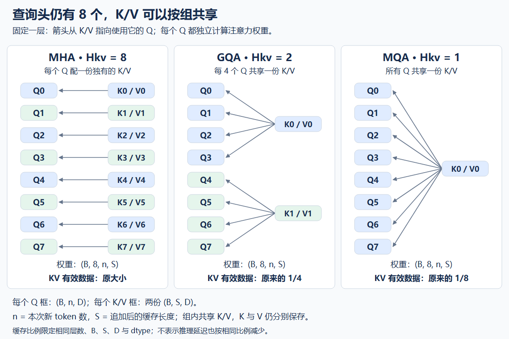

# MQA / GQA：让多个查询头共享 K/V

你已经能让 mini-GPT 用缓存生成：旧位置的 K/V 留下来，新 token 只产生自己的 Q/K/V，再读取历史缓存。
这解决了重复计算，但没有让历史 K/V 消失。生成越长，每一层持有的缓存仍越大。

这一课沿着同一条路径继续：**K/V 怎样产生 → 哪些查询头使用它 → 怎样保存 → 到底省了什么。**
从完整模型看，我们只改每个块中的 Attention；词表输出、FFN、残差和位置规则继续沿用。

## 1. 缓存中，哪些内容必须每个头各存一份？

先固定一组贯穿本文的配置：

- 块输入宽度 `C=512`。
- 查询头数 `Hq=8`，每头宽度 `D=64`，这里仍采用 `C=Hq×D`。
- `B` 是 batch 大小；本次有 `n` 个新 token。
- `t` 是本次追加前的缓存长度，追加后为 `S=t+n`。

当前 MHA 中，Q、K、V 都有 8 个头。对已经归一化的新输入
`X_new:(B,n,512)`，三份投影分别产生 `(B,n,512)`。
一个历史 token 每层要保存 8 份 64 维 K 和 8 份 64 维 V：

```text
每个 token、每一层的 KV 元素数 = 2 × 8 × 64 = 1024
```

8 个 Q 必须产生 8 组查询，但“每个 Q 必须配备独有的 K/V”是否也是必要条件？
考虑一个改法：Q 仍有 8 个头，把它们分成两组；每组的 4 个 Q 读取同一份 K 和同一份 V。

这样一个 token 只需保存 `2×2×64=256` 个 KV 元素，是原来的四分之一。
这里没有删掉历史 token，也没有把 8 个查询合并成 2 个；变化发生在 **K/V 的投影与共享方式**。

这叫 **分组查询注意力（Grouped-Query Attention，GQA）**。
用 `Hkv` 表示 K 的头数，也是 V 的头数；本例 `Hkv=2`。
这里的“共享”指组内多个 Q 使用同一个 K 头和同一个 V 头，**K 与 V 仍是两份不同的张量、两组参数**。

把分组调到两个端点，就得到：

| 配置 | 查询头 Hq | KV 头 Hkv | 每个 KV 头服务的查询头数 |
|---|---:|---:|---:|
| 你已实现的 MHA | 8 | 8 | 1 |
| 本课主例 GQA | 8 | 2 | 4 |
| 多查询注意力 MQA | 8 | 1 | 8 |

MQA 的英文是 Multi-Query Attention。名字中的“多查询”说的是多个查询头，不表示只能处理多个 token，
也不意味着原来的 MHA 没有多个 Q。两者都可以用于整段前向和单 token decode。
这三个名字描述的是同一条“KV 共享程度”轴上的配置。[原始 MQA 论文](https://arxiv.org/abs/1911.02150)、
[GQA 论文 §2.2](https://arxiv.org/html/2305.13245v3#S2.SS2)给出了这些结构。



图中固定一层；每个 Q 框代表 `(B,n,D)`，每个 K/V 框包含两份 `(B,S,D)`。
箭头表示该 K/V 供哪些 Q 读取。三种配置都保留 8 个独立计算权重的查询头。

## 2. 共享 K/V，会不会让几个头读出完全相同的内容？

不一定，因为权重还取决于 Q。

把上图第一组中的两个查询头放大。为方便看数字，**仅这一局部例子**改用
`D=2`，固定 `b=0`、同一个新 query 位置；它能读取两个 key 位置。
以下都已经是投影后的数值，不是在给真实 embedding 的维度指定固定语义：

```text
共享 K (2,2) = [[1, 0],      共享 V (2,2) = [[10,  0],
                [0, 1]]                      [ 0, 20]]

Q 头 0 的向量 (2,) = [2, 0]
Q 头 1 的向量 (2,) = [0, 2]
```

对每个 Q，按已学的 `softmax(q @ K.T / sqrt(2)) @ V` 计算：

| 查询头 | 缩放后的两个分数 | 两个 key 的权重 | 读出的两维内容 |
|---|---|---|---|
| Q0 | [1.4142, 0] | [0.804430, 0.195570] | [8.044297, 3.911406] |
| Q1 | [0, 1.4142] | [0.195570, 0.804430] | [1.955703, 16.088594] |

**同一份 K/V，可以被不同的 Q 按不同的比例读取。**
因此减少 KV 头，不等于减少注意力分布的数量；本课主例仍有 8 份分布。

但这个变化也带来限制：原来每个查询头可以有各自的 K 投影和 V 投影，
现在同一组内必须使用同一组 K/V 特征。不同 Q 仍可提出不同查询，
却不能要求自己专属的 K/V 投影。后面的节省正是以这种参数共享为代价。

## 3. 从投影开始共享，头之间的对应关系才明确

回到 `C=512,Hq=8,Hkv=2,D=64`。新 token 的 Q 仍需要 512 维，
K/V 各只需要 `2×64=128` 维。于是投影矩阵随之改变：

| 参数 | shape | 作用 |
|---|---|---|
| Wq | (512,512) | 生成 8 个查询头 |
| Wk | (512,128) | 生成 2 个 key 头 |
| Wv | (512,128) | 生成 2 个 value 头 |
| Wo | (512,512) | 混合 8 个查询头各自读出的内容 |

这里沿用现有 Attention 无偏置的配置。四份参数共享于所有 batch/token。

`X_new` 分别乘三份矩阵后，再用已经会的拆头操作：

| 对象 | 投影后、拆头前 | 拆头后 |
|---|---|---|
| Q_new | (B,n,512) | (B,8,n,64) |
| K_new | (B,n,128) | (B,2,n,64) |
| V_new | (B,n,128) | (B,2,n,64) |

**拆 K/V 时传入 2 个头，不能继续传入 8。** 后一种写法能把 128 整除成 8×16，
却把每个 key 的宽度错误地改成了 16，无法按本课配置与 64 维 Q 匹配。

接下来必须定义谁使用谁。本文采用连续、等大的分组，要求 `Hq % Hkv == 0`。
设每组查询头数 `R=Hq/Hkv=4`，查询头 `h` 使用的 KV 头编号为：

```text
g(h) = h // R

查询头 h：  0  1  2  3  4  5  6  7
KV 头 g：   0  0  0  0  1  1  1  1
```

`//` 是整数除法。这里的 `h` 是 head 编号，和 token 位置无关；
分组也不会把不同请求或不同层的缓存混在一起。

追加后已有 `K_all,V_all:(B,Hkv,S,D)`。
固定 batch `b` 和查询头 `h`，本次读取是：

```text
Q_new[b,h]       : (n,D)
K_all[b,g(h)]    : (S,D)
V_all[b,g(h)]    : (S,D)

scores_h  = Q_new[b,h] @ K_all[b,g(h)].T / sqrt(D)    # (n,S)
weights_h = 沿 S 轴做带 mask 的 Softmax              # (n,S)
Z_h       = weights_h @ V_all[b,g(h)]                # (n,D)
```

所有头合起来，`weights:(B,Hq,n,S)`，`Z:(B,Hq,n,D)`。
按查询头顺序合并 Z 得到 `(B,n,Hq×D)=(B,n,512)`，再乘 Wo。
输出宽度由 **查询头的输出数量**决定，所以 Wo 没有随着 KV 缩窄。

实现时可以把 Q 的头轴解释成 `(Hkv,R)`，令同组的 R 个 Q 广播读取一个 KV 头。
这只是多加一个分组轴；Softmax 仍沿 key 位置轴 S，不能沿组轴或查询头轴归一化。

## 4. 共享发生在模型里，不能把旧缓存随便压缩

现在可以区分两件事：

- 设计一个 GQA 模型，从投影开始就只生成两组 K/V。
- 已有一个任意 MHA 模型，它产生了八组不同的 K/V，再试图删掉或平均其中几组。

前者是新结构，后者通常会改变旧模型的输出。用第 2 节的相同 V 看一个反例：
仍固定一个 batch、一个 query、两个 key 位置，令两个头的 Q **都为 [2,0]**。

```text
旧头 0 的 K = [[1,0], [0,1]]
旧头 1 的 K = [[0,1], [1,0]]
V（两头相同）= [[10,0], [0,20]]
```

原来两个头分别读出 `[8.044297,3.911406]` 和 `[1.955703,16.088594]`。
如果把两个 K 平均成共同的 `[[0.5,0.5],[0.5,0.5]]`，
两头都会得到均匀权重，读出 `[5,10]`。令 Wo 为单位矩阵，输出差异就会原样保留。

所以，**把旧 MHA 的 K/V 头取平均，并不是保证输出不变的缓存压缩算法**。
GQA 论文用组内投影参数平均来初始化转换后的模型，并继续训练让模型适应；
这不是无损等价的承诺。[GQA 论文 §2.1–2.2](https://arxiv.org/html/2305.13245v3#S2)

那怎样验证我们将来写的 GQA 数学正确？选一个受控参照：
从同一份紧凑 K/V 出发，按 `[0,0,0,0,1,1,1,1]` 的映射显式重复到 8 头，
再调用已经验收的 MHA。这份 MHA 的组内 K/V 本来就被约束为相同，
其结果才应该与 GQA 一致。

这个参照用于数值检查；实际缓存仍应持有两组 K/V。
而 `Hkv=Hq` 时，共享约束消失，同一组 Q/K/V/Wo 应直接退化为原来的 MHA。
`Hkv=1` 时，所有查询头都读第 0 个 KV 头，就是 MQA。

## 5. 同一份共享关系，怎样落到缓存里？

第 3 节的 K_new/V_new 是这次刚算出的结果，先沿位置轴追加到各层自己的缓存。
从拆头后的布局看：

| 阶段 | Q_new | 本层持有的 K_all、V_all 各自的 shape |
|---|---|---|
| 空缓存 prefill，输入 n 个 token | (B,8,n,64) | (B,2,n,64) |
| 已存 t 个，再追加 n 个 | (B,8,n,64) | (B,2,t+n,64) |
| decode，追加 1 个 | (B,8,1,64) | (B,2,t+1,64) |

为了复用 ex011 沿第 1 轴追加的容器，也可以采用拆头前的持久布局
`(B,S,Hkv×D)=(B,S,128)`，读取时才拆成 `(B,2,S,64)`。
两种布局表达同一份数据；不能一边换成拆头后布局，一边仍把第 1 轴当时间轴追加。
现有容器注释里的 `C` 需要在新接口中区分为 KV 宽度，不能默认等于模型宽度。

头共享并不改变位置权限。本次第 i 个新 query 的绝对位置仍是 `t+i`，
可读 key 仍满足 `j<=t+i`；单 token decode 可以读完追加后的全部历史。
本课先沿用 ex011 的无 PAD 配置；支持 PAD 时再与 key 的有效性相交。

同样，输入的位置表示仍根据缓存长度取值。
减少 KV 头不会改变缓存里有多少个 token，不能把 head 数变化误作位置变化。

这里还有一个看起来省内存、实际上可能没有省的实现：

```text
生成 2 头 K/V → 实体复制成 8 头 → 把 8 头永久放进缓存
```

保存的是 8 头，缓存就还是 8 头的大小。正确的持久状态要保存紧凑的 2 头；
为适配数值参照而临时重复是另一回事，临时张量也会增加该次计算的内存峰值。

尤其不能从“代码用了 expand”推断“后续都不复制”。
`expand` 可以通过 stride=0 让多个逻辑位置引用同一份存储；
随后 `reshape` 若无法只改视图表达目标布局，仍会复制。
以下是 CPU float32 的实际小例子，尺寸缩小为 `B=1,Hkv=2,S=3,D=4,R=2`：

| 张量 | shape | numel×元素字节数 | 底层 storage 字节数 | 与原 K 共享存储 |
|---|---|---:|---:|---|
| 紧凑 K | (1,2,3,4) | 96 | 96 | 是 |
| 插入组内轴并 expand | (1,2,2,3,4) | 192 | 96 | 是 |
| 把两个头相关轴 reshape 合并 | (1,4,3,4) | 192 | 192 | 否 |
| 沿头轴 repeat_interleave(2) | (1,4,3,4) | 192 | 192 | 否 |

`storage` 是张量背后保存数据的存储对象；`numel` 统计逻辑元素数。
第二行的逻辑元素重复引用已有数据，不能把 192 当作额外分配的字节数。
这里每行单独比较，共享 storage 不能重复计账；表中的 storage 也不代表进程总内存或分配器预留。

这个结果只说明所列布局：不能推广成“所有 reshape 都复制”。
反过来，分组广播避免在源码中显式重复，也不保证底层矩阵乘没有工作区或内部复制。
有关 API 的具体约定见 [expand](https://docs.pytorch.org/docs/2.14/generated/torch.Tensor.expand.html)
和 [Tensor Views](https://docs.pytorch.org/docs/2.14/tensor_view.html)。

## 6. 两头到底省下什么，哪些东西仍按八头计算？

现在沿着“参数 → 缓存 → 本次读取”分别算，避免把一种节省扩大成整个模型的节省。

先只数 Attention 的四个投影矩阵，不含偏置：

```text
Wq + Wo 元素数 = 2 × C²
Wk + Wv 元素数 = 2 × C × Hkv × D
总计           = 2 × C² + 2 × C × Hkv × D
```

再取 `12` 层、`B=4`、缓存长度 `S=1024`、float32 每元素 `4` 字节，
用你已经写过的 kv_cache_bytes：

```text
所有层的 KV 有效字节数 = 2 × 12 × 4 × 1024 × Hkv × 64 × 4
1 MiB = 2²⁰ 字节
```

把三种配置代入：

| 配置（Hq 都是 8） | 每层 K/V 参数个数 | 每层四份 Attention 投影参数总数 | 所有层的 KV 有效大小 |
|---|---:|---:|---:|
| MHA：Hkv=8 | 524,288 | 1,048,576 | 192 MiB |
| GQA：Hkv=2 | 131,072 | 655,360 | 48 MiB |
| MQA：Hkv=1 | 65,536 | 589,824 | 24 MiB |

从 MHA 改为主例 GQA，**KV 缓存减为四分之一，Attention 投影参数总数变为原来的 62.5%**。
完整模型还有 FFN、词表、位置表和归一化参数，不能说整个模型也缩小了四倍。

计算量同样要分开。以下按一次乘加计 2 个 FLOPs（浮点算术操作），
只数主要矩阵乘，忽略 Softmax、mask 和数据搬运：

| 单层、本次 n 个 query 的计算 | 主要 FLOPs | 减小 Hkv 的直接影响 |
|---|---|---|
| 新 K/V 投影 | 4 B n C Hkv D | 按 Hkv 减少 |
| 新 Q 与输出投影 | 4 B n C² | 不变 |
| QK 分数与权重乘 V | 4 B Hq n S D | 不变 |

原因可以从第 2 节找到：即使 K/V 共享，8 个 Q 仍各自打分、归一化、读取。
decode 时 `B=4,n=1,S=1024`，三种配置的分数张量都有
`4×8×1×1024=32768` 个元素。

prefill 从空缓存开始时 `n=S`，当前稠密实现仍计算平方规模的分数矩阵；
减少 KV 头不会自动消除这个平方项。

节省更直接地体现在：需要生成并持久保存的 K/V 更少，复用良好的实现可以减少重复搬运。
但实际访存取决于读取内核怎样复用共享 K/V；如果先物化重复副本，或每个 Q 都重新搬同一份数据，
收益会被削弱。以上公式不推出固定加速倍数。本课没有做耗时测量，
也不以 CPU 数学例子宣称 GPU 内核更快。

## 7. 回到你现有的实现：只接上发生变化的接口

现有代码可以继续作为基础，但有两处等宽假设需要在后续练习的新接口里拆开：

| 已有部分 | 可以复用的内容 | 接上 GQA 时要明确的差别 |
|---|---|---|
| ex007 的 split_heads / merge_heads | 精确拆合头索引 | Q 按 Hq 拆，K/V 按 Hkv 拆；最后合并 Hq 个输出 |
| ex007 的 multi_head_attention | 已验收的 MHA 数值参照 | 原入口只有一个 num_heads，不能把紧凑 K/V 直接代入 |
| ex011 的 LayerKVCache | 请求隔离、容量、沿位置追加 | 持久宽度用 Hkv×D；若更换轴布局，也必须改追加轴 |
| ex011 的 block_step_with_cache | Pre-LN、残差与 FFN 的组合 | 新入口的投影宽度及组内读取需要支持 Hq≠Hkv |
| ex011 的 kv_cache_bytes | 原公式已经带 num_kv_heads | 无需改公式，只需传入实际 Hkv |

Wq/Wo 和 FFN 仍按模型宽度工作。Wk/Wv 改变 shape 后，应在模型构造时注册为相应大小的参数；
不能在 forward 中临时创建新的训练参数。旧 MHA 存档也不能直接当作不同 shape 的 GQA 参数装载。
后续验证时先固定同一套 GQA 参数，比较它自己的全量与增量路径。

本课保留现有归一化、FFN 和位置表，先把“谁共享 K/V”单独弄清。
这样对齐失败时，可以直接检查分组、mask、追加轴和位置偏移，避免同时引入多项结构变化。

## 8. 两个检查，留到讲完或实现时使用

无需现在逐条作答；可以在同一份综合实现与排错中提供证据。

**A：输出仍然合法，但读错了哪一组？**

已知 `Hq=8,Hkv=2,D=64`，K/V 的拆头后布局为 `(B,2,S,64)`，
本题使用本文的连续分组规则。某实现为了调用 MHA 参照，
用 `repeat` 使头编号排列成 `[0,1,0,1,0,1,0,1]`，
而不是每个 KV 头连续重复 4 次。输出 shape 仍是 `(B,n,512)`。

指出一个读错 KV 组的查询头，并构造一个小输入，让这两种写法产生不同输出。
这里仅固定排列规则；允许你选简单的 Q/K/V 和单位 Wo，不要求重写整层。

**B：从一份账本指出哪些结论有依据。**

一个模型的 `Hq=12,D=64,C=768`，将 `Hkv` 从 12 改为 3。
其余层数、batch、缓存长度、dtype 都不变，持久 K/V 确实保存为 3 头。
某报告说：

> KV 有效字节数变为原来的四分之一；注意力分数元素数变为四分之一；
> 整个模型推理延迟因此变为四分之一。

逐句判断，并解释决定各项的量是什么。无需实际跑性能测量来否定没有依据的推断。

后续综合实现需要验证：Hkv=Hq 对齐 MHA、Hkv=1 对齐共享 KV 参照、一般分组的前向和梯度、
扰动某组 K/V 仅影响合头前对应的查询头、同一 GQA 全量与缓存 logits 对齐，
以及持久缓存确实只有 Hkv 头。组内共享参数的梯度应累加来自该组所有查询头的贡献；
不能 detach 共享 K/V，也不能只保留某一个查询头的梯度。

## 复现与本课边界

配套 [小例子脚本](../examples/gqa_mechanism_probe.py) 复现第 2、4、5、6 节的数字，
并用已有 MHA 展示共享 K/V 后的权重。它只提供教师的观察例子，没有替你实现通用 GQA 或改模型。

在仓库根目录运行：

```bash
.venv/bin/python -B -m examples.gqa_mechanism_probe
```

本文数值在 CPU 上实际运行，环境为 PyTorch 2.14.0+cu130；
权重例子用 float64，存储例子用 float32。安装包带 CUDA 后缀不代表本次用了 GPU。
新机制与后续实现对应 `modern.mqa-gqa`；存储对照可用于之后核验布局理解，
参数和算术量推导只是 `systems.cost-model` 的一部分，不代表整项已验收。

本次交付是下一课讲义及教师小例子。未新增学习者证据，
不切换学习状态、不上报掌握，也不重复执行已验收的 255 项全仓测试。
