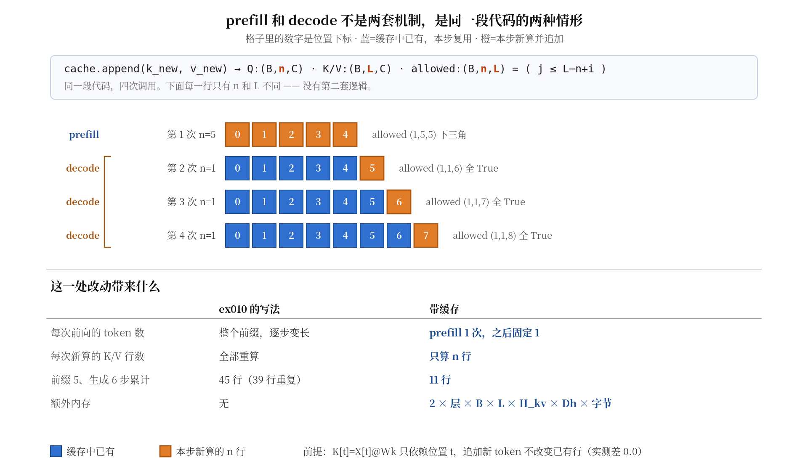

# KV Cache：把重复计算换成可管理的状态

这一课只做一件事：把你 ex010 的生成循环改成带缓存的版本，并证明改完之后结果不变。

全文围绕**同一个例子**展开 —— 前缀 5 个 token，生成 3 步。
所有的量（Q、K/V、mask、缓存长度、位置下标）都会在这个例子上对号入座。

整体路线：先看清现在浪费在哪（第 1 节），确认缓存这个想法成立（第 2 节），
写出带缓存的一步计算（第 3 节），把这一步串成完整生成（第 4 节），
然后回答三个必然会遇到的问题 —— 状态放哪（第 5 节）、怎么验证对不对（第 6 节）、
代价是什么（第 7 节）。第 8 节集中列出会踩的坑。

## 1. 先看清浪费在哪

你 ex010 的 `greedy_generate` 每步都把**完整前缀**重新送进模型：

```python
for _ in range(max_new_tokens):
    logits = model(ids, valid)        # ids 每步变长
    nxt = logits[:, -1, :].argmax(-1)
    ids = torch.cat([ids, nxt], dim=1)
```

前缀 5 个 token、生成 3 步，每步实际算了多少行 K/V：

| 步 | 送进模型的长度 | 算的 K/V 行数 | 其中新的 | 其中**重算的** |
|---|---|---|---|---|
| 1 | 5 | 5 | 1 | 4 |
| 2 | 6 | 6 | 1 | 5 |
| 3 | 7 | 7 | 1 | 6 |

只有每步最后一行是新的，前面全是上一步刚算过的。
把范围放大到生成 6 步：累计算了 45 行，其中 **39 行是重算的（86.7%）**。

前缀越长越严重：

| 前缀长度 | 生成 6 步累计 | 若不重算 | 比值 |
|---|---|---|---|
| 5 | 45 | 11 | 4.1x |
| 50 | 315 | 56 | 5.6x |
| 500 | 3015 | 506 | 6.0x |

想法很直接：**算过的 K/V 存起来，下次直接用**。
但这个想法要成立，得先回答一个问题。

## 2. 存起来的东西，下次还对吗？

这不是显然的 —— "算过就不会变"并不是通则，它取决于可见范围。
拿你 ex009 模型的一个块做对照：同样追加第 6 个 token，看前 5 行的**块输出**变不变。

| 可见范围 | 前 5 行块输出的最大差 |
|---|---|
| 因果（本课模型） | 0.0 |
| 双向（假想的对照） | 0.026 |

因果 mask 下不变，是因为位置 2 本来就读不到位置 5；换成双向就变了。
所以"能不能缓存"必须对具体的量、具体的可见范围逐个确认。

先看最关键的那个量。回忆 `project_qkv` 做的事：

```text
K = X @ Wk        X: (B,T,C)   Wk: (C,C)   K: (B,T,C)
```

这是一个矩阵乘，`K` 的第 t 行只由 `X` 的第 t 行决定 —— **位置之间不交互**。
追加第 6 个 token，只是给 `X` 多加一行，前 5 行原封不动，所以 `K` 的前 5 行也原封不动。

实测（先算 5 个 token 的 K/V，再追加第 6 个后重算一遍，比较前 5 行）：

```text
K[0:5] 最大差: 0.0
V[0:5] 最大差: 0.0
```

**逐位相同**，不是近似相等。位置之间的交互发生在后面的 Attention 加权求和里，
那一步的结果确实会变 —— 但那一步本来就要重算，不在缓存范围内。

那 Q 呢？`Q = X @ Wq` 同样逐位置独立，同样不变。
但**缓存 Q 没有意义**：每一步只需要最后一个位置的 Q 去读取历史，
更早位置的 Q 在这一步根本不参与计算。缓存的价值在于"以后还要反复用"，
K/V 满足这一点，Q 不满足。

这就是为什么叫 KV Cache 而不是 QKV Cache。

## 3. 带缓存的一步长什么样

现在把这个想法落到一个 Pre-LN 块上。对比你 ex008 已验收的写法：

```text
ex008（无缓存）                    带缓存
─────────────────────             ─────────────────────
n1 = norm1(x)                     n1 = norm1(x)
q,k,v = project_qkv(n1,...)       q,k_new,v_new = project_qkv(n1,...)
                                  cache.append(k_new, v_new)      ← 新增
a = MHA(q, k,     v,     ...)     a = MHA(q, cache.k, cache.v, ...)  ← K/V 来自缓存
u = x + drop1(a)                  u = x + drop1(a)
y = u + drop2(ffn(norm2(u)))      y = u + drop2(ffn(norm2(u)))
```

**只改了两处**：K/V 先追加进缓存，然后从缓存取全量。
Q 仍然只来自本步的新 token。残差、LayerNorm、FFN 一个字没动。

注意追加在计算**之前** —— 新 token 必须能读到自己（因果规则允许 `j == i`）。
写反了的话，第一个 token 会面对空缓存。

### 关键：Q 和 K/V 的长度不再相等

这是整个改动带来的最大变化。设本步喂进 `n` 个新 token，追加后缓存长度为 `L`：

```text
Q:       (B, n, C)        只有新 token
K/V:     (B, L, C)        缓存里的全部
allowed: (B, n, L)        不再是方阵
```

`allowed[b,i,j]` 的含义不变 —— 第 i 个 query 能否读第 j 个 key。
本步第 i 个新 token 的**绝对位置**是 `L-n+i`，所以规则是 `j <= L-n+i`。

你 ex007 的 `multi_head_attention` **已经支持**这件事，契约里明确写了
"Tq/Tk 可以不同"。实测把 `Tq=1、Tk=5` 传进去，结果与全量前向的第 5 个位置：

```text
最大差: 0.0
```

但 `multi_head_self_attention` **不支持** —— 它内部写死了
`allowed = make_causal_allowed(input_valid)`，只能产出方阵，
而且从同一个 X 同时投影出 Q/K/V。缓存需要的是"Q 来自新 token，K/V 来自缓存"。
所以这一课的新代码要绕开这个包装层，直接调底层函数。ex006–ex010 一行不改。

## 4. 把这一步串成完整生成

现在看**同一段代码**在不同输入下的表现。还是那个例子：前缀 5 个，生成 3 步。

| 调用 | 本步 n | 缓存长度 | Q | K/V | allowed | 该步省下的重算 |
|---|---|---|---|---|---|---|
| 第 1 次 | **5** | 0 → 5 | (1,5,32) | (1,5,32) | (1,5,**5**) | — |
| 第 2 次 | 1 | 5 → 6 | (1,1,32) | (1,6,32) | (1,1,**6**) | 5 行 |
| 第 3 次 | 1 | 6 → 7 | (1,1,32) | (1,7,32) | (1,1,**7**) | 6 行 |
| 第 4 次 | 1 | 7 → 8 | (1,1,32) | (1,8,32) | (1,1,**8**) | 7 行 |

第 1 次和后面三次跑的是**完全相同的代码**，区别只在 `n`。
它们各自有个名字：

- `n > 1`（一次处理整个前缀，建立缓存）叫 **prefill**
- `n = 1`（每次追加一个 token）叫 **decode**

**这两个词不是两套机制，是同一段代码在两种输入下的情形。**
真实系统把它们分开命名，是因为两者的性能特征差别很大（第 7 节会说）。

下图把上表画出来，顺带标出每次调用里哪些格子是复用的、哪些是新算的：



### 一个容易错的推论：decode 的 mask 是全 True

把 `n=1` 代进第 3 节那条规则 `j <= L-n+i`：唯一的 query 是 `i=0`，
所以条件是 `j <= L-1` —— 缓存里**每一个** key 都满足。

换句话说：**因果性不再由 mask 保证，而是由"缓存里只有历史"这个事实保证**。
未来的 key 根本不存在，没有东西需要屏蔽。

如果这里套用 `torch.tril`，`(1, L)` 的下三角只有第一列是 True，
模型就只能看见位置 0。这个错误不报错。

### 位置下标从哪来

每个新 token 的位置就是**它进来之前的缓存长度**：上表里 0、5、6、7。

不要用 `prefix_len + step` 之类从参数推算的值。这在一次性生成时恰好正确，
但只要出现"分两次调用、续用同一份缓存"的场景就会错 —— 第 8 节有具体数字。
从缓存自身读长度，这个问题不会存在。

## 5. 这份缓存归谁所有

到这里数学已经完整了。但还有个工程问题：`cache` 这个对象该放在哪？

一个自然的想法是挂到模型上：`self.k_cache = ...`。**这是错的**，
而且理由不是风格问题 —— 缓存和参数的生命周期根本不同：

| | 模型参数 | KV 缓存 |
|---|---|---|
| 属于谁 | 模型 | **单个请求** |
| 存活多久 | 训练到部署 | 一次生成，结束即弃 |
| 要不要存档 | 要 | 不要 |
| 要不要求导 | 要 | 不要 |
| 两个请求同时来 | 共享同一份 | **必须各有一份** |

最后一行是要害。挂在 `self` 上意味着两个请求共用一份缓存，
请求 B 的第一个 token 会读到请求 A 遗留的历史：

```text
A 结束时缓存长度 5，B 的正确起点应为 0
串用时 B 的第 1 个 query 看到 6 个 key，而不是 1 个
```

shape 完全合法，**不报错**，答案是错的。

所以缓存应该作为**显式传递的值**：函数接收它、更新它，由调用方持有和丢弃。
这和你在 ex010 学的模型状态是两回事 —— `model.eval()` 切的是模型自己的模式，
缓存是请求的数据。

## 6. 怎么确认改完之后结果没变

缓存版和全量版应该给出"一样"的结果。但"一样"要先定义清楚。实测：

| dtype | 增量 vs 全量 最大差 | 逐位相同 | argmax 一致 |
|---|---|---|---|
| float64 | 3.61e-16 | **否** | 是 |
| float32 | 2.98e-07 | **否** | 是 |

**两种精度下都不逐位相同。这不是 bug。**

原因回到第 4 节那张表：全量时 5 个 query 一次矩阵乘完成，
增量时每个 query 单独乘。矩阵乘法的分块和累加顺序不同，
而浮点加法不满足结合律，最后几位就可能不同。
差值分别落在各自 dtype 的机器精度量级上。

所以验收标准是**事先声明容差**，不是 `torch.equal`。比较时还要注意：

- 必须关闭 Dropout（`model.eval()`），否则差异来自随机失活而不是缓存逻辑
- 必须固定同一份参数和同一套位置编号
- 只比 logits 不够，还要比**生成出来的 token 序列**

用你 ex010 训练好的模型做端到端对照（float32，86 条验证集前缀）：

```text
缓存生成 vs 无缓存生成，结果完全相同: 86/86
  模式A: 无缓存 [c0,c1,c2,<eos>]   缓存 [c0,c1,c2,<eos>]
  模式B: 无缓存 [c2,c1,c0,<eos>]   缓存 [c2,c1,c0,<eos>]
```

logits 差 3e-07，但 argmax 之后完全一致 —— 这是贪心的一个性质：
只要差异不足以改变最大值的位置，结果就相同。
**换成采样就不一定**，因为采样对概率的微小变化敏感。这一课只做贪心。

## 7. 账本：省下什么，付出什么

**省下的是计算。** 第 1 节那张表的另一面：

| | 前缀 5、生成 6 步累计新算的 K/V 行数 |
|---|---|
| 无缓存 | 45（39 行重复） |
| 有缓存 | 11 |

**付出的是内存。** 缓存的字节数可以直接从形状推出来：

```text
KV 有效数据字节数
  = 2 × 层数 × B × 缓存长度 × KV头数 × 每头维度 × 每元素字节数
```

开头的 `2` 对应 K 和 V 两份。用真实张量核对过：

```text
2 层、B=1、长度 16、4 个 KV 头、Dh=4、float32
  公式: 4096 字节
  实测: 4096 字节    （逐个张量 numel × element_size 求和）
```

放大到更现实的配置：

| 配置 | 缓存大小 |
|---|---|
| 12 层、B=1、长度 512、12 头、Dh=64、float32 | 36.00 MB |
| 同上但 B=8 | 288.00 MB |

这个式子**不包含**模型权重、前向工作区、分页管理的浪费、分配器预留。
它只算"KV 有效数据"这一项。

注意内存随 `B × 缓存长度` 线性增长 —— 长上下文和高并发会互相挤占显存预算。

### 两个阶段的性能特征为什么不同

回看第 4 节那张表：prefill 一次算 5 个 query 对 5 个 key，是一次较大的矩阵乘；
decode 每次算 1 个 query 对 L 个 key，是很多次很小的矩阵乘。

算术量上 decode 便宜得多，但它每步都要把**整个缓存**读一遍。
随着 L 增长，decode 的瓶颈会从"算得多"转向"读得多"。

这只是一个**待验证的常见假设**，不是定律 —— 具体取决于模型、batch 和硬件。
这一课在 CPU 上验证的是"算术操作数减少了"和"结果仍然正确"，
**没有做任何计时**。真实加速需要 `systems.benchmarking` 的方法
（热身、重复、计时范围、同步）才能测量。省下计算不等于一定变快。

## 8. 三个不报错的故障

这三个都来自前面的机制，集中列在这里便于实现时对照。

**decode 阶段误用下三角 mask**（第 4 节）。
`(1, L)` 的下三角只有第一列 True，模型只能看见位置 0。

**位置下标从参数推算**（第 4 节）。假设先用前缀 `A B C` 生成 2 个，
再在同一缓存上续 3 个，而位置写成 `prefix_len + step`（`prefix_len=3`，`step` 重新从 0）：

| 续用时的第几步 | 实际用了 | 应该用 |
|---|---|---|
| 0 | P[3] | **P[5]** |
| 1 | P[4] | **P[6]** |
| 2 | P[5] | **P[7]** |

全部偏了 2 行。改成 `pos = len(cache)` 就不会有这个问题。

这个 bug 的隐蔽之处在于：**一次性生成的测试发现不了它**，
因为那时 `prefix_len + step` 恰好等于缓存长度。

**请求之间不清空**（第 5 节）。缓存必须随请求创建、随请求丢弃。

三个故障有个共同点：**shape 全部合法，程序不抛异常**。
所以验证必须靠数值对齐，不能靠"跑通了"。

## 9. 两个理解检查

题面自包含。可以直接回答，也可以在后续实现中用等价实验核验。

### 检查 A：哪些量需要跨步保留

某个 Pre-LN 块的一次 decode 里出现了这些张量（B=1，C=32，4 头，缓存原有 t 个）：

```text
x        (1, 1, 32)      本步新 token 的输入表示
n1       (1, 1, 32)      x 过 norm1 的结果
q        (1, 1, 32)      n1 @ Wq
k_new    (1, 1, 32)      n1 @ Wk
k_all    (1, t+1, 32)    缓存的 K 拼上 k_new
attn_w   (1, 4, 1, t+1)  Softmax 后的注意力权重
out      (1, 1, 32)      块的输出
```

哪些**必须**跨步保留？对每个不需要保留的，说明理由属于哪一种：

- (a) 下一步会重新算出**不同**的值，保留了也不能用
- (b) 下一步根本不需要这个位置的这个量

这两个理由不一样，别混用。

### 检查 B：一个通过了对齐测试的错误实现

某人实现了缓存版生成，用"前缀长度 4、生成 3 个 token"做对齐测试，
缓存版与全量版的 logits 在 1e-6 容差内一致，**测试通过**。

他的位置下标写的是 `prefix_len + step`，其中 `prefix_len` 是传入前缀的长度，
`step` 从 0 开始计数。

现在他要支持分两次调用：先用前缀 `A B C` 生成 2 个，
拿到结果后**在同一份缓存上**再生成 3 个。第二次调用时他仍传 `prefix_len=3`，
`step` 重新从 0 开始。

第二次生成的第 1 个 token 会用 `P` 的哪一行？正确的应该是哪一行？
为什么第一次的测试没能发现这个问题？
如果改成从缓存自身读取位置，这个 bug 还会存在吗？

## 工程边界与后续衔接

- 本文是新准备的讲义。新内容是：缓存成立的前提（逐位置投影）、
  Q/K/V 长度不等带来的 mask 形状变化、prefill 与 decode 作为同一段代码的两种情形、
  缓存作为请求状态而非模型参数、容差对齐而非逐位相等、KV 字节账本。
  因果 mask、`eval`/`no_grad`、位置表、参数注册都已学过，本文只在缓存语境中复用。
- 本文覆盖 `modern.kv-cache` 三条验收标准的**讲解部分**。按 map 的要求，
  该节点需要学习者**实际实现**缓存并跑通逐位置对齐、前缀长度变化、分块追加、
  容量边界、缓存重置与请求隔离 —— 这些留给配套练习，本文不代做。
- 全部数值为实跑结果。配置：CPU、`torch 2.14.0+cpu`；
  第 2、3、4 节的对齐实验用 `C=32`/4 头/2–3 层，float64 与 float32 各测一次；
  第 6 节的端到端生成用 ex010 已训练的 float32 模型（`C=64`/4 头/2 层、400 步）。
  第 1、7 节的比值是按 K/V 行数计的**算术量**，不是墙钟时间。
  第 2 节的双向对照是把同一个块的 mask 换成全 True 后实跑的，
  本课模型本身不含双向配置，那一行只用于说明「可缓存性依赖可见范围」。
- 第 7 节末尾"decode 瓶颈转向内存读取"是常见假设，本文未做测量，
  不作为已验证结论。
- 本文只做**贪心**生成的缓存对齐。采样对 logits 微小差异更敏感，
  `modern.sampling` 之后才适合讨论缓存与采样的联合验证。
- 尚未展开：MQA/GQA 的 KV 头共享（`modern.mqa-gqa`）、RoPE 在缓存下的位置偏移
  （`modern.rope`）、滑窗与缓存联调、分页 KV 管理、连续批处理。
  按 roadmap 属于 G4 后续与 `systems.serving-bridge`。
- 读过本文不构成任何节点的掌握证据。实际状态以 `learning/progress.json` 为准。
  本次不修改知识地图依赖，不切换 `currentNodeId`，不新增已掌握记录。
