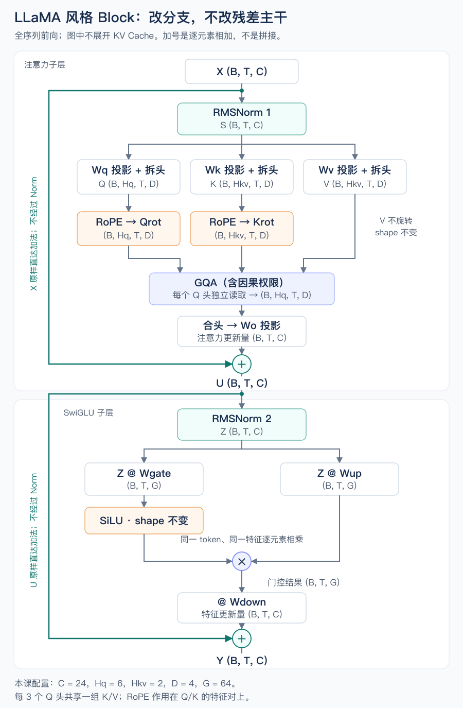

# 从 GQA MiniGPT 到 LLaMA 风格模型

这一课不另起炉灶。我们沿着你已经实现的模型走一遍：一批 token 进入模型，穿过一个块，再把这个块用于增量生成。在这条路径上完成三个有关联的改造：**RMSNorm、RoPE、SwiGLU**。

你已经完成 GQA 和紧凑 KV Cache。这次不重考分组、拆头、缓存追加的基础操作；新问题是：换了归一化、位置机制与 FFN 后，整个模型怎样仍然构成同一个正确的计算。

## 1. 先确定我们究竟在改哪一份模型

当前 [ex012](../exercises/ex012_grouped_query_attention/model.py) 的结构是：

```text
输入：E[input_ids] + P[position]
每层：X → X + GQA(LN1(X)) → U + ReLU_FFN(LN2(U))
输出：最后一次 LayerNorm → 独立词表投影 → logits
```

这里的两处加法都是逐元素残差相加；`U` 是第一条残差相加后的结果。位置表只在模型入口加一次，GQA 的 K/V 则逐层计算、逐层保存。

现在要构造的新模型保留这些骨架：因果读取、GQA 分组、两条残差、逐 token 的 FFN、最后的归一化、预测下一 token 的训练目标。改变的是骨架内部三处计算：

| 经过哪里 | 原来的操作 | 本课的改动 | 要弄清的问题 |
|---|---|---|---|
| 子层入口 | LayerNorm | RMSNorm | 控制输入尺度是否一定要先减均值？ |
| Q/K 进入匹配之前 | 位置已混入输入表示 | 按位置旋转 Q/K，即 RoPE | 能否直接让匹配分数包含相对位置信息？ |
| 第二条残差支路 | 两矩阵 ReLU FFN | 三矩阵门控 FFN，即 SwiGLU | 特征更新能否由另一组输入相关特征调制？ |

这不是“旧模型有 bug，必须修好”。三种改动是架构选择，会改变模型函数，需要训练；不是把旧 checkpoint 换个名字就能无损转换。原始 LLaMA 使用了预归一化、RMSNorm、SwiGLU 和 RoPE；本课在这些选择上沿用你已有的 GQA，构造**明确配置的小型 LLaMA 风格模型**，不宣称复现某个官方型号，也不把 GQA 当作所有 LLaMA 版本共有的结构。[LLaMA 论文 §2.2](https://arxiv.org/html/2302.13971v1#S2.SS2)

全课沿用同一组尺寸，避免每一节换一套对象：

```text
B = 2             两条序列
T = 6             全量前向时，每条序列有六个输入位置
C = 24            每个 token 的主干特征数
Hq = 6            查询头数
Hkv = 2           K/V 头数，每组服务三个查询头
D = C / Hq = 4    每个头的特征数，RoPE 要求本课的 D 是偶数
G = 64            新门控 FFN 的中间宽度
N = 11            词表大小
n_layer = 2       两个独立的块
```

目标配置还固定为：Pre-Norm；所有线性投影不加偏置；RMSNorm 只有可训练缩放 `gamma`；`eps=1e-5`；Dropout 为 0；每个 head 的全部 D 维参与 RoPE；内容表和词表投影不共享参数。先用 CPU float64 核对数学，再用 float32 训练。

下面按**一个块实际执行的顺序**展开：先处理支路入口的尺度，再让 Q/K 带位置读取，最后把读取后的表示交给门控 FFN。

## 2. X 进入注意力支路：为什么可以不减均值

进入某一层的 `X` 是 `(B,T,C)`。先固定一个 batch 和 token，取出长度 C 的向量 `x`。它不是所有 token 拼起来的统计样本。

你写过的 LayerNorm 做了两件不同的事：

1. `x - mean(x)`：去掉所有特征共同的偏移。
2. 除以 `sqrt(var(x) + eps)`：控制居中后向量的整体尺度。

这两件事没有逻辑上的捆绑。假如我们仍然要限制送入投影层的整体幅度，但不要求所有特征的均值变成零，便可以直接测量原始向量相对于零的大小。

为每个分量平方、取平均、开平方，得到 **RMS：均方根**：

$$
r(x)=\sqrt{\frac{1}{C}\sum_{i=0}^{C-1}x_i^2+\epsilon}
$$

然后定义本课的归一化：

$$
y_i=\gamma_i\frac{x_i}{r(x)}
$$

`r(x)` 是由当前 token 算出来的一个标量，不是参数；`gamma` 是 `(C,)` 的长期可训练参数，初始为全 1，同一个模块内所有 token 共享。`eps` 是固定的小正数，放在根号内，避免零向量造成除零。本课不设 `beta`。

这就是 RMSNorm 的核心改动：**不居中，仍缩放**。[RMSNorm 原论文 §4](https://arxiv.org/html/1910.07467#S4)

### 2.1 它控制的到底是什么

暂时只为分析令 `eps=0`、`gamma=1`，且 x 非零。归一化后各分量的平均平方为：

$$
\frac{1}{C}\sum_i\left(\frac{x_i}{r(x)}\right)^2=1
$$

因此，原始向量整体放大十倍，不会仅凭这个十倍幅度把后续 Q/K 投影一起放大十倍。对于正数 a，`r(a*x)=a*r(x)`，分子分母的 a 会消掉。实际有 `eps>0` 时，这种缩放不变性只是近似，尤其接近零的向量不能忽略 eps。

但它**不控制均值为零**。因为：

```text
mean(x²) = mean((x - mu)²) + mu²
         = var(x) + mu²
```

展开平方后，中间项含 `mean(x-mu)=0`，所以消失。RMS 测量的是离零的大小；标准差测量的是离自身均值的大小，二者不是一个量。

回到你之前质疑过的例子。以下固定 `gamma=1`、LayerNorm 的 `beta=0`，为便于读数令 `eps=0`，结果由 CPU float64 核对：

| 输入向量 | LayerNorm 输出 | RMSNorm 输出 |
|---|---|---|
| `[1,3,5,7]` | `[-1.342,-0.447,0.447,1.342]` | `[0.218,0.655,1.091,1.528]` |
| `[101,103,105,107]` | `[-1.342,-0.447,0.447,1.342]` | `[0.971,0.990,1.009,1.029]` |

LayerNorm 把共同的 `+100` 消除了。RMSNorm 不做这个消除，所以这两个向量的方向不同，归一化结果仍不同。

这也不代表 RMSNorm “无损保留所有信息”：当 eps 可忽略时，正比例的两个向量仍会变得相同；上例中均值很大时，分量间的相对差异也被压小。它只是选择了不同的归一化性质，不是普遍比 LayerNorm 更合理。

### 2.2 gamma 不是把归一化撤销

所有 token 先各自除以自己的 r，再乘共享的逐特征 `gamma`。前一步控制输入相关的整体幅度；后一步让模型学习哪些特征需要放大、缩小或翻转。共享 gamma 不可能逐个还原每个 token 不同的 r，所以不是“先除掉再原样乘回去”。

放回 `(B,T,C)`：平方平均只沿最后一轴做，保留轴后 `r` 是 `(B,T,1)`，输出仍为 `(B,T,C)`。两条残差主干本身不经过这一步：

```text
S = RMSNorm1(X)    # 只送进注意力支路
U = X + attention_update
```

全模型的 `norm1`、`norm2`、`final_norm` 都替换为各自独立的 RMSNorm；不是在每层加一份共享 gamma。

少了均值与居中步骤，算子工作有所改变，但真实耗时还取决于实现、融合和设备，不能仅凭公式保证更快。也不需要重新推一遍 LN 的 Jacobian：本次新证据应来自 RMSNorm 自身的前向和梯度对齐。

## 3. S 已投影成 Q/K：让位置直接改变“怎么匹配”

`S=RMSNorm1(X)` 经过你熟悉的三份投影：

```text
Wq: (24,24)   → Q_flat: (B,T,24) → Q: (B,6,T,4)
Wk: (24,8)    → K_flat: (B,T,8)  → K: (B,2,T,4)
Wv: (24,8)    → V_flat: (B,T,8)  → V: (B,2,T,4)
```

接下来本来就是 Q 与对应组的 K 做点积。假如想让匹配体现“这个 key 在我前面多远”，位置就可以在**点积之前**介入，而不一定先作为 P 加进内容表示。

注意区分两个问题：位置机制影响可见 key 之间的分数，因果 mask 决定哪些 key 根本不可见。RoPE 不会替你屏蔽未来。

### 3.1 先只旋转两个数，别急着看整块张量

固定 batch、head、token，拿该头中的两个特征 `[a,b]` 当作平面坐标。这里把两个数画成二维，只是描述计算；没有宣称这两维对应现实世界中的方向。

在单位圆上，转过角度 α 后，原本朝右的单位向量变为 `[cos(α),sin(α)]`；原本朝上的单位向量变为 `[-sin(α),cos(α)]`。按 a、b 加权相加，就得到旋转公式：

```text
a_new = a*cos(α) - b*sin(α)
b_new = a*sin(α) + b*cos(α)
```

角度用**弧度**：转一整圈是 `2π`，四分之一圈是 `π/2`。因此 `[1,0]` 转 `π/2` 后成为 `[0,1]`。需要的三角关系只有：`cos²(α)+sin²(α)=1`，以及连续旋转的角度会相加。

把上面两个新分量平方相加，交叉项抵消，得到 `a_new²+b_new²=a²+b²`。旋转改变方向，不改变向量长度。

现在让旋转角度来自 token 的位置：

```text
角度 = 位置编号 × 每移动一个 token 转过的角度
α    = p × ω
```

`p` 是整数位置；`ω` 是预设的每位置旋转角度，不是当前向量的数据，也不是标准差。我们让 Q 和 K 使用同一套 ω。

### 3.2 为什么这样就出现了相对位置

同一个 head 的某个特征对，未旋转的 query 为 `q=[a,b]`，key 为 `k=[c,d]`。query 在位置 m，key 在位置 n。

定义 `rotate(z,α)` 为上一节的两数旋转，不是新训练层。把两边都向回转 `m*ω`，两者夹角和点积不变：

```text
dot(rotate(q,m*ω), rotate(k,n*ω))
    = dot(q, rotate(k,(n-m)*ω))
```

若希望看到实际代数，展开右边就是：

```text
(a*c+b*d)*cos((n-m)*ω) + (b*c-a*d)*sin((n-m)*ω)
```

位置通过 `n-m` 进入分数。把 m、n 同时加 17，保持未旋转的 q、k 不变，分数不变；只移动其中一个，分数一般会变。这比单独记一句“RoPE 是相对位置编码”更具体。[RoFormer 论文 §3.2](https://arxiv.org/html/2104.09864v5#S3.SS2)

它也不是“距离越远，分数就必然越低”：正弦和余弦会往复变化，分数还依赖 a、b、c、d。上面的等式限定在**固定内容向量的点积**；不能把它夸大为无论怎样插入上下文，整个模型输出都不变。

### 3.3 从一对数扩展到一个 head

一个 head 有 D 个特征。我们规定相邻配对：

```text
D=4 的一个向量：[x0,x1,x2,x3]
第 0 对：[x0,x1]
第 1 对：[x2,x3]
```

不是两个 token 配成一对，也不是两个 head 配成一对。这就是本课要求 D 为偶数的原因。

如果所有特征对都用同一个转速，位置变化就只有一种角度尺度。为了在同一个 head 中同时提供变化较快与较慢的位置信号，本课给第 j 对指定：

$$
\omega_j=\theta^{-2j/D},\qquad j=0,\ldots,D/2-1
$$

`theta=10000` 是固定配置。D=4 时，两对的 ω 分别为 1 和 0.01；位置 p 的角度分别为 p 和 `0.01*p`。不同尺度不保证长距离理解更好，它提供的是可被训练利用的位置信号。

每个 Q 头和 K 头都采用同一套配对与频率。不要求 Q 头数等于 KV 头数：GQA 仍然按照 `query_head//3` 选择 K/V 组。

| 运算对象 | 输入 shape | 使用的位置 | 输出 shape |
|---|---|---|---|
| Q | `(B,Hq,T,D)` | `(T,)` | `(B,Hq,T,D)` |
| K | `(B,Hkv,T,D)` | 同一批位置 `(T,)` | `(B,Hkv,T,D)` |
| V | `(B,Hkv,T,D)` | 不执行旋转 | shape 与数值都不由本步改变 |

旋转后的 Q/K 照旧打分、除以 `sqrt(D)`、加因果和 PAD key 权限、Softmax、读取 V，再合头乘 Wo。无需重写 GQA 的数学。

V 为什么不旋转？本次目标是改变“谁该读谁”的匹配；V 仍提供要写入残差的内容。旋转 V 当然也能定义另一个模型，但它会改变内容聚合的坐标，不是本课选定的结构。高层 V 的输入早已受前层位置相关的 Attention 影响，所以“不直接旋转 V”不等于“V 完全不含位置信息”。

### 3.4 对现有代码真正需要改哪一处

模型入口由 `E[input_ids]+P[position]` 改成**仅** `E[input_ids]`；但每一层新投影出的 Q/K 都要按位置旋转，不能只在第一层做一次。

这里有个与你现有代码直接相关的陷阱：`GQAMiniGPT` 继承的 `MiniGPT.forward` 会自动调用 `embed_with_positions`。因此，**只换 blocks、不重写模型入口，会偷偷继续加 P**。目标模型必须显式改全量和增量入口；不要删了 P，却仍调用要求位置表的旧 forward。

另一个接口边界：现有 `grouped_query_attention` 接收的是未拆头的 Q/K/V。可以这样复用：

```text
投影 → split_heads → 对 Q/K 旋转 → merge_heads → 原 GQA 读取
```

其中 Q 合回 `(B,T,C)`，K 合回 `(B,T,Hkv*D)`，V 沿用原投影结果。不要把四轴张量直接塞进接收三轴输入的旧接口。未来可以减少重复拆合，但先保持边界明确。

相邻配对与“前半、后半维配对”都是可用的布局约定。它们需要相应一致的权重和参考约定，不能对固定 checkpoint 随手换一种；本课始终使用相邻配对。

## 4. 注意力已经写回 U：用另一条特征路径调制 FFN

注意力输出是 `(B,T,C)`，与 X 相加得到 U。第二条支路仍先做 `Z=RMSNorm2(U)`，shape 不变。

你现有的 FFN 是：

```text
Z → Z@W1+b1 → ReLU → @W2+b2 → 写回残差的更新
```

一个中间特征的数值，同时决定它携带什么值，以及它是否通过 ReLU 的正负门槛。现在我们把这两种计算分开：一条路径产生内容，另一条路径产生随输入变化的乘数。

```text
A = Z @ Wgate      # 门控输入，(B,T,G)
Bv = Z @ Wup       # 内容分支，(B,T,G)；Bv 不是 batch 大小 B
M = SiLU(A) * Bv   # 逐元素乘，(B,T,G)
update = M @ Wdown # (B,T,C)
Y = U + update
```

`Wgate`、`Wup` 各是 `(C,G)`，`Wdown` 是 `(G,C)`。两条上行路径都读同一个 Z，但参数不同，因而能学习不同的特征组合。这里没有对 token 做混合，也没有 Softmax。

### 4.1 SiLU 是什么，门值是不是概率

先定义 sigmoid：

$$
\sigma(a)=\frac{1}{1+e^{-a}},\qquad \operatorname{SiLU}(a)=a\sigma(a)
$$

sigmoid 把一个实数映射到 0 到 1 之间；SiLU 再乘 a 自己。SiLU 是一个平滑激活，也称固定参数为 1 的 Swish。**门控使用的是 SiLU(a)，不是 sigmoid(a)**，所以门值能为负，也能大于 1，不是概率，更不是多个特征之间总和为 1 的权重。

固定 batch、token、中间特征下标，只看两个标量 a 和 b：

| 门控输入 a | 内容 b | SiLU(a) | 写给下游的中间值 SiLU(a)×b |
|---|---|---|---|
| -2 | 3 | -0.2384 | -0.7152 |
| 0 | 3 | 0 | 0 |
| 2 | 3 | 1.7616 | 5.2848 |
| 2 | -3 | 1.7616 | -5.2848 |

同一个内容值会被另一条路径缩放或翻转；同一个门值也能作用于不同符号的内容。比如 b 编码一类待写入特征，a 编码另一组当前输入条件，两者的乘积就能让该特征的贡献随条件变化。这里的语义只是说明可能的计算用途，不预设真实神经元有固定的人类标签。

传统 FFN 也能学习复杂条件，不能由这个例子证明只有门控才做得到。SwiGLU 的意义是**显式提供两条可学习投影之间的乘法交互**；其效果需要训练实验验证，不是换一个名字就自动更聪明。[GLU Variants 原论文 §2–3](https://arxiv.org/html/2002.05202)

### 4.2 多了一份矩阵，预算怎么算

先只比较矩阵权重，不把旧偏置混在一起：

```text
普通 FFN，中间宽 F： C*F + F*C       = 2*C*F
SwiGLU，中间宽 G：  C*G + C*G + G*C = 3*C*G
```

要让两者矩阵参数量相同，取 `G=2F/3`。本课 C=24、旧 FFN 选 F=96，新 G=64：两边都是 4608 个矩阵参数。若新旧中间宽度都用 96，SwiGLU 就有 6912 个矩阵参数，不能说成本没变。

注意，这里的 F=96 是本课为预算比较选的基线，并非宣称你所有旧模型都用这个 F。旧 ex008 FFN 还有 F+C 个偏置，新结构不含偏置；因此完整参数量仍有差异。实际大模型经常将中间宽度取硬件友好的整数倍，`2F/3` 说明预算来源，不是所有型号必须精确满足的定律。

## 5. 现在把一个块拼完整，再让它处理新 token

走完两条支路，新块已经确定：



图中显示全量输入的一个块；两次加号表示逐元素相加，左侧两条旁路分别保留 X 与 U。RoPE 只在注意力内部；门控乘法只在 FFN 中间特征上，二者不混淆。

整个模型从内容查表开始，经过两层这样的块，最后一次 RMSNorm 和独立的 `(C,N)` 词表投影。输入仍是 `(B,T)`，logits 仍是 `(B,T,N)`，训练仍使用已经会的错位标签和有效目标交叉熵。

这时才能回答缓存问题：归一化和 FFN 都逐 token 计算，不读取未来；因果 Attention 保证历史表示不因追加未来 token 而变化。所以对于固定参数和确定性前向，历史 K/V 仍然可以复用。但现在**被缓存的 K 的含义变了**。

### 5.1 追踪同一条长度 6 的输入，分三次交给模型

先处理 3 个 token，再处理 2 个，最后处理 1 个。设进入一次调用时历史长度为 t，本次长度为 n。这次所有层都使用同一批绝对位置 `t..t+n-1`：

| 本次调用 | 进入时 t | 新位置 | 新 Q shape | 新 K/V shape（分头后） | 每头分数 shape |
|---|---:|---|---|---|---|
| 前三个 token | 0 | `[0,1,2]` | `(2,6,3,4)` | 各 `(2,2,3,4)` | `(3,3)` |
| 再来两个 | 3 | `[3,4]` | `(2,6,2,4)` | 各 `(2,2,2,4)` | `(2,5)` |
| 最后一个 | 5 | `[5]` | `(2,6,1,4)` | 各 `(2,2,1,4)` | `(1,6)` |

表中“每头分数”固定一个 batch 和一个 query head；完整分数张量还带前两轴 `(B,Hq)`。

第二次调用的因果权限尤其重要：位置 3 只能读 key 0..3，位置 4 可以读 0..4。虽然两枚 token 同批送来，也不能让前一个看到后一个。

对每一层，本次顺序是：

1. 本层新输入经过 RMSNorm1，投影出 `Q_new/K_new/V_new`。
2. 对 Q_new、K_new 分头，按本次绝对位置旋转。
3. 将**已旋转的新 K**与**未旋转的新 V**追加到本层缓存；历史 K 不再旋转。
4. 用旋转后的新 Q 读取追加后的全部紧凑 K/V，沿用 GQA 分组和偏移因果权限。
5. 完成两条残差及 SwiGLU，将本次 n 个位置的输出交给下一层。

沿用 `LayerKVCache` 时，持久布局仍是拆头前 `(B,t+n,Hkv*D)`。旋转 K 后合回这个布局即可，**不把 K/V 永久展开为 Hq 份**。

### 5.2 为什么历史 K 不能再旋转

缓存中的第 j 个 key 已是“本层投影结果旋转 `j*ω`”。若下次又给它旋转 `j*ω`，它就带上了 `2*j*ω`；shape 完全不变，但与 query 的相对角度已经错了。

同理，如果第二次调用用局部下标 `[0,1]` 旋转新 Q/K，它们会被当成序列开头，而旧缓存仍保留位置 0、1、2 的角度。新位置与旧 key 的距离关系就错了。

还有更隐蔽的版本：把本次两个 token 都旋转位置 3。单 token decode 永远看不出它，必须用一次追加多个 token 的对齐测试。

缓存保存“未旋转 K、每次读取时再按原位置旋转所有历史 K”也能设计成正确算法，但会重复位置变换；本课明确选择存已旋转 K。两种约定不能混用。

`t=len(cache)` 能当绝对位置，是因为本课从位置 0 开始、不丢弃历史、不处理带空洞的缓存。未来做滑动窗口时，保留的缓存长度与绝对位置可能不同，不能直接沿用这个等式。

### 5.3 删了位置表，并不等于长度无限

RoPE 的角度可以按公式计算，因而不再受可训练 P 的行数约束。但缓存容量、运行内存、训练见过的长度仍各有边界。

本课保留 `max_positions=128` 作为人为规定的输入/缓存容量上限，不创建 `(128,C)` 的 P 参数；超过上限仍要在改变任意层缓存前报错。以后放大这个配置，也只说明程序允许更长输入，不说明模型能可靠理解更长上下文。

参数或 RoPE 配置一旦改变，旧请求的缓存也不能直接续用。每个请求、每一层仍然拥有独立状态；这些已有规则不因替换位置机制而消失。

## 6. 用一份模型验证三个改动，而不是做三套重复作业

本课的核心产物是**一个能训练、能全量前向、也能分块增量前向的小模型**。下一次准备练习时，核心实现仍由你填写；这里先明确验收应该抓什么，不预先放入完整答案。

### 6.1 先用组件参照排除“全量和缓存一起写错”

- RMSNorm：按最后一轴的前向、输入/gamma 梯度、零向量和非连续输入，与独立参照对齐；不要求重复 LN 的导数推导。
- SwiGLU：与独立逐步骤参照核对前向和梯度，核对三份矩阵及无偏置约定；不能只看输出 shape 或 loss 是否下降。
- RoPE：位置 0 不改变向量；每个特征对长度不变；对固定 q/k 同时平移位置，点积不变。另外与独立逐对标量旋转参照核对具体数值，使用 D=4、非零位置、两对不同频率和非对称向量，不能只靠这些性质或全量/缓存自对照。直接检查 K 已旋转、V 未旋转。

这些测试都服务于一个模型，不要求三个单独训练项目。旧 GQA/KV 测试只作回归，不再拆成一串口头复述题。

### 6.2 真正的集成参照是“新模型对自己”

固定**同一份新参数**、相同输入与可见范围，比较一次处理 6 个位置，和按 `[3,2,1]`、六次单 token 等方式处理时得到的**所有位置、整个词表的 logits**。不是只比较 argmax，也不是要求新模型输出等于旧 MiniGPT。

教师已经用隔离的小型 Tensor 实现核验了本课数据流：CPU float64、seed=1301、B=2、C=24、Hq=6、Hkv=2、D=4、G=64、两层、N=11、eps=1e-5、theta=10000、无偏置/Dropout。两种正确分块的 logits 最大绝对差分别约为 `1.67e-15`、`2.11e-15`，通过 `atol=2e-12, rtol=0` 的比较；重置新位置、重复旋转历史 K 的错误版本，最大差分别约为 3.35、1.51。这是教师的材料自检，不是你的实现验收，也没有测量推理加速。

### 6.3 账本与训练也接回同一份实现

目标配置的矩阵和缩放参数可以直接逐项数出来：

| 对象 | 参数个数 |
|---|---:|
| 单层 Q/K/V/O 投影 | `2*C*C + 2*C*Hkv*D = 1536` |
| 单层 SwiGLU | `3*C*G = 4608` |
| 单层两份 RMSNorm gamma | `2*C = 48` |
| 两个块合计 | `2*(1536+4608+48) = 12384` |
| 内容表与独立词表投影 | `2*N*C = 528` |
| final RMSNorm | `C = 24` |
| 全模型 | **12936** |

本配置没有 P 参数，也没有投影偏置。RoPE 固定频率不算可训练参数；若预先保存 cos/sin，它们占运行存储，但不能计作可训练权重。

缓存的数据字节账本继续沿用你已经会的公式。B=2、两层、缓存长度 6、Hkv=2、D=4、float32 每元素 4 字节时，K+V 有效数据共 **1536 字节**。旋转不改变 K 的 shape，不会因此再多存一份完整 K；临时计算空间另算。

接着复用已学的小数据任务、交叉熵和 Adam，让**新模型**完成小批次拟合并产生可检查的预测；再用同一模型核对缓存生成。这个训练检查确认新组件确实被登记、连接并更新，不要求重做之前的随机标签/泛化课程，也不宣称小模型获得通用语言能力。

旧训练损失与数据构造可复用；旧 `load_checkpoint` 若写死构造 MiniGPT，则需要新模型对应的构造入口和配置字段，不能只靠 `state_dict` 猜出模型结构。保存恢复是接口适配，不必重写整套训练工程。

### 两个收尾讨论足够了

完成阅读后可以一起回答，也可以在实现时用实验给出证据，不逐节暂停提问：

1. 对本课的 `(B,T,24)` 块，某实现把两次归一化换成 RMSNorm，把旧 FFN 改为 `SiLU(Z@W1+b1)@W2+b2`，还给所有 Q/K 做了正确的 RoPE，便声称已经是本课模型。它具体缺了什么计算？你会核对哪些参数，而不是只看 shape？
2. 某人把 `apply_rope(x, positions)` 写成直接返回 x。结果“位置 0 不变”“向量长度不变”“共同平移位置后点积不变”，甚至新模型的全量/缓存对齐都通过了。这些通过为什么仍不能证明实现正确？请补一个能排除此错误的独立数值检查：固定一个 batch、head、token，给出输入向量 `[1,0,1,0]`，D=4、theta=10000、位置 1；用 sin/cos 表示应有输出即可，不需要手算小数。

## 实现备忘：新 API 只解释一次

这些是基础算子提示，不是模型答案。

- `torch.sigmoid(a)`：对张量逐元素计算 sigmoid，shape 不变。SiLU 还需乘 a；不要直接调用现成 SwiGLU/MLP 代做本次核心。
- `torch.cos(angle)`、`torch.sin(angle)`：逐元素计算三角函数，输入为弧度。
- `x[..., 0::2]`：`...` 保留前面所有轴，末轴从 0 开始每隔 2 个取一个；`x[..., 1::2]` 从 1 开始取。对 `(B,H,n,D)` 得到两份 `(B,H,n,D/2)`。
- `torch.stack((a,b),dim=-1)`：要求 a、b 同 shape，增加新的末轴来放两份数据。若 a/b 各 `(B,H,n,D/2)`，结果是 `(B,H,n,D/2,2)`；按这个配对轴再合回 D，才恢复相邻交错顺序。它不同于沿已有轴拼接的 `cat`。
- 构造角度时，位置 `(n,1)` 与频率 `(1,D/2)` 相乘得到 `(n,D/2)`；插入 batch/head 的单例轴后可广播给不同头数的 Q 和 K。位置从调用方传入，旋转函数不要自行假定从 0 起步。
- 若用 `self.register_buffer(name,tensor)` 保存固定频率：它属于随模块移动的非参数张量，默认可随 `state_dict` 保存，不出现在 `parameters()` 给优化器的列表里。也可以按配置即时生成；请求 KV 不属于这种共享 buffer。

这些配置和算子先在 CPU float32/64 下验证；半精度统计、长位置角度精度、旋转内核融合留待后续，不在本课靠未测断言带过。

---

教学衔接：本课联合覆盖 `modern.rmsnorm`、`modern.swiglu`、`modern.rope`，并衔接 `implementation.llama`。组件、缓存对齐和小数据训练将作为不同能力的具体证据；讲义准备完成不改变当前掌握状态。ALiBi、滑窗、FlashAttention 不在本课同时展开，避免把一次模型迁移变成无主线的组件合集。
