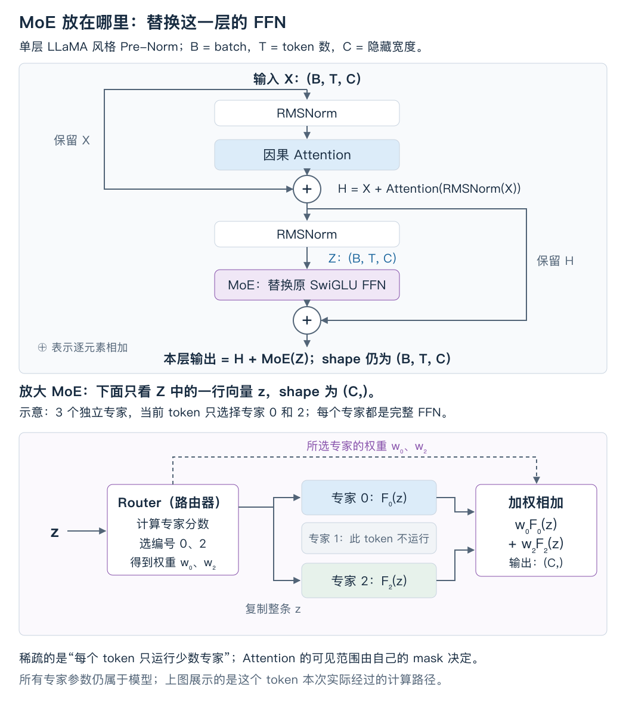
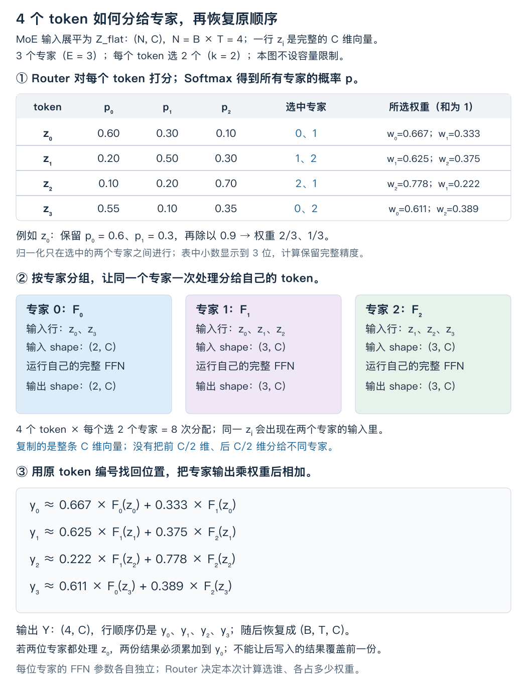
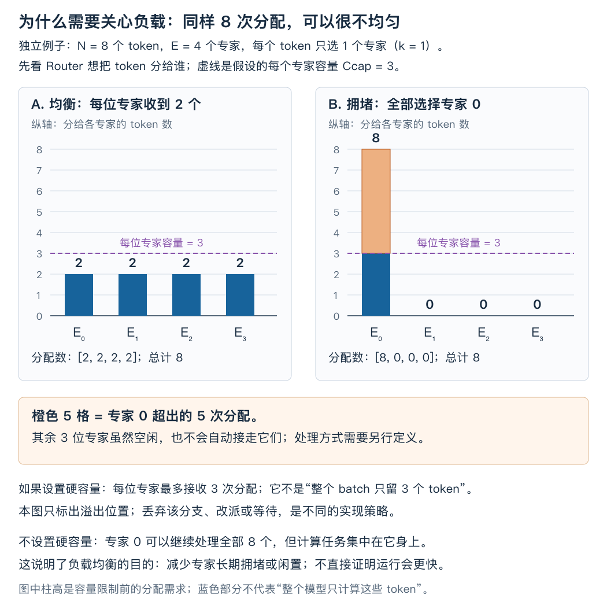

# 稀疏专家模型：参数可以很多，每个 token 只用其中一部分

在已经实现的 LLaMA 风格模型里，每个 token 经过 Attention 后，都要经过同一个 SwiGLU 前馈网络。假设想给模型增加更多参数，一个直接办法是把这个前馈网络加宽。但这样一来，**每个 token 都必须执行更大的矩阵乘法**。

能否准备多组前馈网络，让每个 token 只使用其中几组？这样模型可以保存更多参数，而单个 token 不必把它们全部算一遍。这就是本课要建立的计算过程。

**专家（expert）是一组独立参数的前馈网络；路由器（router）根据当前 token 的表示决定使用哪些专家；MoE（Mixture of Experts，混合专家）把选中专家的输出加权合并。** 每个 token 只使用少数专家时，称为稀疏 MoE。

这里的“稀疏”指参与计算的专家少。被选中专家内部的矩阵仍然可以是普通稠密矩阵。

阅读路线：[放进模型](#1-先把-moe-放回已经学过的模型) → [选择专家](#3-路由器怎样选出专家) → [分组与合并](#4-怎样真正少算以及怎样放回原位置) → [梯度](#5-没有正确专家标签路由器怎么学) → [负载与容量](#6-所有-token-都挤向同一个专家会怎样) → [成本](#8-参数变多了到底省了什么)。

本课主例采用 **Top-2、选中专家内重新归一化、不丢弃 token 的路由**。Top-2 就是每个 token 选择得分最高的两个专家。后面为解释负载均衡，会单独切换到 Top-1 例子，并明确区分两种规则。

## 1. 先把 MoE 放回已经学过的模型

看已有的 [LlamaBlock](../exercises/ex013_llama_style/model.py)：Attention 子层结束后，代码执行的是：

```python
x1 = x + grade             # grade：Attention 合头、经过 Wo 后的输出
n2 = self.norm2(x1)         # 第二次 RMSNorm
x2 = x1 + self.ffn(n2)      # 逐 token 的 SwiGLU，以及残差相加
```

`x` 是这一层的输入，`x1` 是 Attention 残差相加后的表示。它们和 `n2、x2` 的 shape 都是 `(B,T,C)`：`B` 是 batch 大小，`T` 是本次处理的 token 数，`C` 是每个 token 的特征宽度。

本课把 `self.ffn(n2)` 这个位置换成 MoE。先不改变 Attention、RoPE、KV Cache 和两条残差连接。



图中的 `H` 对应代码里的 `x1`，`Z` 对应 `n2`。MoE 接收归一化后的 `Z`，返回同 shape 的增量，最后与 `H` 相加。专家输出合并是加权求和，不是沿特征轴拼接。放大图中，从 Router 指向专家的实线表示按选择分发原向量 `z`，传过去的不是路由分数。

这张图也说明了三件容易混淆的事：

- **选专家的单位是当前层的一个 token。** 一句话中的不同 token 可以选择不同专家；同一个 token 在不同层也可以选择不同专家。
- **每个专家只处理送给它的 token 向量。** 把多个 token 一起送进去，是批量执行 FFN，不会像 Attention 那样让这些 token 互相读取。
- **专家看到的向量已经包含上下文。** 路由器用的是 `Z[b,t,:]`，并非直接拿原始 token ID 查一个固定“专家编号表”。因此同一个词出现在不同上下文，可能走不同路径。

本课使用常见的逐 token FFN 专家形式。Mixtral 的结构也是在 FFN 位置使用多个 SwiGLU 专家，并按 token、按层选两个专家；“专家”不代表预先贴好“数学”“中文”等标签的完整聊天模型。[Mixtral 原论文 §2.1、§5](https://arxiv.org/html/2401.04088v1#S2.SS1)

## 2. 一位专家究竟是什么

固定一个 batch 和一个 token，从 `Z` 取出行向量 `z = Z[b,t,:]`，shape 为 `(C,)`。第 `e` 个专家记为 `F_e`，沿用已学过的无偏置 SwiGLU：

$$
F_e(z)=\left[\operatorname{SiLU}(zW_{g,e})\odot(zW_{u,e})\right]W_{d,e}.
$$

其中 `W_g,e` 和 `W_u,e` 的 shape 都是 `(C,F)`，`W_d,e` 为 `(F,C)`，`F` 是专家内部的中间宽度；`⊙` 表示逐元素相乘。每位专家的输入和输出都是 `(C,)`。

不同专家具有相同的结构，但各自保存参数，也各自接受训练。同一个专家的参数在送给它的所有 token 之间共享。若所有专家永久共用同一组参数，并且输出权重之和为 1，那么无论怎么路由，加权结果都会退化成同一个 FFN 的结果，无法得到多组参数的作用。

还有两个不同层级的“门控”：

| 出现位置 | 决定什么 | 作用的对象 |
|---|---|---|
| SwiGLU 内部的 gate 分支 | 哪些中间特征被放大或抑制 | 一个专家内部的 `F` 个特征 |
| MoE 路由器给出的 gate 权重 | 哪些专家参与，各占多少权重 | `E` 个候选专家 |

下面用 `E` 表示专家总数，专家编号为 `0 … E-1`；用 `k` 表示每个 token 选几个专家，满足 `1 ≤ k ≤ E`。

## 3. 路由器怎样选出专家

### 3.1 先给每位专家一个分数

把 `Z: (B,T,C)` 的前两轴合并为 `Z_flat: (N,C)`，这里没有 PAD，`N=B×T`。第 `n=b×T+t` 行仍然是原来那个 token，合并轴没有混合它们的内容。

准备一张可训练的路由矩阵 `W_r: (C,E)`。和词表输出层类似，做一次投影就能得到每个 token 对每个专家的分数：

$$
R=Z_{\mathrm{flat}}W_r,\qquad R\in\mathbb{R}^{N\times E}.
$$

第 `n` 行 `R[n,:]` 是这个 token 的 `E` 个路由分数，又叫路由 logits。它们不是专家输出，也不是“这个专家答对题目的概率”。

对每一行做 Softmax，得到方便观察的偏好权重：

$$
p_{n,e}=\frac{\exp(R_{n,e})}{\sum_{j=0}^{E-1}\exp(R_{n,j})}.
$$

`p` 的 shape 为 `(N,E)`，每行和为 1。这里 Softmax 沿**专家轴**计算；Attention 的 Softmax 沿可读取的 **key 轴**计算，两者不是同一张表。

### 3.2 只保留分数最高的 k 个专家

本课固定 `N=4、E=3、k=2`。下面直接给定路由概率，便于看清选择过程；它是一组可独立核对的路由样例，不声称由某个已训练的 `W_r` 产生。

| token 行 | 专家 0 的概率 | 专家 1 的概率 | 专家 2 的概率 | 选中的专家（按分数从高到低） |
|---|---:|---:|---:|---|
| 0 | 0.60 | 0.30 | 0.10 | 0、1 |
| 1 | 0.20 | 0.50 | 0.30 | 1、2 |
| 2 | 0.10 | 0.20 | 0.70 | 2、1 |
| 3 | 0.55 | 0.10 | 0.35 | 0、2 |

Softmax 不改变同一行的大小顺序，所以从 `R` 选 Top-k 和从 `p` 选 Top-k 会选中相同专家。分数并列时，需要另外约定选择规则；本例没有并列。

### 3.3 为什么选完还要重新除一次

看 token 0：选中的原概率是 `0.6、0.3`，和是 `0.9`。本课约定选中专家的合并权重之和为 1，所以把它们分别除以 `0.9`：

$$
w_{0,0}=\frac{0.6}{0.6+0.3}=\frac23,\qquad
w_{0,1}=\frac{0.3}{0.6+0.3}=\frac13.
$$

这就是此处的**归一化：用总和去除每一项，使保留下来的权重加起来为 1**。它和前面的 RMSNorm 是不同操作；这里没有调整 token 的特征向量。

为什么要明确这一点？假设两个选中专家刚好都输出 `[3,6]`：

- 用 `0.6、0.3` 合并，结果是 `[2.7,5.4]`，整体被乘了 `0.9`。
- 用 `2/3、1/3` 合并，结果仍是 `[3,6]`。

两种规则会得到不同计算，必须在实现前选定。**重新归一化是本课采用的设计，不是所有 MoE 都必须遵循的定律。** 第 5 节会看到保留原概率的 Top-1 方案。

设 `S_n` 是 token `n` 选中的专家编号集合。完整公式为：

$$
w_{n,e}=\frac{p_{n,e}}{\sum_{j\in S_n}p_{n,j}}
=\frac{\exp(R_{n,e})}{\sum_{j\in S_n}\exp(R_{n,j})},\qquad e\in S_n.
$$

第二个等号是因为原 Softmax 的共同分母在分子、分母中抵消了。因此可以**先取 Top-k 分数，再只在这 k 个分数上做 Softmax**，直接得到同样的合并权重。实际 Softmax 会使用减最大值的稳定写法。

对应的核心代码只有两步。这里 `scores` 就是 `R`，shape `(N,E)`：

```python
selected_scores, expert_ids = torch.topk(scores, k, dim=-1)
weights = torch.softmax(selected_scores, dim=-1)
```

`topk` 同时返回选中分数和它们在原专家轴上的编号，二者 shape 都是 `(N,k)`；`weights` 也是 `(N,k)`。例如 token 2 的编号是 `[2,1]`，对应权重是 `[7/9,2/9]`，不能把第一个权重误当成专家 0 的权重。[PyTorch `topk`](https://docs.pytorch.org/docs/2.14/generated/torch.topk.html)

## 4. 怎样真正少算，以及怎样放回原位置

### 4.1 一个 token 被送给两位专家，送过去的是什么

送过去的是同一条完整的 `C` 维向量。以 token 0 为例：

$$
y_0=\frac23 F_0(z_0)+\frac13 F_1(z_0),\qquad y_0\in\mathbb{R}^{C}.
$$

两位专家各处理完整的 `z_0`，各返回一条 `(C,)` 向量，再逐元素加权相加。不会把 `z_0` 的前半维给专家 0、后半维给专家 1，也不会把两条输出拼成 `2C` 维。

沿用上节的四个 token：



图中先按 token 看“我要去哪”，再按专家看“谁送给了我”。这是同一批分配关系的两种排列方式。一个 token 出现在两组里，是因为它选择了两位专家；每一组仍然保留原 token 行号。

### 4.2 把发给同一专家的 token 放在一起算

逐 token 调用专家可以解释数学，但会产生很多小调用。按专家组织时：

| 专家 | 收到的原 token 行号 | 专家输入 shape | 专家输出 shape |
|---|---|---|---|
| 0 | `[0,3]` | `(2,C)` | `(2,C)` |
| 1 | `[0,1,2]` | `(3,C)` | `(3,C)` |
| 2 | `[1,2,3]` | `(3,C)` | `(3,C)` |

“分发”（dispatch）就是按这个表收集输入并送给专家。三位专家一共处理 `2+3+3=8` 行，即 `N×k` 行；若所有 token 都经过全部三个专家，则要处理 `N×E=12` 行。

专家 1 一次接收三行，只是让这三行分别乘同一组专家参数。**不是把三个 token 聚合成一个 token 再处理。**

这和上一课的“先算完整 Attention，再 mask 不会省掉已执行乘法”有同样的执行边界：如果先算了全部 `E` 个专家对全部 `N` 个 token 的输出，最后才把未选专家乘零，数学结果可以正确，但这部分计算没有被跳过。

### 4.3 合并必须累加，不能覆盖

专家计算完成后，“合并”（combine）包括两步：乘上对应的路由权重，再加回原 token 的输出行。

例如专家 0 给原 token 0 的贡献先写入 `Y[0]`，随后专家 1 也要给 `Y[0]` 加一份。若第二次直接赋值覆盖，第一份贡献就没了。

PyTorch 的 `index_add` 可以表达这件事。设 `token_rows: (M,)` 保存当前专家收到的原行号，`contributions: (M,C)` 已乘上各自权重，`Y: (N,C)` 是累加结果：

```python
Y = Y.index_add(0, token_rows, contributions)
```

第一个参数 `0` 表示沿 token 行轴累加。它按 `token_rows` 把 `contributions` 的每行加到 `Y` 的指定行，返回新张量。最后把 `Y` 恢复为 `(B,T,C)`，才能接回块中的残差相加。[PyTorch `index_add`](https://docs.pytorch.org/docs/2.14/generated/torch.Tensor.index_add.html)

### 4.4 用能手算的专家跑完整个过程

暂时把复杂的 SwiGLU 换成三条小函数，只检查路由与合并：

```text
F0(z) = z       F1(z) = 2z       F2(z) = -z
z0 = [1,0]     z1 = [0,1]       z2 = [1,1]     z3 = [2,1]
```

这些函数是数值演示用的替身，不具有真实专家的可训练参数。沿用同一张概率表：

| token | 对选中专家的加权和 | 最终输出 |
|---|---|---|
| 0 | `(2/3)z0 + (1/3)(2z0)` | `[4/3, 0]` |
| 1 | `(5/8)(2z1) + (3/8)(-z1)` | `[0, 7/8]` |
| 2 | `(7/9)(-z2) + (2/9)(2z2)` | `[-1/3, -1/3]` |
| 3 | `(11/18)z3 + (7/18)(-z3)` | `[4/9, 2/9]` |

这组数据可用末尾的文内算例核对；分组实现也应得到相同结果。

## 5. 没有“正确专家”标签，路由器怎么学

前面把概率表写死是为了看清过程。在真实模型中，概率来自可训练的 `W_r`。训练数据通常只给“下一 token 是什么”，不提供“本层应该选专家 2”这样的标签。

已有的语言模型损失仍然能沿着输出往回传：

1. 专家输出改变这一层的表示，进而改变最终的词表 logits 和损失。
2. 合并权重改变两位专家各占多少，也会改变最终损失。
3. 因此选中的专家参数，以及产生合并权重的路由器参数，都可能得到梯度。

### 5.1 专家编号不可导，选中分数仍然可以有梯度

固定一个 token，并固定一小段“Top-2 仍选中同两位专家”的分数变化范围。把两位专家对它的输出记为向量 `a、b`，两项权重记为 `w1、w2`，则：

$$
y=w_1a+w_2b,\qquad w_1+w_2=1.
$$

设选中的两个路由分数是 `r1、r2`。对第一个分数求导时，专家输出保持不变，由 Softmax 可得：

$$
\frac{\partial w_1}{\partial r_1}=w_1w_2,\qquad
\frac{\partial w_2}{\partial r_1}=-w_1w_2,
$$

所以：

$$
\frac{\partial y}{\partial r_1}=w_1w_2(a-b).
$$

这条式子解释了学习信号从哪里来：**两位专家给出的结果有差异时，调整混合比例会改变输出；下游损失再决定这个变化是好是坏。** 若 `a=b`，本次调整比例不改变输出，这条路的梯度就是零。

`topk` 返回的整数编号不提供“换一个编号”的普通梯度，但选中分数进入 Softmax 后保留求导路径。不能因此断言整个路由器完全不能训练。

本课在选中项内重新归一化，所以对当前 token 而言，未选中分数在选中集合不变的局部范围内，不通过这项主任务计算得到梯度；未选中专家的参数也不通过这个 token 的专家分支得到梯度。

这两类对象要分开看：未选中的**路由分数**，仍可能通过第 6 节对全部专家概率计算的辅助项得到梯度；路由矩阵也会被其他 token 的信号更新。当前层未被这个 token 选中的**专家参数**，则可以从其他送给它的 token 获得主任务梯度。后面的负载辅助项直接训练的是路由器，不会直接训练当前层没有参与计算的专家。

### 5.2 一个需要明确的 Top-1 陷阱

如果把上面的 `k` 直接改成 1，又继续对选中项做 Softmax：

$$
w=\frac{\exp(r)}{\exp(r)}=1.
$$

这一个权重永远是 1，主任务不能通过“调整合并权重”训练路由器。在硬选择不变的区间里，输出就是选中专家的输出。

一种不同的 Top-1 设计是：先对全部专家分数做 Softmax，选中专家 `e*` 后，**保留它原来的概率**：

$$
y=p_{e^*}F_{e^*}(z).
$$

因为 `p_e*` 会随分数变化，主任务仍能沿这条乘法路径训练路由器。Switch Transformer 采用这种单专家带权输出。它与本课 Top-2 的重新归一化规则不同，不能只改 `k` 就假定训练行为也相同。[Switch 原论文 §2.1](https://www.jmlr.org/papers/volume23/21-0998/21-0998.pdf)

## 6. 所有 token 都挤向同一个专家，会怎样

现在引入一个新的、专门看负载的例子：`N=8、E=4、k=1`。这里的**负载**就是每位专家收到多少条 token 分配。



两边都只有 8 次专家计算，但分布不同：

- `[2,2,2,2]`：每位专家处理两条。
- `[8,0,0,0]`：专家 0 处理八条，其余专家没有收到 token。

这产生两个具体问题。训练时，长期很少收到 token 的专家缺少来自主任务的训练信号；执行时，若专家分布在多张设备上，处理八条的那张设备可能拖住其他设备。单设备执行也可能因分组大小差异影响效率，但仅凭负载表不能推断耗时。

希望路由兼顾两件事：给 token 选择有用的专家，也避免大部分输入长期挤向少数专家。**均衡不要求同一个 token 平均使用所有专家。** 后者会把稀疏计算变回全部专家参与；我们关心的是一批 token 的总体分配。

### 6.1 为什么只统计人数还不够

把人数记为 `n_e`，它取决于硬选择。分数稍微变化而最高分专家没变时，人数也完全不变。直接把这个计数放进损失，普通反向传播无法知道该怎样小幅调整路由分数。

所以同时观察两个量：

- `f_e`：实际有多少比例的 token 选择了专家 `e`。
- `P_e`：路由器平均给专家 `e` 分配了多少概率。

在当前 **Top-1、容量裁剪之前** 的统计中：

$$
f_e=\frac1N\sum_{n=0}^{N-1}\mathbf{1}[\operatorname{argmax}_j p_{n,j}=e],
\qquad
P_e=\frac1N\sum_{n=0}^{N-1}p_{n,e}.
$$

`1[条件]` 在条件成立时为 1，否则为 0。这里的 `p` 是对全部 `E` 个专家的 Softmax，`f、P` 都是 `(E,)` 向量，且各自的元素之和为 1。

`f` 告诉我们“谁已经很忙”，`P` 则能连续变化并提供梯度。Switch 的负载均衡辅助项使用二者的乘积和。本课把它与主任务的权重分开写：

$$
L_{\mathrm{balance}}=E\sum_{e=0}^{E-1}f_eP_e,
\qquad
L=L_{\mathrm{task}}+\lambda L_{\mathrm{balance}}.
$$

`L_task` 是原来的语言模型损失，`λ` 是控制辅助项影响大小的系数。对多层 MoE，需要明确各层辅助项是求和还是平均，再设置系数。[Switch 原论文 §2.2](https://www.jmlr.org/papers/volume23/21-0998/21-0998.pdf)

### 6.2 这个乘积为什么能推动路由变化

反向传播时把硬计数 `f` 当作固定统计量，梯度经过 `P` 回到路由器。先对 `P_e` 求导：

$$
\frac{\partial L_{\mathrm{balance}}}{\partial P_e}=Ef_e.
$$

某个专家的实际占比 `f_e` 越大，继续给它增加平均概率的代价就越高。再考虑 `P` 来自每行 Softmax，对某个路由分数的完整局部梯度为：

$$
\frac{\partial L_{\mathrm{balance}}}{\partial R_{n,e}}
=\frac EN p_{n,e}\left(f_e-\sum_j p_{n,j}f_j\right).
$$

括号里是在比较：“这位专家的负载”和“当前 token 按概率加权看到的平均负载”。如果前者更高，梯度下降会倾向于降低它的分数；如果更低，则有相反的倾向。**梯度先改变概率，概率变化足够大时，下一次前向的硬选择才可能改变。**

用四位专家做两个数值对照：

| 情况 | 实际占比 `f` | 平均概率 `P` | `L_balance` |
|---|---|---|---:|
| 均衡的例子 | `[.25,.25,.25,.25]` | `[.25,.25,.25,.25]` | `1` |
| 明显拥堵的例子 | `[1,0,0,0]` | `[.85,.05,.05,.05]` | `3.4` |

第一个例子可以由每个 token 都有明确偏好、不同 token 分别偏好不同专家得到，并不需要每一行概率都相等。`1` 是这个均衡例子的参考值，**不要把它当成所有可行分布的严格下界，或把辅助项降到某值当成路由已经合格的证明**。还要直接检查人数、空闲专家和溢出情况。

这个辅助项只鼓励均衡，不保证每个 batch 都平均，也不代替主任务。`λ` 太大时，模型可能过分在意平均分配，损害原任务的学习。

本节专门使用 Top-1 推导。若改为 Top-k，并想统计“分配次数占比”，分母应当是 `N×k`；若仍除以 `N`，各专家占比之和会是 `k`。实现时必须先说清计数口径，不能把上述公式不加说明地搬过去。

## 7. 专家装不下时怎么办

一些实现给每位专家预留固定大小的输入缓冲区。**专家容量**就是在本次路由的一组 token 中，每位专家最多接收多少条分配，记为 `C_cap`。它与特征宽度 `C` 是两个不同的量。

在无 PAD、每个 token 选 `k` 位专家的计数约定下，平均分配量为 `Nk/E`。本课用下面的教学约定说明容量因子：

$$
C_{\mathrm{cap}}=\left\lceil\alpha\frac{Nk}{E}\right\rceil.
$$

`α` 是容量因子，表示在平均分配量上留多少余量，`ceil` 表示向上取整。不同系统还可能使用不同路由分组、最小容量、对齐或计数规则，读实现时要核对。

上图 `N=8、E=4、k=1、α=1.5`，所以每位专家容量是 `3`。均衡时每位只收到两条，装得下；拥堵时专家 0 收到八条，超出五条。**其他专家有空位，并不会自动把这五条重新分配过去。**

系统必须明确处理策略：

| 选择 | 会发生什么 | 代价或语义 |
|---|---|---|
| 丢弃超容量的专家分支 | 这些分配不经过对应专家 | 改变输出；须说明保留哪个分配、剩余权重是否重归一化 |
| 转给其他专家 | 需要额外路由规则 | 选中的函数发生变化 |
| 不丢弃，按实际数量处理 | 忙的专家处理所有分配 | 需要支持变长分组，承担负载和存储压力 |

对 Top-1，如果采用“超容量就跳过本次 MoE 分支”，该位置的 MoE 增量为零，块输出仍有残差 `H`。这不是从序列里删除这个 token，也不是把它从损失中删掉。Switch 论文描述了这种残差保留方式。[Switch 原论文 §2.2](https://www.jmlr.org/papers/volume23/21-0998/21-0998.pdf)

本课主例和文内算例选择**不设容量上限、不丢弃分配**，以便先验证路由数学。MoE 并非必须丢 token；例如 MegaBlocks 研究用块稀疏计算处理不均匀分配，避免为了固定形状而丢弃或大量补空位。[MegaBlocks 原论文](https://arxiv.org/abs/2211.15841)

容量限制还会引入一个接线问题：如果“谁被丢弃”依赖同一组里的其他 token，那么改变 batch 或把整段计算改成逐 token decode，可能改变一个位置得到的专家分支。若希望缓存生成与全量前向对齐，应先固定确定性的路由规则、关闭噪声并采用不丢弃的方案验证；不能只因为两个入口用了同一套参数就断言等价。

## 8. 参数变多了，到底省了什么

先只计算一层 MoE 子层，所有专家使用相同的 `C、F`，无 bias。一个 SwiGLU 专家有三张矩阵，因此参数量为：

$$
P_{\mathrm{expert}}=CF+CF+FC=3CF.
$$

加上路由矩阵，全部参数量和单个 token 前向使用的参数量分别是：

$$
P_{\mathrm{total}}=E\cdot3CF+CE,
\qquad
P_{\mathrm{active/token}}=k\cdot3CF+CE.
$$

这里所有 `E` 位专家都要被路由器评分，因此 `CE` 全部参与；只执行 `k` 位专家的 FFN。其他共享组件如 Attention、归一化、embedding 和词表输出层，算整模型时要另外加上。

沿用已经学过的“一次乘加计 2 FLOPs”口径，只统计前向矩阵乘法，单个 token 的 MoE 成本约为：

$$
\operatorname{FLOPs}_{\mathrm{MoE/token}}=6kCF+2CE.
$$

这个式子没有包含 SiLU、逐元素乘法、Softmax、Top-k、分发与合并，也不是总耗时。

用小尺寸 `C=4、F=8` 做一个可以复算的对照：

| 子层配置 | 全部参数 | 每个 token 使用的参数 | 每个 token 的矩阵乘法 FLOPs |
|---|---:|---:|---:|
| 一个普通 SwiGLU | `96` | `96` | `192` |
| `E=4、k=2` 的 MoE | `400` | `208` | `416` |
| `E=8、k=2` 的 MoE | `800` | `224` | `448` |

从第二行到第三行，专家数翻倍，但每个 token 仍只算两个专家。增加的是保存的专家参数和路由开销，专家 FFN 的主要算术量保持不变。与此同时，第二行比第一行算得更多：**MoE 的稀疏性，是相对于把全部专家都执行一遍而言；不能据此声称它比一个同宽 FFN 更省计算。**

它提供的是一种设计空间：在不同比例的总参数和每 token 计算量之间做选择。是否比某个更宽的稠密模型效果好，要在具体训练和评测中验证。

### 8.1 活跃参数少，不代表只需要保存这些参数

token 0 可能选择专家 0、1，下一个 token 可能选择 1、2。同一个 batch 也可能覆盖全部专家。因此普通的常驻权重实现仍需要保存全部专家参数。将专家分布到不同设备，或暂存在别处再搬入，是额外的存储与执行设计。

同样，训练时专家权重、梯度、优化器状态的实际存储取决于实现与分片方式，不能直接按 `k/E` 把全部训练内存打折。MoE 本身也不改变 Attention 的 KV Cache 字节公式。

### 8.2 为什么理论少算，运行却不一定更快

一次 MoE 前向除了专家矩阵乘法，还需要：路由评分、Top-k、按专家整理输入、计算若干大小不同的矩阵、把结果加回原位置。如果专家分在不同设备，还要把 token 表示送过去，再把专家输出送回来；这种按专家分布权重和计算的方式叫**专家并行**。

当每位专家只收到少量 token 时，矩阵很小，调用和搬运开销可能占比很高；负载不均还可能让设备互相等待。要比较速度，需要固定模型与输入条件并实际计时，不能用活跃参数比例直接换算加速比。本课的推导和文内算例用于理解数学，不提供 GPU 性能结论。

## 9. 接回模型时，要保留哪些边界

现在回到第一张图，可以把本课要替换的位置写成接口草图：

```python
# h 来自当前块的 Attention 残差输出，shape (B,T,C)
z = norm2(h)
moe_delta, router_stats = moe(z)
next_hidden = h + moe_delta
```

`moe_delta` 是 `(B,T,C)`；`router_stats` 是路由统计，用于观察负载、计算辅助损失。上面是接线草图，仓库原 `LlamaBlock` 本次没有被替换。

实现时真正容易悄悄算错的地方有：

| 边界 | 应怎样处理 |
|---|---|
| 同一专家被多个 token 使用 | 共享该专家的参数，逐行独立计算 |
| 某个专家本次没人选择 | 跳过它的空输入；允许没有本次主任务梯度 |
| 一个 token 选择多个专家 | 保留每次分配的原行号与权重，回写时累加 |
| 注册参数 | 专家用 `nn.ModuleList` 等模块容器登记，路由矩阵也必须被登记；否则可能漏优化、漏保存 |
| 有 PAD 的 batch | 用有效 token 掩码决定谁参加路由和负载统计；不能把“没计语言模型 loss 的真实上下文 token”也当成 PAD |
| 训练 | 主任务 loss 加上已选定的辅助项，保留路由权重与专家输出的计算图 |
| 推理 | 仍要执行路由和专家；通常无需计算辅助 loss，但可保留负载统计 |

原模型使用 KV Cache 时，MoE 处理的是本次新增位置的表示；不会因为新增 MoE 就需要重新计算所有历史位置的专家输出。在固定权重、确定性、无丢弃且逐 token 路由的条件下，路由本身不增加 token 之间的读取依赖。

## 10. 跑一次，把公式和实际张量对上

下面的片段可直接复制到已安装 PyTorch 的 Python 环境，使用 CPU、float64 核对第 3、4 节的数值：

```python
import torch

z = torch.tensor([[1, 0], [0, 1], [1, 1], [2, 1]], dtype=torch.float64)
p = torch.tensor([[.6, .3, .1], [.2, .5, .3],
                  [.1, .2, .7], [.55, .1, .35]], dtype=torch.float64)
selected, ids = p.log().topk(2, dim=-1)
w = selected.softmax(dim=-1)
# F0(z)=z、F1(z)=2z、F2(z)=-z，只为检查路由而设置。
scales = torch.tensor([1., 2., -1.], dtype=torch.float64)
y = (w * scales[ids]).sum(dim=-1, keepdim=True) * z
expected = torch.tensor([[4/3, 0], [0, 7/8], [-1/3, -1/3],
                         [4/9, 2/9]], dtype=torch.float64)
torch.testing.assert_close(y, expected)
print(ids)
print(y)
```

`p.log()` 构造一组能还原这张概率表的分数；`scales[ids]` 取出选中玩具专家的倍率。真实专家是独立的非线性网络，不能普遍简化为这种倍率合并。这段代码只验证有限数值，不训练专家分工，也不说明运行速度。

### 可选的三个理解检查

读完后再用它们检查理解即可，不需要每节停下来作答。

1. **先全算再选择：** 有 8 位专家，每个 token 只选 2 位。代码却先算出全部 8 位专家的输出，再取其中 2 份合并。输出可能正确吗？专家计算量有没有降到只算 2 位？
2. **回写覆盖：** 一个 token 的两个专家输出分别是 `[2,0]`、`[0,4]`，合并权重为 `0.25、0.75`。代码先写第一份贡献，再用赋值覆盖成第二份贡献。正确输出应该是什么？错误代码会丢掉哪一份？
3. **总量相同为何仍有麻烦：** 8 个 token 各选一位专家，四位专家的负载为 `[8,0,0,0]`，每位容量为 3。只把容量扩大到 8，解决了什么？哪些训练和执行问题还在？

后续若制作完整练习，用同一份玩具层集中核对：选择与权重、分组回写、没有收到输入的专家、输入及参数梯度、负载统计与保存恢复。无需重新考已经通过的 Attention 或基础 shape 操作。

本课对应 `modern.moe`。前提是已有 FFN 和损失知识，SwiGLU 与 LLaMA 块用于接线。本次交付是讲义、图解和文内算例，尚不构成新的掌握证据。
