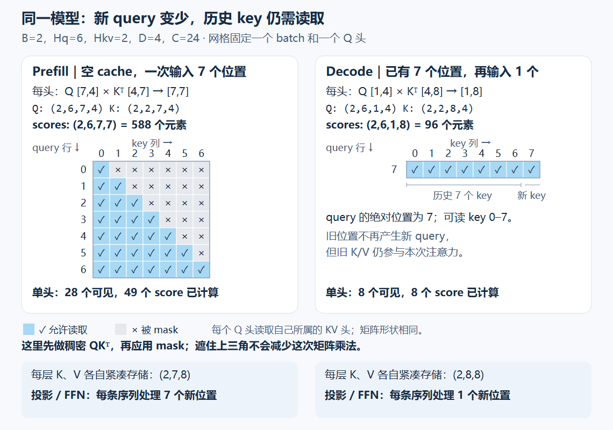

# 从“模型算对了”到“解释它为什么这样快、这样占内存”

上一课已经把 RMSNorm、RoPE、SwiGLU 接入你自己的 GQA 模型，并完成训练、缓存和保存恢复。这一课继续使用 [ex013 的模型](../exercises/ex013_llama_style/model.py)，沿着同一次请求走完：**先数它必须做的计算与保存的数据，再测这段执行，最后用算子记录解释两者为何不成比例。**

参数、计算量、存储、计时、profiling 在这里是一条因果链。我们不重讲已通过的组件原理，也不要求先学 CUDA 编程。后续把本课内容放进一份综合实验中实现和验收。

## 1. 先固定：这次到底让模型做什么

“这个模型一次前向多贵”没有唯一答案。参数相同，处理七个新位置和只处理一个新位置，工作量已经不同。

沿用上一课的主体尺寸，仅把这份诊断输入的词表设为 17：

| 符号 | 本课值 | 对象 |
|---|---:|---|
| B | 2 | 一批两条等长、无 PAD 的序列 |
| C | 24 | 主干特征数 |
| Hq / Hkv | 6 / 2 | 查询头数 / KV 头数 |
| D | 4 | 每头特征数，C=Hq×D |
| K | 8 | 紧凑 KV 投影宽度，K=Hkv×D；此处 K 是宽度整数 |
| G | 64 | SwiGLU 中间宽度 |
| ℓ | 2 | 块的层数 |
| N | 17 | 词表大小，内容表与输出矩阵不共享 |
| t / n / S | 随调用变化 | 调用前历史长度 / 本次新增长度 / 追加后长度，S=t+n |

以下 K 张量写作 `K_tensor`，避免与宽度 K 混淆。权重与浮点中间量都用 CPU float32，每元素 4 字节；ID 为 int64，布尔 mask 每元素 1 字节。模型不加 bias、不使用 Dropout，位置来自 RoPE，容量设为 32。

一次请求的两个阶段如下：

- **prefill**：空缓存接收七个 token，t=0、n=7、S=7。七个位置都要过各层，建立 KV；最后一个位置的 logits 可用于选出第一个新 token。
- **单步 decode**：缓存已有七个位置，只送进接下来一个 token，t=7、n=1、S=8。这个新位置仍要过全部层，并读取已有 KV。

这里是对模型调用的分析。计时输入可以是预先固定的合法 ID；不必把随机采样、文字处理和网络响应都塞进来。



图内的网格固定一个 batch 和一个 query head，行对应 query，列对应 key；图旁的 Q/K 是拆头布局 (B,H,n或S,D)，底部持久 KV 则是拆头前布局 (B,S,Hkv×D)。每个 Q 头读取自己所属的 KV 头。这次变化的是“本次有几行要算”，不是把模型的参数删掉了。

## 2. 从矩阵乘法得到计算账本

你已经能读懂矩阵乘法的配对关系。现在多问一步：为了得到所有输出元素，执行了多少乘加？

先看 `A:(M,K0) @ W:(K0,N0)`。每个输出是 K0 项乘积之和，共 M×N0 个输出。严格逐项计数是每个输出 K0 次乘法、K0−1 次加法；性能账本惯例按 **一次乘加算 2 FLOPs**，写成：

```text
主要浮点操作数 ≈ 2 × M × K0 × N0
```

FLOPs 在这里指操作个数；FLOP/s 才是每秒操作数。它不是 CPU/GPU 指令条数，融合乘加仍按两个浮点操作计数。

令本次输入 `X:(B,n,C)`。线性层等价于把 B×n 个 token 放成矩阵的行；批次和 token 越多，同一份权重被用于越多行。结合当前实现，单层的矩阵乘法账本是：

| 计算 | 参与矩阵的完整 shape | 主要 FLOPs |
|---|---|---:|
| Q 投影 | `(B,n,C) @ (C,C)` | `2BnC²` |
| 新 K、V 两次投影 | 各 `(B,n,C) @ (C,K)` | `4BnCK` |
| QK 打分 | `(B,Hq,n,D) @ (B,Hq,D,S)` | `2BHq nSD = 2BnSC` |
| 权重读取 V | `(B,Hq,n,S) @ (B,Hq,S,D)` | `2BnSC` |
| 合头后的 Wo | `(B,n,C) @ (C,C)` | `2BnC²` |
| SwiGLU 三次投影 | 两次 C→G、一次 G→C，各处理 Bn 行 | `6BnCG` |

GQA 的 K/V 来源仍只有 Hkv 份；表中的 Hq 表示每个 query head 都要进行一次对应的读取，不代表缓存改成 Hq 份。是否显式复制 K/V，不改变这份稠密数学的乘加总数。

将这些项相加，再计入全部层和词表投影：

```text
F_matmul(n,S)
  = ℓ × [4BnC² + 4BnCK + 4BnSC + 6BnCG]
    + 2BnCN
```

这是**当前前向的主要矩阵乘法量**。它不含 RMSNorm、RoPE、Softmax、SiLU、残差、mask、查表、数据复制和 Python 调用；这些没有消失，只是不能混称为“全部精确 FLOPs”。也不能直接拿它代表一次带反向和 Adam 更新的训练步。

### 2.1 缓存省下了什么，又保留了什么

两种调用都用同一份公式，只改变 n、S：

| 当前模型的主要矩阵 FLOPs | prefill：n=7，S=7 | decode：n=1，S=8 |
|---|---:|---:|
| 每层 Q/K/V/O 与 SwiGLU | 172032 | 24576 |
| 每层 QK 与 AV | 9408 | 1536 |
| 两层合计，再加词表投影 | **374304 FLOPs** | **53856 FLOPs** |

decode 的投影和 FFN 只处理新位置，所以这部分降到七分之一；QK/AV 却仍读 S=8 个 key。旧 KV 避免的是历史投影及更早各层的重复计算，没有免除新 Q 读取历史。

注意：这两列完成的工作不同，**374304/53856 不能称为缓存加速比**。要比较缓存的收益，应固定“追加同一个 token 后获得最后位置 logits”这一任务：一边对长度 8 的全部前缀重算，另一边只处理新 token，并先验明两者输出一致。

### 2.2 因果 mask 为什么不让本实现自动少算一半

prefill 的每头分数是 7×7，其中仅 28 个 key-query 配对可见。但你的代码先执行完整矩阵乘法，再对不可见位置填负无穷。因此打分仍生成 49 个元素；AV 也仍是稠密乘法，零权重不会使这些乘法自动跳过。

这区分了两个对象：

- **数学可见范围**：哪些信息允许参与结果。
- **实现执行范围**：底层算子实际计算哪些元素。

以后做局部窗口和 FlashAttention，就会继续追问如何改变执行范围或中间数据的保存方式。本课先把当前实现记准。

## 3. 运算时，这些数据到底住在哪里

计算账本回答“做多少算术”，存储账本回答“哪些数据同时存在”。先按生命周期区分三类：

1. 模型权重跨请求存在。
2. 请求 KV 跨本请求的多次调用存在。
3. 分数、FFN 中间量等用于本次执行；训练时部分中间量还会为反向保留。

### 3.1 权重只是常驻数据的一部分

本模型的精确可训练参数个数为：

```text
P = 2NC + ℓ × (2C² + 2CK + 3CG + 2C) + C
  = 13224
```

两份 NC 来自内容表、独立词表投影；每层末尾的 2C 是两份 RMSNorm gamma；最后的 C 是 final RMSNorm。沿用上课的参数结构，这里把它转换成 float32 权重数据量：

```text
13224 × 4 = 52896 字节
```

做训练时，若全部参数已有同精度梯度，普通 Adam 已初始化两份同形状浮点状态 m、v，则这四组浮点张量的数据量合计是：

```text
权重 + 梯度 + m + v = 4 × 52896 = 211584 字节
```

这仍不是训练峰值：没有计入 Adam 的计步状态、保存的激活、临时工作区、对象开销等。优化器状态在首次更新前可能尚未分配，梯度清为 None 后也不再有那份活跃梯度张量。混合精度采用的存储方案可能不同，不能把“四倍”推广成所有训练的定律。

### 3.2 将 KV、分数和 FFN 中间量分开看

```text
全部层的紧凑 KV 数据 = 2 × ℓ × B × S × K × 4 字节
单层一份分数张量   = B × Hq × n × S × 4 字节
单层一份 FFN 中间量 = B × n × G × 4 字节
```

本课 prefill 结束时：

| 对象 | 有效数据字节数 |
|---|---:|
| 两层持久 KV，S=7 | 1792 |
| 某一层的一份分数，shape=(2,6,7,7) | 2352 |
| 某一层的一份 FFN 中间量，shape=(2,7,64) | 3584 |
| 输出 logits，shape=(2,7,17) | 952 |

decode 追加后，持久 KV 增至 2048 字节，而本次一份分数缩至 384 字节。缓存变大与本次分数变小，可以同时发生。

表里的“**一份**”不能丢：分数、mask 后分数、Softmax 权重可能拥有不同存储；SwiGLU 也不止一个中间张量。把某一份矩阵的大小冒充模型峰值，会漏算其他同时存活的数据；反过来把各层所有中间量静态相加，也不一定是推理峰值，因为部分数据先后使用。

在无求导推理中，旧层许多临时量可释放；训练要保留反向所需数据。不能用“相同模型、相同输入”推导训练和推理峰值相同。

### 3.3 shape 变大，不一定已经多分配内存

现在补齐之前布局问题的剩余部分：不再重做拆头，而是追踪一次 GQA 展开的存储。

固定一份 float32 连续张量 `base:(1,2,3,2)`，轴是 B、Hkv、S、D，共 12 个元素：

```python
base = torch.arange(12, dtype=torch.float32).reshape(1, 2, 3, 2)
shared = base.unsqueeze(2).expand(1, 2, 3, 3, 2)
flat = shared.reshape(1, 6, 3, 2)
```

新增的第三轴是“组内 query head”，长度 3；最后两轴仍是 S=3、D=2。这与两个 KV head 分别供三个 Q head 使用的关系一致。

- `unsqueeze` 只加轴；`expand` 用该轴 stride=0，让不同索引访问同一地址。
- `shared` 逻辑上有 36 个元素，但仍只依赖 base 的 48 字节存储。
- 这个指定布局合并 Hkv 与组内轴时，无法用一个固定步长表达“两组各重复三次”的地址顺序；`flat` 因而复制为 144 字节。

要读数，可分别用：

```python
x.numel() * x.element_size()  # 按逻辑元素数计算的数据量
x.untyped_storage().nbytes() # x 所依赖的整块底层存储大小
```

后一项可能包括切片没有使用的部分。多张量共用同一 storage 时，要去重，不能逐项相加；固定小例子可用 storage 的 `data_ptr()` 比较底层地址，且同时保留对象，避免释放后地址复用。

`view` 不会为兼容目标 shape 自动复制，步长不兼容时会报错；非连续不代表所有 view 都失败。`reshape` 可以返回视图，也可以复制；`contiguous` 在指定内存格式已连续时返回自身，否则复制。具体是否复制取决于输入步长与目标形状，不能只看操作名。[PyTorch Tensor Views](https://docs.pytorch.org/docs/2.14/tensor_view.html)

由此可以解释当前模型的两件事：

- 你的持久 KV 仍是紧凑布局；当前 GQA 用 `s_K[:, kv_indices]`、`s_V[:, kv_indices]` 按 query head 的组号做高级索引，实际创建 Hq 份临时读取数据。这不同于上面的 expand 视图例子，但同样说明：**缓存省了多少**和**整次前向省了多少内存**是两个问题。
- 当前 `LayerKVCache.append` 用 `torch.cat`。旧缓存不是原地多出一行：它要给拼接结果分配存储并复制旧、新数据；新旧存储会在执行期间短暂共存。这是未来可以测量的成本，不影响此前正确性验收。

### 3.4 底层 storage 也不是设备总占用

框架通常向设备申请内存后保留可复用的块，张量释放后未必立刻归还给驱动。在 CUDA 上，`memory_allocated` 观察活跃张量占用，`memory_reserved` 观察 PyTorch 分配器持有的内存；后者包含前者，不能把它们相加。GPU 上下文及其他库的分配又可能不在这个口径中。[PyTorch CUDA 内存管理](https://docs.pytorch.org/docs/2.14/notes/cuda.html#memory-management)

因此报告内存时写清是逻辑数据、去重 storage、活跃分配峰值还是分配器预留。CPU 本课用前两项核对对象；它们不等于进程 RSS，也不冒充 CUDA 显存峰值。

## 4. 为什么操作数少了，时间却不按比例下降

假设一个线性层需要读取同一份 `W:(C,G)`。处理一个 token 时，这份权重服务一行；同时处理多个 token 时，同一权重有机会在底层矩阵乘法中复用给多行。操作数按行数增加，但读取权重的成本不一定同倍增加。

把这种关系量化，得到**算术强度**：每传输一个字节，完成多少浮点操作。字节必须指明跨哪一级存储，例如 GPU 主存到计算单元附近的缓存；它不是把程序所有张量的 numel 简单相加。

只作理想化比较：忽略输入/输出流量，假设一份权重只读一次且每元素 s 字节，M 行线性层的“权重侧强度”约为：

```text
(2MCG FLOPs) / (CGs 字节) = 2M/s FLOPs/字节
```

这说明多行有更多复用机会，不证明实际内核一定实现了这份复用。真实访问还包括输入、输出、中间结果、缓存层级及可能的重复读取。

在同一个带宽层级上，若知道实际需要搬运的数据量 Q_bytes、持续算力 P_rate 和带宽 BW，一个粗略理想下界是：

```text
执行时间至少受 max(FLOPs / P_rate, Q_bytes / BW) 约束
```

这里取 max 是因为计算和搬运可能重叠；真实执行还有调度、同步、小算子、分配等成本，所以这个式子不是精确计时器。宣传的峰值算力也不等于当前形状能达到的持续算力。

由此才得到可验证的假设：

- prefill 的多行矩阵乘法可能更充分复用权重。
- 小 batch decode 每步新增位置少，却仍要使用权重和历史 KV，可能更受数据搬运影响。
- 本课的极小 CPU 模型还可能主要受许多小算子、Python 调用及线程管理影响。

**这是待测假设，不是给所有设备盖章。** 若只删除一个乘法项，却保留同样的复制、调度和其他算子，总时间可能变化很小。前面刻意分开的计算与存储账本，到这里才共同用于预测性能。

## 5. 先把“相同任务”测准，再谈快慢

benchmark 是在明确条件下重复测量，不是运行一次看时间。尤其你的接口会修改缓存：同一行代码执行第二遍，可能已经不是同一个工作量。

### 5.1 计时边界沿用现有接口

本课先测 CPU、float32、`eval()` 加 `torch.no_grad()` 下的模型调用。eval 管理模块行为，no_grad 管理求导；它们不是同一开关。输入、模型构造和日志输出放在计时之外。

| 指标 | 开始前状态 | 计时内容 | 结束状态 |
|---|---|---|---|
| prefill 延迟 | 每层空缓存，固定 (B,T) ID | 一次 `llama_model_step`，包括建 KV 与输出 logits | 各层长度 T |
| 固定历史单步 decode 延迟 | 每层都是同一前缀的长度 t 缓存 | 输入同一 (B,1) ID，调用一次 step | 各层长度 t+1 |
| 连续 K_step 步 decode | 同一长度 t 的起点 | 明确约定的整段模型调用循环 | 长度 t+K_step |

这里 K_step 是步数，与 KV 宽度 K 区分。当前 step 返回**本次所有位置**的 logits；prefill 也执行全部位置的词表投影。只投影最后位置可以成为后续另一实现，但不能在对比中悄悄换口径。

固定历史单步测量时，每个样本都必须恢复同一个 t。可以在计时外重新 prefill，再测一次；也可以在 no_grad 下保存历史 K/V 引用，每次交给新缓存容器。后一办法依赖当前 append 只分配新结果、不原地改历史；未来换成预分配原地写入，就得重新设计恢复方式。恢复方法会影响数据在硬件缓存中的冷热程度，也应记录。

把同一个 cache 反复追加 100 次，再把平均值叫作“t=7 的单步延迟”，是不成立的：测到的是越来越长的上下文。热身调用也会修改缓存，正式测量前同样要重置。

### 5.2 从计时 API 到可信样本

CPU 可用 `time.perf_counter()`，它给单调的高精度秒数，前后相减得到墙钟时间。先固定并记录 `torch.set_num_threads(1)` 和实际 interop 线程数，再用同一输入做热身、重复采样；热身用于避开首次初始化等一次性影响。

本课综合实验的起点可以是 10 次热身、50 个独立样本，报告中位数和第 25/75 百分位。次数是可复现起点，不保证噪声足够小；若样本很短或分布很散，再增加重复、检查后台负载，并说明调整。

`torch.utils.benchmark.Timer` 可以处理热身、线程和重复测量，对无状态小算子很方便；对会改变 KV 的调用，仍必须由你保证每次测量的初始状态一致。自动重复不会替你修正实验对象。[PyTorch Benchmark Utils](https://docs.pytorch.org/docs/2.14/benchmark_utils.html)

CPU 上函数返回通常已完成该段计算；GPU 调用则可能只把工作放进队列就返回。若未来迁移到 CUDA，普通墙钟计时要在开始前等待旧任务完成，在结束读数前等待本次任务完成；或用 CUDA events 测同一执行流上的设备时间。设备事件时间与含 Python 提交、同步的墙钟延迟不是同一个指标。[PyTorch CUDA 异步执行](https://docs.pytorch.org/docs/2.14/notes/cuda.html#asynchronous-execution)

当前练习契约是 CPU，部分 mask 构造也默认 CPU。仅执行 `model.to("cuda")` 不能作为迁移验收；若做 GPU 实验，要先验证所有输入、mask、位置、参数和缓存的设备一致及数值正确。

### 5.3 延迟、吞吐与服务指标不要混用

假设 B 条序列每次各处理一个新 token，单步平均耗时 d 秒，则这段模型调用的聚合吞吐约为 B/d 个 token/s。连续多步更适合用“总处理 token 数 / 总耗时”；报告中同时保留单步延迟，不用总吞吐掩盖每条序列的等待。

prefill 的 B×T/耗时，指**输入 token 处理吞吐**；不是输出生成吞吐。增加 batch 后总吞吐可能增加，但不能据此说每个请求延迟下降。

本课测量不含排队、分词和网络传输，所以不叫服务端到端首 token 延迟。使用固定 ID 的 decode 测量还不含实际采样与停止条件开销；若纳入这些步骤，应另起明确的计时范围。

## 6. 账本给出怀疑，profiler 找到实际执行的位置

如果公式中的 Attention 占比小，实际耗时却高，下一步不是继续猜。**profiling** 是记录一次执行里各算子的调用、输入形状和时间，帮助定位“到底执行了哪些操作”。

先在不启用 profiler 的条件下完成基准，再单独抓取少量轨迹。profiler 自身会增加开销，尤其记录 shape 和内存时，不把其中的时间直接当成正式基准。

下面只示范新 API 的连接方式；`model`、`next_ids:(B,1)`、`caches` 已在计时外准备成长度 t 的一致状态，并先完成热身：

```python
from torch.profiler import profile, ProfilerActivity, record_function

with torch.no_grad():
    with profile(
        activities=[ProfilerActivity.CPU],
        record_shapes=True,
        profile_memory=True,
    ) as prof:
        with record_function("decode_one_token"):
            logits = llama_model_step(model, next_ids, caches)

print(prof.key_averages(group_by_input_shape=True).table(
    sort_by="self_cpu_time_total", row_limit=12
))
```

`profile` 负责采集，`record_function` 给一段代码加名字，`key_averages` 按算子及可选的输入 shape 聚合。CPU total 包含子调用，self CPU 排除子调用；不能把父子各行的 total 全加起来，否则重复计算。

沿本课账本寻找具体证据：

| 在记录里寻找 | 回到代码问什么 |
|---|---|
| `mm / bmm / matmul` | 哪个输入 shape 对应投影，哪个对应 QK/AV？ |
| `cat` | 缓存追加是否复制了整个历史？ |
| `clone / copy_ / contiguous` | 哪次布局变换或临时展开分配了新数据？ |
| `softmax / masked_fill` | 稠密分数之外还产生了什么操作和中间量？ |
| 很多短小算子 | 是否存在调度与逐元素开销占比大的迹象？ |

这些是待定位的候选，不保证表中必有某个名字或排名。Profiler 的 FLOPs 选项也只是对受支持算子的公式估算，不是硬件全部操作的精确计数；不能让它替代前面的边界说明。[PyTorch Profiler](https://docs.pytorch.org/docs/2.14/profiler.html)

教师已在当前实现实跑一次本课 CPU decode（两层、t=7、n=1、float32、seed=1401、单线程）。记录中出现以下配对：

| 观察到的算子输入 | 调用次数 | 对应计算 |
|---|---:|---|
| bmm：`(12,1,4) @ (12,4,8)` | 2 | B×Hq=12 组 QK，每层一次 |
| bmm：`(12,1,8) @ (12,8,4)` | 2 | 每层一次 AV |
| index：源 shape 为 `(2,2,8,4)` | 4 | 每层各展开 K、V |
| cat | 4 | 每层分别追加 K、V |

这把公式中的 B、Hq、n、S 对上了实际算子，尚未说明谁最耗时。这里先建立历史缓存，再开始采集，因此历史分配不在采集窗口内；该记录不能独立还原完整请求的内存峰值。

profiler 看到 cat，并不自动证明 cat 是瓶颈。需要同时看它在固定任务中的耗时占比，再在后续用一项针对性改动复测。当前代码正确，先形成基线，再决定是否值得改缓存分配或临时展开。

## 7. 一份综合实验收尾

不拆成参数题、布局题、计时题三份作业。后续共同实现一份“现有 LLaMA 的成本与执行报告”，模型核心沿用已验收代码：

1. **建立账本**：对同一配置输出参数、KV、单份分数、主要矩阵 FLOPs；把逻辑量与去重底层存储分开。参数结构沿用已有证据，重点是推导每项操作量、识别复制和账本边界。
2. **测同一工作量**：分别记录 prefill、固定历史 decode；CPU 先采用 B∈{1,2}、T/t∈{8,16}、模型容量 32、其他配置不变，逐项对照。每次 decode 断言进入长度 t、退出长度 t+1；在计时外对齐同一权重下全量与增量最后 logits，float32 使用 rtol=1e-5、atol=1e-6。
3. **解释一处差异**：选一个从账本产生的假设，抓取相关算子轨迹。报告实际输入 shape、耗时口径和支持或反对假设的观察；不要求必须测出加速。
4. **自己选择一个反例**：为报告最担心的一种静默错误补一项检查，并说明错误版本为什么会失败。教师会提供基础框架和必要测试，这一项用于积累你独立选择测试的证据。

报告还需记录 CPU 型号、OS/WSL、Python/PyTorch、dtype、线程、种子、模型配置、输入长度、样本数、热身次数、计时范围、缓存恢复办法与未验证项。只改变 B 或长度时，其他条件保持一致；初始比较不混入量化、编译或新的注意力实现。

这次只保留两个贯穿实验的思考，不要求现在逐题作答：

- 一份报告说“KV 逻辑字节数减到原来的三分之一，所以峰值内存、全部设备读写和延迟也应减到三分之一”。你会从自己的张量和算子记录里找哪些证据，分别判断三种推断？
- 两份单步测量使用同一模型与 ID，一份每次恢复 t，另一份只在循环开始前恢复一次。怎样用状态断言证明它们测的不是相同工作量，而不是只比较谁的时间小？

## 复现与衔接

教师固定示例 [model_cost_probe.py](../examples/model_cost_probe.py) 核对本课小配置的参数、KV、布局复制、主要乘法计数及全量/分块数值一致性：

```bash
.venv/bin/python -B -m examples.model_cost_probe
```

它用于核对讲义数字，不是通用预算工具，也不包含你的性能基准答案。计时与 profiling 的综合练习待本课机制讲清后再准备；此处没有宣称已获得 GPU 加速或硬件带宽结论。

本课联合覆盖 `systems.cost-model`、`systems.benchmarking`，并在实际存储分析中补 `foundation.tensor-layout` 尚缺的复制条件解释。独立选择反例可以为 `implementation.testing-debugging` 积累新证据；不会仅凭教师测试通过自动补齐该节点。

讲义准备不改变能力状态。已有组件与缓存验收继续有效；FlashAttention、滑窗等后续改动可以用本课建立的口径比较。原版 Transformer、BERT/T5 分支仍保留在原路线中，本次不重排全局计划。
