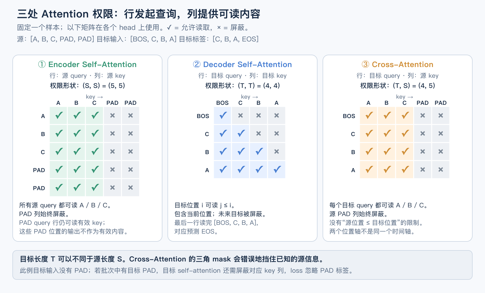

# 原版 Encoder–Decoder：读完源序列，再按需生成目标序列

这章沿着一个任务推进：输入 `A B C`，输出 `C B A`，最后生成结束标记。你已经有能读取整句的 Encoder，也有能根据前缀继续生成的 Decoder；现在要接通一条路径，让**同一个目标前缀的预测，能够因为源序列不同而改变**。

我们沿用已掌握的 MHA、FFN、LayerNorm、Post-LN、目标错位、交叉熵与训练循环。新内容集中在：源/目标角色、跨序列读取、固定正弦位置，以及这些机制的整体组合。BERT 的独立重写不是这里的先修。

## 怎么推进这一章

| 顺序 | 这一段要解决的问题 | 学完能做什么 |
|---|---|---|
| 1. 两条序列和一条预测任务 | 完整输入与尚未生成的输出，哪些信息此刻可以用？ | 把源输入、目标输入、目标标签接对，解释训练与生成的差别 |
| 2. Decoder 读取 Encoder | 同样的目标前缀，怎样根据不同源输入产生不同结果？ | 明确三处 Q/K/V 的来源，正确构造三份 mask |
| 3. 正弦位置短模块 | 如何不用可学习位置表，也给两侧输入位置身份？ | 解释频率、实现固定编码、处理位置偏移与奇数宽度 |
| 4. 接成原版结构 | 哪些积木保留，Decoder 要多出哪一个子层？ | 追踪从双侧输入到 logits、loss、反向与逐步生成的完整路径 |
| 5. 一份综合实现 | 输出正确是利用了源信息，还是只记住固定样本？ | 用权限性质、未见组合和无标签生成验证小型序列转换模型 |

第 1、2 段合在同一个例子里讲；第 3 段是进入完整原版配置前的短桥接。最后只做一份综合实现，不为每个节点分别布置重复作业。

## 1. 同一个 BOS，为什么这次应该生成 C，另一次应该生成 D？

`BOS` 是开始生成的特殊 token，`EOS` 是结束 token，`PAD` 是批处理补齐位置。它们都是词表 ID；不是矩阵运算，也不直接执行生成或停止，停止由生成循环检查 EOS 实现。

先放两条输入在一起：

| 样本 | 已经完整拿到的源序列 | 应生成的目标序列 | 生成开始时的目标输入 |
|---|---|---|---|
| 甲 | `A B C` | `C B A EOS` | `BOS` |
| 乙 | `A B D` | `D B A EOS` | `BOS` |

如果目标侧只能看 `BOS`，固定参数、关闭随机失活，两条样本的第一步输入完全相同，就会给出相同的概率分布。问题不是少了一层 FFN，而是**两条不同的源输入还没有通向预测的路径**。

一种办法是把源和目标前缀拼成一条 Decoder 输入，GPT 也可以承担条件生成。原版 Encoder–Decoder 选择另一种组织：源侧先处理完整输入，目标侧在每一层按自己的需要读取源表示。这里学的是这种结构，不是说翻译或反转只能用它。

源序列是任务已提供的条件；目标序列是要生成的结果。翻译中可以分别是中文输入和英文输出。普通无条件续写只有一条不断延长的序列；即便文本中出现两个句段，也不自动变成两套模型。

### 训练时把目标右移，生成时把模型自己的输出接回去

对于样本甲，准备完整目标记录：`[BOS, C, B, A, EOS]`。

| 目标位置 t | 送入 Decoder 的 token | 这个位置监督的下一个 token |
|---:|---|---|
| 0 | BOS | C |
| 1 | C | B |
| 2 | B | A |
| 3 | A | EOS |

这个过程就是目标右移：输入比标签落后一个 token。训练时提供真实的前缀 token，称为 **teacher forcing**。它复用了你已经实现的 next-token 训练，只是现在额外有一份源输入。

训练时整个目标记录已知，可以一次送入 `[BOS,C,B,A]`，用因果 mask 同时计算各位置。位置 0 仍然不能读后面的 C，否则它会直接看到自己的答案。**右移和因果 mask 各有职责，二者都需要。**

生成时目标答案未知：先输入 `[BOS]`，取最后位置的预测，例如 C；再输入 `[BOS,C]`，继续取最后位置，直到 EOS 或长度上限。源输入一直是完整的 `A B C`。

源里出现 C 是允许的任务条件，不是答案泄漏。泄漏指把本来尚不可用的目标答案接进了目标前缀，或允许目标位置读取它。

### 先定位最终要接出的两条路径

下图中的 B 是 batch，S 是补齐后的源长度，T 是目标输入长度，C 是特征宽度，Nt 是目标词表大小。Encoder 的最终输出记为 `E(B,S,C)`，它保留所有源位置，不做 CLS 池化。

[放大整体结构图](assets/original-encoder-decoder/architecture.svg)

先找图里跨越两侧的箭头：它把 Encoder 的最终表示送到每一层 Decoder 的 cross-attention。下面只放大这条连接，其余积木沿用已有知识。

## 2. Cross-attention：目标位置提出查询，源位置提供候选

假设源侧补齐后为 `[A,B,C,PAD,PAD]`，所以 `S=5`；目标输入为 `[BOS,C,B,A]`，所以 `T=4`。两侧长度不相等是正常情况。

Encoder 把源输入处理成 `E(B,S,C)`。Decoder 当前这一层先做目标侧因果 self-attention，再做残差相加和 LayerNorm，得到 `U(B,T,C)`。**U 是这一层已读取目标前缀的状态，不是原始 token ID，也不是上一层的最终输出直接跳过 self-attention。**

接下来使用这一层 cross-attention 自己的三份投影参数：

~~~python
Q = U @ Wq_cross    # (B,T,C) @ (C,C) → (B,T,C)
K = E @ Wk_cross    # (B,S,C) @ (C,C) → (B,S,C)
V = E @ Wv_cross    # (B,S,C) @ (C,C) → (B,S,C)
~~~

这里暂时省略偏置，只突出数据来源。Q 描述每个目标位置要读取什么，K 用来给源位置打分，V 是最后按权重组合的源特征。三者都需要通过训练形成适合任务的表示，不是人为规定哪个头负责哪个词。

H 个头、每头 `D=C/H`，拆头后的完整形状是：

~~~text
Q: (B,H,T,D)
K: (B,H,S,D)
V: (B,H,S,D)

scores  = Q @ K.transpose(-2,-1) / sqrt(D)   → (B,H,T,S)
weights = softmax(masked_scores, dim=-1)    → (B,H,T,S)
read    = weights @ V                      → (B,H,T,D)
合头并乘 Wo_cross                           → (B,T,C)
~~~

输出仍然有 T 个位置，因为每个目标 query 各读出一份结果。它不是把源序列机械压缩成和目标等长，而是为 T 个不同查询分别读取 S 个候选位置。

`self` 与 `cross` 的区别在于 Q/K/V 的上游来源；打分、Softmax、加权读取仍是你已有的数学。cross 不意味着换了一种 Softmax，也不意味着一定使用不同的 Q/K 长度；即使 S=T，来源仍然可以不同。

### 三处 Attention 分别读谁

| 位置 | Q 来自哪里 | K/V 来自哪里 | 要解决的读取问题 |
|---|---|---|---|
| Encoder self-attention | 本层源输入表示 | 同一份本层源输入表示 | 源位置结合已知的整句上下文 |
| Decoder self-attention | 本层目标输入表示 | 同一份本层目标输入表示 | 当前目标位置结合已知的目标前缀 |
| Decoder cross-attention | 本层 self-attention 残差/LN 后的 U | 最后一层 Encoder 输出 E | 当前目标位置按需要读取源序列 |

三处 Attention 使用各自的投影参数；各层之间也不共用这些投影。每一层 Decoder 读取同一份最终 E，但用本层的 `Wk_cross/Wv_cross` 生成 K/V，因此各层的 K/V 通常不同。E 是输入相关的中间结果，不是模型参数。

### 为什么 cross-attention 不加目标侧那种三角 mask

生成第一个目标 token C 时，源位置 2 的 C 已经拿到了。若错误地要求 `源位置 j <= 目标位置 i`，目标位置 0 只能读源位置 0，失去了直接读取源位置 2 表示的路径。双向 Encoder 可能已把 C 的信息混入其他源位置，因此不能断言这样一定生成不出 C；错误在于无依据地限制了本来允许的源读取。

“未来不能读”约束的是尚未生成的目标内容。**源位置 2 和目标位置 0 不在同一条时间轴上；源的右边不等于目标的未来。**

[放大权限矩阵图](assets/original-encoder-decoder/attention-masks.svg)

图中行是 query，列是 key；✓ 表示允许，× 表示屏蔽，对应布尔权限的 True/False。源 PAD 的 query 行仍可读有效源 key，避免产生没有可读 key 的整行；这些 PAD 位置的输出之后不能作为有效源 K/V 使用。

对应本仓库 `True=允许读取` 的约定，三份权限分别是：

~~~text
src_valid: (B,S)，源输入非 PAD 位置
tgt_input_valid: (B,T)，目标输入非 PAD 位置

encoder_allowed[b,i,j] = src_valid[b,j]                     → (B,S,S)
decoder_allowed[b,i,j] = tgt_input_valid[b,j] and (j <= i)  → (B,T,T)
cross_allowed[b,i,j]   = src_valid[b,j]                     → (B,T,S)
~~~

这里不使用 target_valid 控制读取。target_valid 决定哪个标签计入 loss，是另外一份 `(B,T)` 标记。例如较短目标记录补齐为：

~~~text
完整记录：        [BOS, A, EOS, PAD, PAD]
Decoder 输入：   [BOS, A, EOS, PAD]   input_valid = [1,1,1,0]
监督标签：        [A, EOS, PAD, PAD]  target_valid = [1,1,0,0]
~~~

位置 1 要监督 EOS；位置 2 的输入 EOS 可以是真实输入，但它对应的 PAD 标签不计分。每个样本至少保留一个有效源 token 和目标 BOS；不把 PAD query 整行清空。

### 一个真正能看出区别的小对照

教师演示使用手选源特征，不假装它们是已训练 Encoder 的输出。固定一个 batch、一个 head，令 Q 为 0，使所有有效源分数相等，三份有效 V 分别是 `[1,0]`、`[0,1]`、`[2,3]`。

| 权限选择 | 第一个目标位置能读的源位置 | 读出的特征 |
|---|---|---|
| 正确 cross mask | 0、1、2 | 三者平均：`[1,4/3]` |
| 错误三角 mask | 只有 0 | `[1,0]` |

两种写法都能运行、输出 shape 完全相同，但可读取的信息不同。演示还会修改源 PAD 特征，验证正确屏蔽时结果不变；修改有效源特征，验证这条连接确实能改变目标输出。

运行 [跨序列与位置对照](../examples/encoder_decoder_probe.py)：

~~~bash
.venv/bin/python -B -m examples.encoder_decoder_probe
~~~

这是固定特征的机制演示，不能据此声称模型已经学会反转或一定会利用所有有效源位置。

## 3. 接入正弦位置：同一内容放在不同位置，输入要能区分

两侧 Attention 的读取范围明确后，还需要表示位置。如果源输入只有内容 embedding、没有位置信息，交换 A/B 的位置会交换对应表示；cross-attention 仍然面对同一组源内容，难以区分需要依赖顺序的反转任务。

你已经会可学习的位置表，也理解 RoPE。这里换成原版选用的**固定正弦位置编码**：按位置编号直接计算一个向量，加到 token embedding 上。不需要再训练一张位置表；它不是把 Q/K 旋转一次。

### 一个频率，就是位置每增加 1，角度增加多少

先看一对特征：

~~~text
第一个特征：sin(p × ω)
第二个特征：cos(p × ω)
~~~

p 是位置编号，ω 是角度随位置前进的步长，也就是这里的频率。ω 大，随位置变化快；ω 小，变化慢。单一频率会周期性重复，原版使用多个频率，让不同位置拥有由快慢变化共同组成的特征。

对 C 维位置向量，令 i 是从 0 开始的特征对编号：

~~~text
ω_i = 1 / 10000^(2i/C)
PE[p,2i]   = sin(p × ω_i)
PE[p,2i+1] = cos(p × ω_i)
~~~

注意：这里 C 是模型特征宽度，不是 Attention 单头的 D。输出 `PE(T,C)` 加到 `token_embeddings(B,T,C)`，沿 batch 广播。源侧按源位置 0..S-1 计算，目标侧按目标位置 0..T-1 计算；不把目标起点接在源长度 S 后面。

例如 C=4，两个频率分别是 1 和 0.01：

| p | sin(p) | cos(p) | sin(0.01p) | cos(0.01p) |
|---:|---:|---:|---:|---:|
| 0 | 0 | 1 | 0 | 1 |
| 1 | 0.841471 | 0.540302 | 0.010000 | 0.999950 |
| 2 | 0.909297 | -0.416147 | 0.019999 | 0.999800 |

### 为什么成对使用 sin/cos

对同一频率，固定移动 Δ 个位置，有：

~~~text
sin((p+Δ)ω) = sin(pω) cos(Δω) + cos(pω) sin(Δω)
cos((p+Δ)ω) = cos(pω) cos(Δω) - sin(pω) sin(Δω)
~~~

因此，只要 Δ 固定，后一位置的这一对特征就可以由前一位置的特征做同一个线性变换得到。这给位置偏移提供了有规律的表示；它不保证训练后的 Attention 一定学会按相对距离读取。

这与 RoPE 使用的三角关系有关，但接入位置不同：本课把 PE 加到两侧输入 embedding，RoPE 则旋转投影后的 Q/K。把 PE 加到内容上，也不意味着最终点积只由相对距离决定，里面仍然有内容及内容与位置的交互项。

只保留三个实现边界：

- 本课整模型先选偶数 C；若位置函数支持奇数 C，约定最后一个未配对维度保留 sin，不能给长度不匹配的 cos 切片赋值。演示覆盖了这个约定。
- 处理目标位置 3..6 时应使用这些真实位置编号，不重新从 0 开始。演示核对了完整编码切片与指定 offset 的计算一致。
- 公式能计算训练长度之外的位置，不代表模型就能可靠处理更长序列。是否能外推需要单独实验。

原版输入使用 `sqrt(C) × token_embedding + PE`。乘 sqrt(C) 改变内容向量相对于位置向量的幅度；它不是对 W 做持续归一化，也不与 Attention 的 `/sqrt(D)` 相互抵消。[原论文 §3.4–3.5](https://arxiv.org/html/1706.03762v7#S3.SS4)

## 4. 把新增连接放回完整模型

现在三处读取与位置输入都明确了，再看整体图就不需要靠背模块顺序。

源侧一层保留两个子层，目标侧一层需要三个子层。用 `Drop` 表示已学过的 Dropout，LN1/LN2/LN3 各有独立可学习参数；每一层也有自己的子层参数。下面的 SA/CA 都包含各自的 Q/K/V 投影和合头后的 Wo 投影。

~~~text
Encoder 一层，输入 X(B,S,C)：
  A = LN1(X + Drop(SourceSelfAttention(X, src_valid)))
  E_layer = LN2(A + Drop(ReLU_FFN(A)))

Decoder 一层，输入 Y(B,T,C)，另接最终 E(B,S,C)：
  U = LN1(Y + Drop(TargetCausalSelfAttention(Y, tgt_input_valid)))
  R = LN2(U + Drop(CrossAttention(U, E, src_valid)))
  Y_next = LN3(R + Drop(ReLU_FFN(R)))
~~~

这就是 Post-LN：每条更新先加回输入，再归一化。Decoder 中 cross-attention 的残差加回 U，而不是 E；二者甚至可能长度不同。

堆叠源侧后得到最终 E；所有目标层都可以读取它。堆叠目标侧后得到 `Z(B,T,C)`，然后：

~~~text
logits = Z @ W_vocab + b_vocab   → (B,T,Nt)
loss = masked_cross_entropy(logits, target_labels, target_valid)
~~~

这里没有 BERT 的 MLM 变换、pool 或 CLS 分类头。监督是目标侧下一 token；源侧虽然没有单独的词表 loss，梯度仍然能沿 `loss → Decoder → cross-attention K/V → E → Encoder` 更新源编码器，不能随手对 E 做 detach。

### 生成为什么可以只编码一次源输入

生成过程中源输入和模型参数不变，在 eval 模式下，E 可以算一次反复用。最简单的课堂版本每一步重新计算全部目标前缀，取最后位置的 logits，不先引入新缓存接口。

如果后续扩展缓存，目标 self-attention 的 K/V 随目标长度增长；cross-attention 的 K/V 来自固定 E，可以按 Decoder 层各算一次复用。两类缓存的内容与生命周期不同。训练时参数不断更新、还需要梯度，不能把上一训练步的 E 或 cross K/V 当作当前模型的结果继续用。

### 与原论文的关系，以及这次明确采用的简化

原版的 Encoder/Decoder 子层排列、目标侧的额外源读取、ReLU FFN 和输入位置表示以 [Attention Is All You Need §3](https://arxiv.org/html/1706.03762v7#S3) 为依据。本课复现这些核心计算结构，用小配置验证，不把它称为原论文训练结果复现。

| 配置项 | 本课选定方案 |
|---|---|
| 主干 | Post-LN；Encoder 两个子层、Decoder 三个子层；ReLU FFN |
| 位置与输入 | 固定正弦位置；两侧 embedding 乘 sqrt(C) 后加 PE；不加 BERT 的 segment embedding 或 embedding LN |
| 小模型起点 | CPU float32 训练；C=32、H=4、FFN 宽度=64、两侧各 2 层；局部数值对照用 float64 |
| Dropout | 保留子层输出及 embedding+PE 后的放置位置；机制测试与首次小样本拟合设为 0，后续对照再开启 |
| 词表参数 | 源 embedding、目标 embedding、词表输出投影先使用独立参数，便于看清路径；与论文中的共享权重配置有差别 |
| 训练与输出 | 已有 Adam、普通目标交叉熵、逐步取最高分 token；不复现论文的学习率配方、标签平滑或多候选序列搜索 |

最后一行提到的标签平滑，是把监督分布从“正确类概率 1”改成略分散的分布；多候选搜索是生成时保留多条候选前缀。它们不是本课前置要求。小模型的学习率和步数根据实际训练曲线调整，不预先保证某个配置一定学会任务。

## 5. 接下来写什么，以及怎样证明接对了

后续综合实现只新增正弦位置、双侧输入组织、cross-attention 接线、原版两种 block 的组合与源条件生成。以下是实现安排，不是声称仓库已经有完整 Encoder–Decoder 模型。

| 已有代码 | 这次怎样使用 |
|---|---|
| [ex007 通用 MHA](../exercises/ex007_multi_head_attention/attention.py) | 已支持 Q/K 长度不同；三处读取都可复用，它的输出已经乘过 Wo，不能再乘一次 |
| [ex006 因果权限](../exercises/ex006_single_head_attention/attention.py) | 只用于目标 self-attention；Encoder 和 cross 另按源有效位置构造 |
| [ex008 基础组件](../exercises/ex008_transformer_block/block.py) | 复用 LayerNorm、ReLU FFN、Dropout |
| [ex009 PostLNBlock](../exercises/ex009_mini_gpt/model.py) | 参考残差后归一化的排列，Decoder 要新增 cross 子层及第三次 LN |
| [ex016 EncoderBlock](../exercises/ex016_mini_bert/model.py) | 参考双向 mask；不照搬 GELU、学习位置表、segment、embedding LN 和任务头 |
| [ex005 损失](../exercises/ex005_training_loop/loss.py) | 继续按有效目标 token 计算交叉熵，无须重写已通过的 loss |

特别注意，`project_qkv(X,...)` 和 `multi_head_self_attention(X,...)` 默认三份投影同源，后者还自动加因果权限，不能直接作为 cross-attention wrapper 使用。Cross 应分别投影 U 和 E，再交给通用 MHA。

### 一份综合实现，检查四件事

1. **标签与三种权限确实表达同一任务。** 源/目标长度不同也能运行；源 PAD 内容扰动不影响有效目标输出，目标未来输入扰动不影响较早 logits；PAD 标签不计 loss，EOS 标签计入。性质对照时固定参数、关闭 Dropout。
2. **源信息能到达目标，梯度也能回去。** 在手选特征或明确构造的参数下，修改有效源位置能改变目标读取；目标 loss 对源侧参数有相应梯度。不能要求任意随机/退化参数下每个源改动都必然改变输出。
3. **生成使用自己的前缀，任务效果在未见组合上核对。** 用小词表生成变长反转数据，先按完整源序列去重并切分训练/验证，再训练。分别报告真实前缀下的 token 准确率，以及只给源输入和 BOS 时的整句反转准确率（含 EOS）；检查两集合无重叠。训练集拟合成功不等于验证集成功，未见组合成功也不证明更长长度能外推。
4. **能自行选择一个错误并抓住它。** 从数据接线、三份权限、位置偏移或梯度路径中选一项，写会在错误版本失败、修复后通过的检查，并解释原因。教师提供的例子可参考，但直接复用本页的答案不作为独立测试设计的证据。

复制任务可以用作训练管线的简易排错；主任务采用反转，以便观察模型是否利用源顺序。若未见组合表现差，保留实际结果，继续区分接线错误、样本记忆和优化问题，不改成只看训练 loss 就宣布完成。

### 进度映射与交接

本章覆盖 `architecture.sequence-roles`、`attention.source-types`、`text-input.sinusoidal-position`，最终在同一份实现中验收 `architecture.encoder-decoder` 与 `implementation.original-transformer`。已掌握的先修不重考；`implementation.testing-debugging` 保留的自主选测试边界可并入本次实现，不单独开重复补课。

当前已准备讲义、两张结构图及教师机制演示；完整模型作业与训练实验是下一阶段。材料准备不改变掌握状态。正式推进从第 1、2 节这一条双序列数据流开始，讲清后再进入正弦位置和整体实现。
