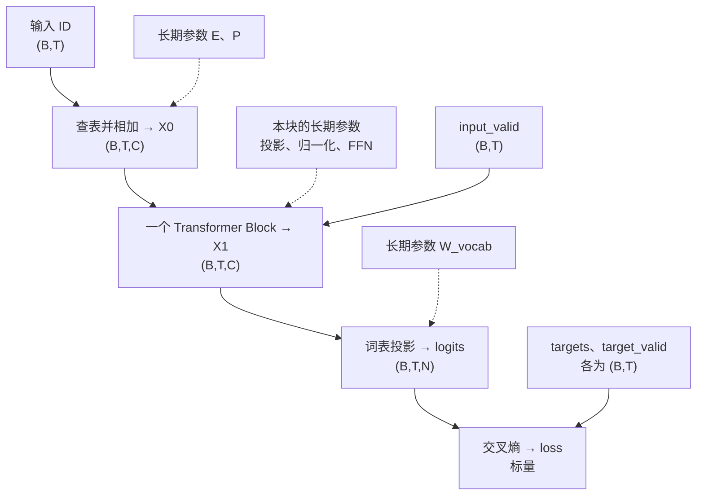

# 参数与数据流：同一次预测里，谁在计算，谁在被更新？

先暂停增加新组件。本页把已经接触过的输入、MHA、Block 和训练连起来，
重点是每个对象的身份、来源、去向与生命周期，不重讲各组件的完整推导。

最重要的区分：**数据带着当前内容经过一系列计算；参数在相应步骤被反复使用，
定义怎样计算。前向产生新结果，不把旧参数变成下一层的参数。**

本文用一个单块、Pre-LN、ReLU、支路输出 Dropout 的组合草图。
它接可学习绝对位置和独立的无偏置词表投影；为聚焦现有组件，暂不加堆栈末尾的归一化。
这不是完整 GPT 配方，也不是仓库已经完成的端到端模型。

## 1. 先分清四类对象

| 类别 | 例子 | 谁决定它，后续怎样处理 |
|---|---|---|
| 本批数据 | token ID、正确标签、有效位置标记 | 数据准备给出；不是用 SGD 改写的对象 |
| 长期模型参数 | E、P、Wq、gamma、W1、W_vocab | 模型初始化后保存；跨批使用，训练更新它们的值 |
| 本次计算结果 | X、Q、K、V、注意力权重、logits、loss | 用本批数据与当前参数算出；下次前向重新计算 |
| 配置与控制 | 头数、Dropout 概率 p、eps、学习率、训练/推理开关 | 人为配置或控制；不是本课反向更新的模型参数 |

浮点中间结果也叫**激活值（activation）**，不表示它一定经过了 ReLU。
“参数”一词有歧义：Python 函数的入参可以是上述任何类别；这里的“模型参数”仅指第二类。
参数不只包括名称带 W 的矩阵，也包括内容/位置表、偏置以及归一化的缩放平移。

反向时还会产生**梯度**：例如 Wq.grad 是关于 Wq 的损失变化率，不是另一份模型权重。
Dropout 的随机保留表也是临时对象，不是可学习参数；后面单独定位。

## 2. 同一份数据，从 ID 开始

取一个具体配置，后面始终沿用：

```text
B=1：一条序列       T=4：四个输入位置
N=6：六个词表项     C=4：每个位置四个特征
H=2：两个头         Dh=2：每头两个特征，C=H*Dh
F=8：FFN 中间宽度   T_max=8：位置表容量
```

这些都是维度配置或本批尺寸，不是装着向量的数组。
固定词表编号：PAD=0、BOS=1、A=2、X=3、EOS=4、Z=5。
BOS/EOS 是起止标记，PAD 是补齐占位；A、X、Z 在此表示三个普通 token。

```text
原序列 ids      = [[1,2,3,4,0]]       shape (1,5)
原有效标记 valid = [[1,1,1,1,0]]       shape (1,5)，这里 1/0 表示布尔值

input_ids       = [[1,2,3,4]]         shape (1,4)
targets         = [[2,3,4,0]]         shape (1,4)
input_valid     = [[1,1,1,1]]         shape (1,4)
target_valid    = [[1,1,1,0]]         shape (1,4)
```

本次的预测任务：BOS 预测 A，A 预测 X，X 预测 EOS；EOS 后的 PAD 不计入损失。
input_ids 进入模型；targets 与 target_valid 在评分时使用，不作为额外答案传进 Attention。
虽然完整输入包含后面位置，每个 query 仍由因果权限限制为只能读取当前位置及之前。

下面图中，实线是本次数据/结果的去向；虚线是该操作读取哪一组长期参数。
虚线不表示更新，前向也不沿虚线修改参数。



## 3. 两张表怎样成为本批表示？

长期保存：

```text
E：内容表     (N,C)     = (6,4)
P：位置表     (T_max,C) = (8,4)
```

本次前向产生：

```text
token_vectors    = E[input_ids]       (1,4,4)
position_vectors = P[:T]              (4,4)
X0 = token_vectors + position_vectors (1,4,4)
```

E 回答“这个 ID 用什么向量表示”；P 回答“这个位置加什么位置向量”。
X0 是它们在本批输入上的计算结果，不是第三张长期参数表。
P[:T] 可以是 P 的视图：逻辑上本次选取的数据，不代表底层一定复制了存储。

例如 X0[0,2,:] 来自 **E[3,:] + P[2,:]**：3 是 token X 的 ID，2 是它的序列位置。
换一条输入仍使用同一张 E，不为每个请求训练一套新表。

## 4. 放大一个 Block：每一步从哪取参数，产出什么？

后续把块输入叫 X0，块输出叫 X1，中间叫 U；三者均为 (B,T,C)。
本例这些 shape 都是 (1,4,4)。块只产生新的表示，不直接输出 token ID。

### 第一条支路：按上下文形成更新

**① 归一化。**

```text
N1 = LN1(X0; gamma1, beta1)          (B,T,C)
```

这是数学记法，分号右侧专门列出长期参数，不是可复制执行的 Python 语法。
gamma1、beta1 均为 (C,)，由训练调整。
mu1、var1 均为 (B,T,1)，从本次 X0 的最后一轴计算，不是训练保存的均值方差参数。
N1 是本次标准化并缩放平移后的结果；原来的 X0 另有残差路径。

**② 投影。** 四份长期参数 Wq、Wk、Wv、Wo 均为 (C,C)，本例为 (4,4)。
先使用前三份：

```text
Q = N1 @ Wq     (B,T,C)
K = N1 @ Wk     (B,T,C)
V = N1 @ Wv     (B,T,C)
```

Wq 没有“变成 Q”；它参与计算，生成了一份依赖当前输入的 Q，自身仍保留。
下一批再用同一个 Wq 计算新的 Q。此处投影输入是 N1，不是未经归一化的 X0。

**③ 各头读取，再合头。** 下面都是本次计算结果，不新增模型参数：

```text
拆头后的 Qh、Kh、Vh      (B,H,T,Dh) = (1,2,4,2)
匹配分数 scores          (B,H,T,T)  = (1,2,4,4)
读取比例 attn_weights    (B,H,T,T)  = (1,2,4,4)
各头读取 attn_weights@Vh (B,H,T,Dh) = (1,2,4,2)
合头结果 merged          (B,T,C)   = (1,4,4)
```

scores 来自每头 Qh 与 Kh 的点积及 sqrt(Dh) 缩放。
对允许位置做 Softmax，才得到 attn_weights；候选轴是 key 位置，不是词表 ID。
权限来自 input_valid 与因果规则，本次基础接口为 (B,T,T)，在各头间广播。

特别注意命名：代码返回的 **weights 是 attn_weights，是动态读取比例，不是长期模型权重。**
它受输入与 Wq/Wk 间接影响，但不作为一张独立参数表做 SGD。
拆头不会创建新的参数；各头对应投影矩阵中不同的特征列。

**④ 使用 Wo，再执行 Dropout 和残差。**

```text
A      = merged @ Wo     (B,T,C)
A_drop = dropout(A)      (B,T,C)
U      = X0 + A_drop     (B,T,C)
```

Wo 是长期参数，负责把合头内容变成写回 C 维的更新；A 是这次产生的更新量。
本课 Dropout 的操作对象正是 **A 的元素贡献**，不是 Wq/Wk/Wv/Wo。
它也不删除 token、特征维度或整个 head，shape 不变。

训练时抽一份与 A 同形状的临时布尔表 keep_A，True 表示保留。
对 0<=p<1，保留处输出 A/(1-p)，丢弃处输出 0；p 是配置，不是参数。
同一次反向使用这次前向的保留情况，不会重新抽表。
推理时 A_drop=A。两种模式下原 X0 都沿直接路径参与相加。

### 第二条支路：处理已有特征，再形成更新

先列这里才需要的长期参数：

```text
gamma2、beta2：(C,)        = (4,)；与 LN1 的参数独立
W1：(C,F)                 = (4,8)
b1：(F,)                  = (8,)
W2：(F,C)                 = (8,4)
b2：(C,)                  = (4,)
```

然后计算：

```text
N2     = LN2(U; gamma2, beta2) (B,T,C)
S      = N2 @ W1 + b1          (B,T,F) = (1,4,8)
G      = ReLU(S)               (B,T,F) = (1,4,8)
D      = G @ W2 + b2           (B,T,C)
D_drop = dropout(D)            (B,T,C)
X1     = U + D_drop            (B,T,C)
```

LN2 的统计量从本次 U 重算；ReLU 没有可训练参数。
W1/b1 形成特征组合，ReLU 产生条件响应，W2/b2 将它写回 C 个特征。
D 是 FFN 算出的更新，Dropout 临时影响 D，不修改 W1/W2。
第二次 Dropout 重新采样自己的保留表，不复用第一条支路的表。

如果接第二个 Block，X1 成为它的输入；第二个块一般拥有另外一套长期参数。
变换后的数据逐层传下去，不是将第一层 Wq 改名成第二层 Wq。

## 5. 特征变成词表分数，再和答案比较

现在才使用长期参数 W_vocab，shape (C,N)=(4,6)：

```text
logits = X1 @ W_vocab                 (B,T,N) = (1,4,6)
loss = masked_cross_entropy(
    logits, targets, target_valid
)                                    标量 Tensor，shape ()
```

W_vocab 是 ex005 中输出矩阵 W 在这份组合草图里的明确命名；不和输入表 E 共享参数。
它与 Wo 不同：**Wo 在 Attention 内输出 C 维特征；W_vocab 在模型末端输出 N 个候选分数。**
即使 C 恰好等于 N，它们的用途也不同。

logits[0,2,:] 是 token X 所在位置预测下一 token 的六个分数，正确答案 targets[0,2]=4，即 EOS。
targets 用来挑选正确答案的分数；它不会被 loss “优化成模型喜欢的标签”。
target_valid 排除最后那个 PAD 标签，input_valid 则参与 Attention 的读取权限。
Dropout 的 keep 又是第三种布尔表；三者职责不同，不能互换。

## 6. 到这里，参数仍然没有被前向修改

把一次训练更新按时间分开：

| 时刻 | 做什么 | 长期参数数值是否改变 |
|---|---|---|
| 准备本步 | 清理上次的参数 .grad | 否，清的是梯度槽 |
| 前向 | 读取参数，生成表示、分数和 loss | 否 |
| 反向 | loss.backward() 沿本次依赖计算参数梯度 | 否；变化的是 .grad |
| SGD 更新 | 参数 -= 学习率 × 参数.grad | 是，这一步才改变参数值 |
| 下一次前向 | 用更新后的参数处理下一批或同一批数据 | 重新产生中间结果 |

这份组合草图需要更新的长期参数清单是：

```text
模型两端：E、P、W_vocab
一个 Block：Wq、Wk、Wv、Wo
            gamma1、beta1、gamma2、beta2
            W1、b1、W2、b2
```

共 15 个参数 Tensor，不是 15 个标量。它们在前向外初始化并保存。
不会对 input_ids、targets、Q/K/V、attn_weights、logits 或随机 keep 表逐一执行 SGD。
中间浮点结果会参与链式法则，但“参与反向”不等于“它是长期参数”。

例：loss 能经 logits、X1、各支路、N1/Q/K/V 等结果影响 Wq；autograd 沿依赖计算 Wq.grad。
同一个 Wq 被多个位置使用，它们的梯度贡献汇总到同一个 Wq.grad，shape 仍为 (C,C)。
E 某一行也会汇总所有使用位置的贡献；有梯度路径不保证每个元素的数值梯度都非零。

本课不使用缓存。中间结果及本次 Dropout 保留情况在反向所需期间保留；
完成这次计算后，不把旧 Q/K/V 或旧 loss 当作下一批的模型状态继续用。
.grad 则是可累积的训练暂存，按当前每批独立更新的约定主动清理，不能假设它自动消失。

## 7. 生成时，什么变，什么不变？

复用同一套前向组件，关闭 Dropout，在 no_grad 范围内计算；两者不是同一个开关。
具体模块模式 API 见[模块组织讲义](dropout-and-module-organization.md)。

```text
已有前缀 ID → 内容/位置表示 → Block → logits
只取最后位置的词表分数 → 选一个 ID → 追加到前缀 → 再次前向
```

生成时：

- 长期参数值保持不变，不算监督 loss、不 backward、不执行 SGD。
- 前缀会增长，T 会变化；在位置表容量内，用新输入重新计算各中间结果。
- 推理不抽 Dropout 保留表；因果/PAD 权限依然存在。
- 关闭 Dropout 不等于所有生成策略都没有随机性；这里沿用已学的最高分选择。

## 8. 回到你实际写过的代码

| 已有代码 | 在上述链路中的位置 |
|---|---|
| [ex003：embed_with_positions](../exercises/ex003_position_embedding/position_embedding.py) | E/P 产生 X0 |
| [ex005：prepare_next_token_batch](../exercises/ex005_training_loop/training.py) | 生成错位 input_ids/targets/target_valid；input_valid 另由 valid 切出 |
| [ex005：forward_logits / train_step](../exercises/ex005_training_loop/training.py) | 当前真实基线只有 E[input_ids]@W；训练更新的还只是 E/W |
| [ex005：masked_cross_entropy](../exercises/ex005_training_loop/loss.py) | logits 与标签、有效标记得到标量 loss |
| [ex007：multi_head_self_attention](../exercises/ex007_multi_head_attention/attention.py) | 接收 N1 和四份投影参数，返回 A 与 attn_weights；本身不做 LN/Dropout/残差 |

完整 Block 与这些积木的端到端训练组合，仍待你实现。
教师用已有查表、MHA、交叉熵及参考 LayerNorm 做了 CPU float64 的临时组合核对：
各 shape、E[3]+P[2] 的索引关系、15 份参数的梯度形状与有限性均符合本页约定；
前向与 backward 后参数值不变，显式 SGD 后才变化。这不是学习者的 Block 实现。
本文不新增掌握记录，不重考已回答的 Dropout 期望题。

以后碰到新名字，先定位三个问题即可：**谁创建它？在哪一步用它？SGD 是否要直接更新它？**
不必先把所有缩写硬记下来。
