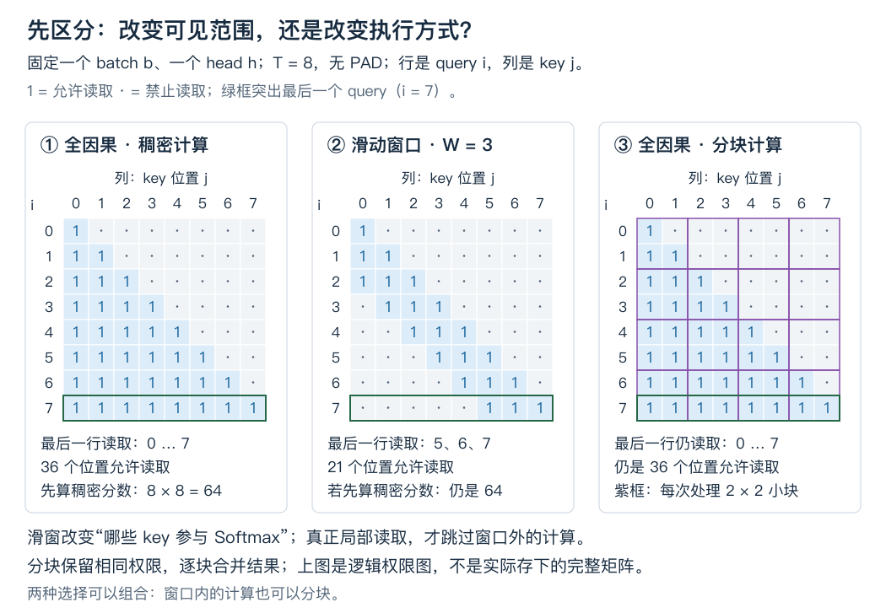
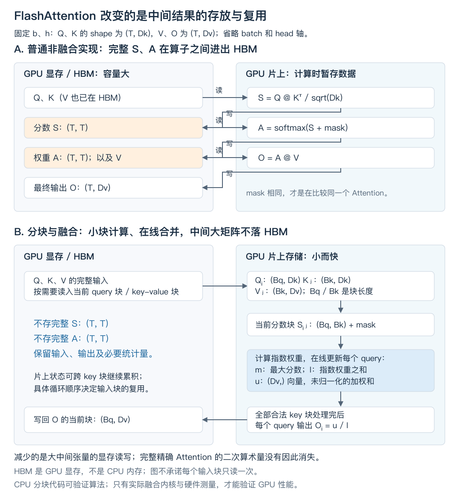

# 长序列 Attention：少读一些，还是不再存下整张分数表？

我们继续改造已经会写的 Attention，不另起一套模型。上一轮已走通原版 Encoder–Decoder；这次回到你实现过的 [ex013 因果模型](../exercises/ex013_llama_style/model.py)，处理同一个问题：**序列越来越长，一次注意力读取需要越来越多的计算和中间存储，应该改哪里？**

先让每个位置只读附近的历史，得到滑动窗口；再追问：如果不能删掉远处的信息，能不能不保存整张注意力表？这个要求会自然引出分块、在线 Softmax 和 FlashAttention。最后把两个改动组合起来，接回缓存生成。

这是一个完整知识块，不拆成若干 API 小课。沿途先讲机制，末尾给一组综合验证方向；不要求读一节就停下来答题。

## 1. 从已有代码中找出真正要改的部分

先固定一层，Q/K/V 已经由该层输入投影、拆头得到；使用 RoPE 时，Q/K 也已经按各自位置旋转。我们只替换下面这段，不改投影、合头后的 Wo、残差或 FFN。本课关闭 Dropout，假定输入和屏蔽前的点积分数有限。

```text
Q: (B,H,T,Dk)     K: (B,H,T,Dk)     V: (B,H,T,Dv)
S: (B,H,T,T)      A: (B,H,T,T)      O: (B,H,T,Dv)

S = (Q @ K.transpose(-2,-1)) / sqrt(Dk)
A = softmax(masked_S, dim=-1)
O = A @ V
```

`B` 是 batch 数，`H` 是头数，`T` 是这次整段前向的 token 数；`Dk/Dv` 分别是每头的匹配/内容宽度。`S` 是缩放后的分数，`A` 是归一化权重，`O` 是各头输出，尚未合头或做 Wo。这里先用 MHA，避免让 KV 头映射分散注意力；GQA 的每个 query head 读所属 KV head，以下单头推导照样成立。

如果 `B=1,H=8,T=8192`，仅一张 float32 的 S 就是：

```text
1 × 8 × 8192 × 8192 × 4 字节 = 2 GiB
```

A 若也完整保存，单独又是 2 GiB。这不是整个模型的峰值：是否同时存活、反向保存什么、其他激活占多少，都要另算。这里已经足以定位一个具体问题：**大量数据只为了从 Q/K 算出权重，再把 V 汇总成 O。后面的层真正需要的是 O，而不是整张 S 或 A。**

现有实现先做稠密乘法，再加因果 mask。即使一半位置不能读，乘法也已执行。所谓“稠密”，在此就是把整个矩形逐项作为普通矩阵计算；它不因其中很多位置稍后被设为零就自动跳过运算。

接下来先尝试删掉部分读取，再解决剩下的中间表。

## 2. 先少读：让每个 query 只访问最近 W 个位置

我们明确约定：**W 是每个 query 最多能读的 key 个数，包含自身。** 本课只讲因果滑窗；Encoder 的左右双向窗口是另一种权限约定。

整段位置从 0 开始，无 PAD 时，位置 i 允许读取：

```text
max(0, i-W+1) <= j <= i
```

用同一条长为 8 的序列，设 `W=3`：

| query 位置 i | 全历史因果注意力能读的 key | 因果滑窗能读的 key |
| -----------: | -------------------------- | ------------------ |
|            0 | 0                          | 0                  |
|            2 | 0,1,2                      | 0,1,2              |
|            5 | 0,1,2,3,4,5                | 3,4,5              |
|            7 | 0,1,2,3,4,5,6,7            | 5,6,7              |



图固定一个 batch 和一个 head；每一行是一个 query，列是 key。局部窗口删掉了部分允许的配对；分块边界本身不删配对。注意区分“允许多少对”和“实现实际计算多少对”。

### 2.1 这是模型计算的改变，不是无损压缩

固定最后一个 query，令它对 8 个 key 的分数全为 0，V 的每个向量只有一维：

```text
scores = [0,0,0,0,0,0,0,0]       shape (8,)
V      = [0,1,2,3,4,5,6,7]       shape (8,1)
```

全历史结果是 `3.5`；W=3 的滑窗结果是 `(5+6+7)/3=6`。同一份 Q/K/V，换了权限，输出就变了。窗口内的权重也重新归一化，而不是保留原来的 1/8。

这给出了实际代价：远处的 key 即使匹配度很高，本层也无法直接取它的 V。把已训练的全注意力模型直接改成滑窗，不能保证质量不变；要考虑训练时的结构与任务需求。这里研究的是计算机制，不用玩具数值推断语言质量。

### 2.2 但整模型不一定只能利用最近 W 个原始 token

Attention 读的是**上一层的表示**，不是每层重新读取原始 embedding。

仍取 W=3，第二层的位置 7 能读第一层的 5、6、7；第一层的位置 5 已经能读原始位置 3、4、5。因此原始位置 3 的信息有一条经过第一层位置 5 到达第二层位置 7 的路径。

若所有 L 层都使用这个窗口，其他算子都逐 token 计算，位置 i 在原始输入中的结构可达范围最远到：

```text
max(0, i-L×(W-1)) ... i
```

最长包含 `1+L×(W-1)` 个原始位置。这里算的是“存在传播路径”，不保证模型真的保留了那些信息，更不保证它和一层直接全局读取等价。窗口宽度和整网的信息可达范围不能混为一谈。

[Mistral 论文的结构说明](https://arxiv.org/html/2310.06825v1#S2)将局部读取、逐层传播和有限缓存结合使用。本课始终按“W 含自身”精确计数；对照外部实现时，要先核对其窗口参数是总宽度还是向左的距离。

## 3. 再少算：只改 mask，为什么账本还没变？

代码中的小写 `q/k/v` 就是前面的 Q/K/V。`window_allowed` 是按窗口规则与 key 有效性生成的 bool 权限，shape `(B,1,T,T)`，在 head 轴广播；True 表示允许读取。下面的写法已经有滑窗语义，但仍然产生整张分数表：

```python
scores = q @ k.transpose(-2, -1)  # 先算完 T×T
scores = scores.masked_fill(~window_allowed, float("-inf"))
```

要真正少算，必须在矩阵乘法之前缩小 K/V 的参与范围。固定一个 query 位置 i，让所有 B、H 同时计算：

```python
left = max(0, i - W + 1)
qi = q[:, :, i:i+1, :]           # (B,H,1,Dk)
ki = k[:, :, left:i+1, :]        # (B,H,w_i,Dk)
vi = v[:, :, left:i+1, :]        # (B,H,w_i,Dv)
scores_i = (qi @ ki.transpose(-2, -1)) / math.sqrt(Dk)
# scores_i: (B,H,1,w_i)，再按该窗口内有效 key 做 Softmax、读取 vi
```

`w_i=min(W,i+1)`；Python 的 `left:i+1` 左闭右开。`i:i+1` 保留长度为 1 的 query 轴，便于继续使用批量矩阵乘法。示例只展示计算范围如何缩小，不是完整的 PAD/错误处理实现。

无 PAD、T≥W 时，每个 head 真正需要的配对总数是：

```text
1+2+...+(W-1)+W+...+W = T×W - W×(W-1)/2
```

T=8、W=3 时只有 21 对。稠密实现却仍算 64 对。QK 与 AV 的主要算术量可以从平方规模降到 `O(BH T W (Dk+Dv))`；**这是 W 固定或远小于 T 时的节省，不是把 W 也随 T 增长后仍称为线性。** 投影与 FFN 的计算没有被这个改动删掉。

逐 query 的 Python 循环可能比一次大矩阵乘法更慢：调用次数、每次矩阵规模与硬件利用率也影响时间。这个版本先证明“计算哪些对”，之后可以把相邻 query 合成块，并跳过完全不相交的 KV 块。

还有一个接口变化：优化路径只返回 O，不能仍要求返回完整 `(B,H,T,T)` 权重用于日常前向，否则又把二次大小的输出加回来了。完整权重只在小尺寸参照或调试中使用。

## 4. 读取范围固定后，KV Cache 可以忘掉什么？

全历史因果模型的每个新 query 都可能读任意旧 KV，因此缓存随请求增长。滑窗模型的本层新 query 只需要邻近 KV；更老的条目不会再被未来 query 直接读取，可以逐步驱逐。

“驱逐”就是把不再需要的条目从缓存有效内容中移走；不是重新训练，也不是把模型参数删掉。每层仍有各自的 KV，它们可能已经包含更早信息。

### 4.1 缓存长度不再等于处理过的 token 数

例如 W=3，已经处理位置 0…7，持久缓存只保留位置 5、6、7。此时必须同时知道：

| 状态                                      |  数值 | 用途                            |
| ----------------------------------------- | ----: | ------------------------------- |
| 已处理数 / 下一个绝对位置 `next_position` |     8 | 下一个 token 的 RoPE 和权限位置 |
| 缓存有效长度                              |     3 | 现在保存了多少份 KV             |
| 缓存条目的绝对位置                        | 5,6,7 | 每一条 KV 究竟来自哪里          |

你的旧 `llama_model_step` 用 `len(cache)` 推出下一个位置，在完整缓存里成立。裁剪后继续这么做，会把位置 8 当成 3；旧 K 却已按原来的 5、6、7 旋转，新 Q 与旧 K 的相对位置就错了。**本课保持绝对位置递增，不因缓存裁剪而重编号或重新旋转旧 K。**

有限缓存可以先用切片选出最近 W 条。不过你在布局课见过：**切片可能只是 view，仍持有整个旧张量的底层存储。** 若要在关闭求导的推理中实际释放大块旧存储，需要把窗口复制成独立存储，并释放旧引用；不是只看新 shape 变小。

工程上还可用固定容量的环形缓冲区：位置 p 放在 `slot=p%W`。slot 只是物理存放位置，不是 RoPE 的位置。读取时需要恢复逻辑顺序，或携带位置正确生成权限。

所有层都局部、等长无 PAD、KV 头宽相同时，保留不超过 W 条的持久 KV 有效数据上界为：

```text
2 × 层数 × B × Hkv × W × D × 每元素字节数
```

2 表示 K 和 V，D 是各自头宽。使用 GQA 时算 Hkv 而不是 Hq。这个式子不含权重、元数据、临时追加区和分配器预留；部分层仍全局时，要给全局层另算增长的缓存。

### 4.2 一次追加多个 token，不能先只留下最后 W 条

继续 W=3，旧缓存为位置 3、4、5，本次一次送入位置 6、7：

| 本次 query | 实际需要的 key |
| ---------: | -------------- |
|          6 | 4,5,6          |
|          7 | 5,6,7          |

若先追加、立即裁成 5、6、7，再计算两行，query 6 需要的 4 已经没了。即使最后一行正确，也不能说明整个 chunk 正确。chunk 只是“一次处理的一段新增 token”。

教学实现可以先让本次计算看到“旧缓存 + 全部新增 KV”，逐 query 应用窗口与因果约束；**整个 chunk 读完，再把持久缓存裁成最后 W 条。** 临时工作区允许大于 W，持久状态才受 W 限制。也可以逐 token 更新，但那是另一种执行安排。

以后缓存与全量对齐，参照必须是“保留完整输入、每层同样使用滑窗”的前向，不能是原先的全注意力前向，也不能仅把最后 W 个原始 token 重新跑一遍——后者丢失了历史中间表示携带的信息。

## 5. 如果远处的信息不能删，能否只不保存那张表？

前面用窗口减少了读取集合。现在固定读取集合不动：它可以是完整因果历史，也可以是刚才的窗口。我们只改变这些配对被计算、汇总的顺序。

最直接的想法是：一次算一块 scores，用完就丢。但 Softmax 的分母是**这个 query 全部允许 key 的指数之和**。分块后怎样知道全局分母，成了必须先解决的问题。

### 5.1 每块各做 Softmax，再平均输出，会偷偷改掉权重

固定一个 batch、一个 head、一个 query。它能读 4 个 key，下面的 s 已经是缩放后的分数；每个 V 只有一维：

```text
s: (4,)   = [0, 0, ln(3), ln(3)]
V: (4,1)  = [0, 0, 10, 10]

块甲取前两项，块乙取后两项。
```

若每块各自归一化，块甲输出 0，块乙输出 10。平均得到 5。

但全局逐项指数是 `[1,1,3,3]`，权重是 `[1/8,1/8,3/8,3/8]`，正确结果为 7.5。块乙本来就应该占总权重的 3/4，而不是一半。**块内 Softmax 抹掉了“这个块相对于其他块有多大”的信息。**

因此我们不急着归一化输出，而是保存能合并的分子与分母。这里的“在线”表示每来一块就更新状态，不必提前存下所有分数；不是网络服务在线。

### 5.2 只需要保存哪三个量？

固定同一个 query，把已处理的有效 key 集合记作 J。每个 `s_j` 是一个标量，每个 `v_j` 是 `(Dv,)` 向量。保存：

$$
\begin{aligned}
m &= \max_{j\in J}s_j \\
\ell &= \sum_{j\in J}e^{s_j-m} \\
u &= \sum_{j\in J}e^{s_j-m}v_j
\end{aligned}
$$

`m` 是目前的最大分数，标量；`ℓ` 是以 m 为基准的指数总和，标量；`u` 是同一基准下的加权内容总和，shape `(Dv,)`。u 不是已经归一化的注意力输出；最后才能做 `o=u/ℓ`。

现在新块来了。假设旧状态和新块都至少含一个有效 key，令：

$$
\begin{aligned}
m' &= \max(m,\max s_{\mathrm{new}}) \\
\alpha &= e^{m-m'}
\end{aligned}
$$

为什么不能直接把新块加进去？因为旧 ℓ、u 按 m 缩放，新块要按 m′ 缩放。同一个旧分数满足：

$$
e^{s_j-m'}=e^{m-m'}e^{s_j-m}=\alpha e^{s_j-m}
$$

所以先把旧分母和旧分子一起换到新基准，再加新块：

$$
\begin{aligned}
\ell' &= \alpha\ell+\sum_{j\in\mathrm{new}}e^{s_j-m'} \\
u' &= \alpha u+\sum_{j\in\mathrm{new}}e^{s_j-m'}v_j
\end{aligned}
$$

这就是核心。m′ 不小于旧 m 或新块分数，因此指数里的差都不大于 0；不会为了合并而直接计算巨大正数的指数。重复这一步，最后的 ℓ、u 和一次处理全部允许 key 的定义相同，不需要近似注意力。

回到刚才的 4 个 key：

| 处理进度               |     m |         ℓ |   u | u/ℓ |
| ---------------------- | ----: | --------: | --: | --: |
| 只处理块甲             |     0 |         2 |   0 |   0 |
| 合并块乙；旧状态乘 1/3 | ln(3) | 2/3+2=8/3 |  20 | 7.5 |

如果忘记给旧状态乘 1/3，就变成 `20/(2+2)=5`，错在合并基准，不在矩阵 shape。把全部分数统一加 1000，正确输出仍应是 7.5；这也是数值稳定性的有效检查。

### 5.3 mask 使“空块”和“空行”成为两件不同的事

因果、窗口、PAD 都可能让某个 query 在**当前 KV 块**里没有可读项。这时不要对一串负无穷直接做普通 Softmax，也不要计算 `-inf-(-inf)`。

- 这个 query 在当前块没有可读项：跳过该行的状态更新，保留旧 m/ℓ/u。
- 还没读到任何有效 key：可视为空状态，首次遇到有效块时直接初始化 m/ℓ/u。
- 全部块读完仍没找到有效 key：这是整行无定义，沿用本项目契约抛 `ValueError`。

批量实现要逐行判断，不能因为某一行为空，就跳过这个分数块里其他有效行。并且应先给指数与减法构造安全输入，再选择结果；不能寄望事后用 `where` 盖掉 NaN 来保证反向安全。`torch.where(condition,a,b)` 是按布尔条件逐元素选择，a、b 通常已先计算，不是 Python 的短路分支。

最后一种行为是我们的接口约定，并非所有库都相同。比如某些融合接口为空行返回零；未来对照时先对齐契约，不能直接互判错误。

还有一个滑窗特有的 PAD 边界：很靠后的 PAD query 可能连最近 W 个位置里都没有有效 key。真实模型接线时可以不计算这些无效 query，或明确规定如何处理它们；不能以为右侧补 PAD 永远不会遇到全空行。本课底层探针对全空行保持严格报错。

## 6. 从一行变成一块，为什么这才连接到 FlashAttention？

逐行公式解决了数学。要在设备上高效执行，还必须让这些临时量留在合适的存储层级。

以常见 CUDA GPU 为背景，**HBM** 是设备上的大容量高带宽内存；不是 CPU 内存。计算单元附近还有容量更小的片上存储，例如 shared memory 与寄存器。IO 在这里指这些层级之间的数据读写，不是磁盘或网络 IO。Mac CPU 教学代码不等于在控制 GPU 片上存储。

朴素路径把 S 写入 HBM，Softmax 再读 S、写 A，AV 又读 A。完整 S/A 在算子之间反复经过设备内存，并非注意力数学要求，而是执行安排。

在线状态让我们可以把一块 Q/K/V 搬到片上，算一个小分数块，立刻更新输出累计量，随后丢掉这个分数块，不把整张 S/A 写入 HBM。这是 [FlashAttention 原论文 §3.1](https://arxiv.org/html/2205.14135v2#S3.SS1) 的关键出发点。

GPU kernel 指提交给 GPU 执行的一段计算程序。“融合”在这里指把打分、屏蔽、指数与汇总等步骤放进同一个 kernel，让中间量在片上继续使用，而不是每一步都通过独立的大张量交接。只把 Python 函数包成一个函数，并不等于实现了这种融合。



图中的 mask 是允许位置加 0、禁止位置加负无穷的加性 mask，不是把 bool 权限直接加到 S。图是数据生命周期示意，不是某一代 kernel 的完整调度。输入块可能被不同 query 块重复加载；不能从“不落整张分数表”推出“所有输入只读一次”或“总 IO 一定是 O(T)”。

### 6.1 每个 tile 的 shape 都能接回刚才的一行公式

把连续 `Bq` 个 query 和 `Bk` 个 key 分别组成块，tile 就是这样一块矩形计算。`Bq/Bk` 是块尺寸，不是 batch 数 B。

```text
Q_block: (B,H,Bq,Dk)
K_block: (B,H,Bk,Dk)
V_block: (B,H,Bk,Dv)

S_block: (B,H,Bq,Bk)
m, ℓ:    (B,H,Bq,1)       每个 query 各有一个状态
u:       (B,H,Bq,Dv)
```

末块可能不足 Bq/Bk。QK 打分后，先加这个 tile 对应的权限，再按**最后的 key 轴**更新状态；不同 query 不共享一个分母。

下一段只写“已有有效历史、新块每行也有有效 key”的核心合并；实际实现还要按上一节处理空行：

```python
m_new = torch.maximum(m, scores_block.amax(dim=-1, keepdim=True))
alpha = torch.exp(m - m_new)
p = torch.exp(scores_block - m_new)
l = alpha * l + p.sum(dim=-1, keepdim=True)
u = alpha * u + p @ v_block
m = m_new
# 扫完所有允许的 KV 块，才得到 output_block = u / l
```

代码的 `l` 就是公式中的 ℓ。`torch.maximum` 对两个同形或可广播张量逐元素取最大；`amax(...,keepdim=True)` 沿指定轴取最大并保留长度 1 的轴。`p` 是当前基准下的指数量，**还不是每行和为 1 的概率**。`alpha:(B,H,Bq,1)` 同时缩放每行的分母及 Dv 个分子分量。

同样的数学在实数运算下等价；浮点运算的求和顺序变了，比较输出与梯度要用事先约定的容差，不能要求逐 bit 相等。

### 6.2 前向不存整张表，训练时就一定省成线性了吗？

不一定。若只是用 PyTorch 循环搭出上面的运算，autograd 可能为了 backward 保留每一块的中间量。没有一个叫 `(T,T)` 的张量，不代表所有分块加起来不再是二次大小。

真正的 FlashAttention 训练实现还改变了反向的保存策略：保留输入、输出和必要行统计，反向时按块重新计算所需分数/概率，而不是保存完整 A。这里“重算”是用少量额外算术换掉大量存储与搬运。只写前向循环不能声称已经实现了这种训练内存收益。

因此本课分清三个结论：

| 验证对象                        | 能证明什么                           | 不能据此证明什么               |
| ------------------------------- | ------------------------------------ | ------------------------------ |
| 基础 Tensor 分块前向/反向对齐   | 数学接线与 autograd 梯度在容差内正确 | GPU 融合实现正确、训练显存线性 |
| 关闭求导，记录各次 score shape  | 没有构造完整分数矩阵；最大单块多大   | 整个进程或设备的真实峰值       |
| CUDA 融合 kernel + 正确设备测量 | 指定硬件和 workload 的实际收益       | 任意输入/设备必然同倍数加速    |

本课完成前两项；不以安装 CUDA、换机器或手写 GPU kernel 作为继续学习的门槛。后续版本还优化并行与工作分配，见 [FlashAttention-2](https://arxiv.org/abs/2307.08691)；这里不扩展成 GPU 编程课。

## 7. 把两种改动装在同一份 Attention 上

现在才有足够依据比较它们：

| 实现                      | 数学读取集合       | 是否需要完整 S/A | 主要配对量级                                    |
| ------------------------- | ------------------ | ---------------- | ----------------------------------------------- |
| 原先稠密因果 Attention    | 所有过去位置与自身 | 本实现需要       | T²                                              |
| 稠密矩阵加窗口 mask       | 最近 W 个位置      | 仍需要           | 仍是 T²                                         |
| 真局部窗口读取            | 最近 W 个位置      | 不需要           | T×W，含边界修正                                 |
| 全历史分块在线 Attention  | 所有过去位置与自身 | 不需要           | 仍为 T² 量级                                    |
| 窗口 + 分块在线 Attention | 最近 W 个位置      | 不需要           | 跳过不相交块后可按 T×W 规模组织，块边界有额外量 |

表中的配对数不包含投影/FFN；FlashAttention 不会自动消除完整注意力的二次算术量。它主要改变中间量的存储与搬运。滑窗才改变需要哪些配对，两者不是互相替代的方案。

组合时先决定 query/key 的绝对位置权限。一般增量输入为：

```text
Q: (B,H,Tq,Dk)       K: (B,H,Tk,Dk)       V: (B,H,Tk,Dv)
q_positions: (Tq,)   k_positions: (Tk,)   key_valid: (B,Tk)

allowed[b,i,j] = key_valid[b,j]
                 and 0 <= q_positions[i]-k_positions[j] < W
```

`Tq` 是本次新增 query 数，`Tk` 是本次可用 KV 数，两者无需相同。位置向量给的是全序列中的位置，不是当前 tile 的局部行列号。这里假定 batch 中请求使用同一组位置；不同时要扩成按请求的位置表示。

分块版本只生成当前 `(B,1,Bq,Bk)` 权限并广播到 heads；不预先构造完整 `(B,Tq,Tk)` mask，否则 mask 自身也随面积增长。整块完全在窗口外时可在 QK 之前跳过；边界块仍需逐元素屏蔽。若仍扫描并计算所有块，只是最后填负无穷，得到了正确的窗口结果，却还没有获得窗口应有的算术节省。

教师探针会跳过全无效 tile 的点积，但仍遍历候选块检查权限。这会留下遍历开销，不能把减少点积对数直接说成整个程序线性或必然加速；进一步优化应按位置直接定位相交的块。

对接外部库时不要照抄整数：例如 [FlashAttention 官方接口](https://github.com/Dao-AILab/flash-attention#how-to-use-flashattention) 的局部范围使用左右距离；等长因果情形下，本课“W 含自身”对应左距离 W−1、右距离 0。Tq≠Tk 时还要核对其因果对齐位置。当前练习不依赖这个封装，只用它说明接口契约为什么重要。

最后回到生成：窗口决定哪些 KV 可淘汰，分块算法决定如何汇总仍需读取的 KV。后者不会让全历史模型的旧 KV 自动失效。prefill 有很多 query 行，decode 通常只有一行；两者都能分块，但原来的中间矩阵规模和瓶颈不同，不能拿 prefill 的收益比例承诺 decode。

## 8. 在同一个对照实验里验证，不再分散做定义题

教师探针见 [efficient_attention_probe.py](../examples/efficient_attention_probe.py)：

```bash
.venv/bin/python -B -m examples.efficient_attention_probe
```

它是便于复核本课数值与机制的教师实现，不是你的提交，也不修改 ex013。先看四个结果：

1. 相同 Q/K/V，全历史和 W=3 的输出确实不同；稠密窗口与真局部窗口则应对齐。
2. 分块在线结果与**同 mask** 的稠密结果对齐；分块各自 Softmax 后平均、换最大值却不缩放旧状态都能被反例抓到。
3. 更换块尺寸、尾块不整除、非零绝对位置、PAD、空块时仍对齐；全空行按契约报错。
4. 同一份滑窗 Q/K/V 一次追加两个位置、再追加一个位置，延后裁缓存能对齐全量参照；提前裁剪会破坏 chunk 前面的 query。

探针中的缓存验证止于 Q/K/V 层，不冒充完整多层模型、RoPE 或生成 logits 的集成验收。它记录最大单块分数元素数与已执行配对数，不测 GPU，也不把这些计数当作真实峰值内存。

本次 CPU 实跑通过 float64/float32 前向与梯度对照。T=8、W=3 时，稠密窗口确实算了 64 对，局部切片只算 21 对；默认 3×4 分块的窗口实现算了 44 对，因为跨边界的块里仍有随后被屏蔽的元素。这是为什么“分块”本身还不足以声称做到了最少计算。图 1 的 2×2 划分仅用于看清边界，算法不依赖那个固定块尺寸。

后续 coding 合成一份作业即可，保留两条验收线，而不是每个新名词单独出题：

- **同数学、换执行**：局部切片/在线分块对同 mask 的稠密参照，检查输出与 Q/K/V 梯度；至少选一个“随机正常样本容易漏掉”的反例，让一种错误合并实现明确失败。这同时补足独立测试选择的证据。
- **同模型、换调用切分**：把窗口接到 ex013 后，固定权重和输入，比较全量滑窗与逐 token/多 token 追加的每个位置 logits；同时检查绝对位置、持久 KV 上界、请求重置。原有全注意力路径保留作为另一种模型配置，不拿它当滑窗的相等参照。

边界优先覆盖 W=1、W≥序列长、窗口正好滑走一个 key、块尺寸不能整除长度、新块暂时全无效但后面仍有有效 key。测试形状、dtype 与容差先写清；基础 Tensor 核心不调用融合 Attention 代做。CPU Python 版本不要求更快，若比较时间，继续沿用已有的固定输入、线程、热身与重复测量方法。

你读完需要形成的整体判断是：**先确定这份模型允许哪些信息参与，再决定怎样计算同一个结果，最后说明保存了什么、少算了什么，以及哪些性能结论仍需测量。**

---

教学衔接：覆盖 `modern.sliding-window` 与 `modern.flash-attention`。沿用已掌握的 Attention、Softmax、KV Cache、RoPE 和成本分析；`implementation.testing-debugging` 的独立测试选择留在上述综合任务中核验，不从头补课。材料与教师探针准备好不构成新的掌握证据；本次不改历史进度，不要求立刻完成作业。
