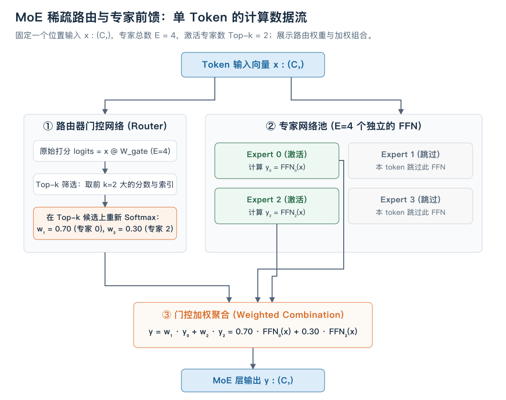
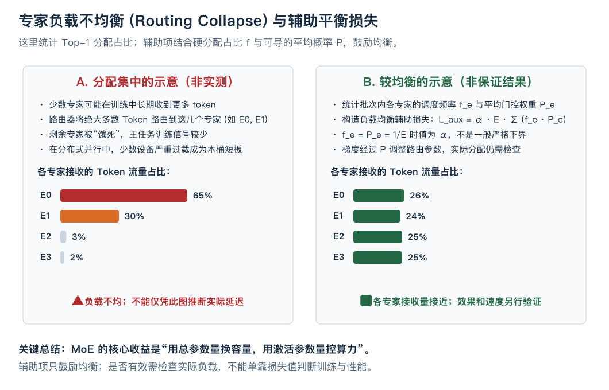

# 稀疏专家模型（MoE）：结构速览与玩具代码

这份速览集中看结构与玩具代码；完整的例子、梯度推导和容量分析见[MoE 图文主讲义](mixture-of-experts.md)。

在已有 Transformer 的 FFN 子层中，所有 token 都使用同一组前馈参数。若把这个 FFN 加宽，每个 token 的前馈矩阵乘法也会增大。

这种共享完整 FFN 计算的方式称为稠密前馈。保持输入宽度不变、只把 FFN 中间宽度扩大十倍，主要前馈参数与矩阵乘法量会近似扩大十倍；整模型延迟还受其他子层、内存访问和执行效率影响，不能直接按参数倍数推断。

**能不能在大幅增加模型总参数量的同时，让单个 token 的计算量基本保持不变？**

这就是 **混合专家模型（Mixture-of-Experts，简称 MoE）** 的核心动机。本课将从已有 FFN 出发，拆解稀疏路由（Sparse Routing）、Top-k 门控机制、加权组合，以及它在系统训练中必然面对的**负载均衡（Load Balancing）**难题。

---

## 1. 从单一 FFN 到专家池：算力账本的变化

回忆你写过的标准 Pre-LN 块后半段：一个特征向量 $x \in \mathbb{R}^C$ 进入 FFN 子层：

$$y = \text{FFN}(x) = \text{Linear}_2(\text{GELU}(\text{Linear}_1(x)))$$

若输入维度 $C=512$，中间隐藏层维度 $F=2048$，则一个标准 FFN 的参数量约为 $2 \times C \times F \approx 2.1 \times 10^6$。每个 token 经过它都需要做两次矩阵乘法。

现在，我们把这一个庞大的 FFN 替换为一个包含 $E$ 个**结构完全相同但独立初始化、参数各异**的 FFN 集合：

$$\{ \text{FFN}_0, \text{FFN}_1, \dots, \text{FFN}_{E-1} \}$$

这些独立的子网络被称为 **专家（Experts）**。



### 稠密 vs 稀疏激活

| 模型形态 | 专家总数 $E$ | 单 Token 激活专家数 $k$ | 模型总参数量（FFN 部分） | 单 Token 激活计算量（FLOPs） |
| :--- | :---: | :---: | :---: | :---: |
| **稠密 FFN (Dense)** | 1 | 1 | $P$ | $O(P)$ |
| **全激活 MoE (Dense MoE)** | 8 | 8 | $8P$ | $8 \times O(P)$ （计算代价极大） |
| **稀疏 MoE (Sparse MoE)** | 8 | 2 | $8P$ （容量扩大 8 倍） | **$2 \times O(P)$ （计算量仅相当于 2 个 FFN）** |

> **核心结论**：MoE 将模型的**总参数量（Total Parameters）**与**激活参数量（Active Parameters）**解耦。例如准备 $8P$ 的专家参数、每个 token 只运行其中两位专家，专家部分的算术量约为执行两次同宽 FFN；还要另计路由和合并开销。这不是运行时间的保证。

---

## 2. 路由器（Router）：如何决定把 Token 发给谁？

有了 $E$ 个专家，核心问题是：**对于当前这个 token $x$，应该由哪 $k$ 个专家来处理？各自权重是多少？**

这个决策由一个极轻量的线性网络——**门控网络/路由器（Router / Gating Network）** 完成。

### 2.1 路由评分与 Top-k 选择

设路由器的权重为 $W_g \in \mathbb{R}^{C \times E}$（本例不使用偏置）。

1. **计算原始专家得分（Logits）**：
   $$h(x) = x W_g \quad \in \mathbb{R}^E$$
   $h_e(x)$ 表示当前输入 $x$ 对第 $e$ 个专家的匹配亲和度。

2. **Top-k 门控（以 $k=2$ 为例）**：
   从 $E$ 个得分中挑出最大的 $k$ 个数值及对应的专家索引集合 $\mathcal{T} = \text{TopK}(h(x), k)$。
   将不在 $\mathcal{T}$ 中的其他 $E-k$ 个专家的得分设为 $-\infty$：

   $$\tilde{h}_e(x) = \begin{cases} h_e(x), & \text{if } e \in \mathcal{T} \\ -\infty, & \text{otherwise} \end{cases}$$

3. **重新归一化门控权重（Softmax over Top-k）**：
   $$g_e(x) = \text{Softmax}(\tilde{h}(x))_e = \frac{\exp(\tilde{h}_e(x))}{\sum_{j \in \mathcal{T}} \exp(h_j(x))}$$
   对于 $e \notin \mathcal{T}$，其权重 $g_e(x) = 0$；对于被选中的 $k$ 个专家，它们的权重之和严格为 1：$\sum_{e \in \mathcal{T}} g_e(x) = 1$。

### 2.2 专家输出的加权组合

最终 MoE 层的输出是这 $k$ 个激活专家输出的加权线性组合：

$$y = \sum_{e \in \mathcal{T}} g_e(x) \cdot \text{FFN}_e(x)$$

对于未被选中的专家，由于 $g_e(x) = 0$，我们**在代码实现中根本不需要调用它们的 FFN**，从而真正实现计算的跳过与稀疏性。

---

## 3. 选中后是否重新归一化，必须明确约定

本课 Top-2 在选中的分数上做 Softmax，因此权重之和为 1。等价的写法是：先对全部分数做 Softmax，选出 Top-2 概率，再除以这两项之和。

例如 logits 为 `[10,9.5,9,8.5]`，全专家概率约为 `[0.4551,0.2760,0.1674,0.1015]`。直接截取前两项的和约为 `0.7311`；重新归一化后得到 `[0.6225,0.3775]`。

保留原概率与重新归一化会得到不同输出。不能说所有 MoE 都“必须”重新归一化：Switch 的 Top-1 保留全专家 Softmax 中选中专家的概率。若对单个选中分数再做 Softmax，权重恒为 1，主任务经混合权重返回路由器的梯度便会消失。详见[主讲义第 5 节](mixture-of-experts.md#5-没有正确专家标签路由器怎么学)。

---

## 4. 系统级挑战：负载不均衡与路由塌陷（Routing Collapse）

虽然 MoE 的数学形式非常优美，但在实际训练中，朴素路由可能长期偏向少数专家。这种分配集中现象称为**路由塌陷（Routing Collapse）**，并非每次训练都会发生。



### 4.1 什么是路由塌陷？
1. 在训练初始阶段，由于随机初始化的微小差异，某些专家（如 Expert 0）碰巧获得了稍高的分数。
2. 路由器便更倾向于把 token 分配给 Expert 0。
3. 接收更多 token 的 Expert 0 获得更多主任务训练信号；如果这又提高了它被选择的机会，就可能形成进一步集中的反馈。收到更多数据并不保证它学得更好。
4. 最终导致：**绝大多数 token 都被路由到极少数几个“赢家”专家上，其余专家处于“饿死”状态**。
5. 结果：部分专家很少被使用，不仅失去了多专家容量优势，还在分布式部署时造成严重的计算过载与显存失衡。

---

### 4.2 辅助负载均衡损失

路由器需要同时顾及任务效果与分配负载。Switch 的 Top-1 辅助项使用硬选择占比与平均路由概率的乘积。[Switch 原论文 §2.2](https://www.jmlr.org/papers/volume23/21-0998/21-0998.pdf)

为与下面的 Top-k 代码一致，本节明确采用“分配次数占比”的扩展：无 PAD、无容量丢弃，`N=B×T`，每个 token 分给 `k` 位专家。

$$
f_e=\frac{1}{Nk}\sum_{i=1}^{N}\mathbf{1}[e\in\mathcal{T}_i],\qquad
P_e=\frac1N\sum_{i=1}^{N}\operatorname{Softmax}(x_iW_g)_e.
$$

`f_e` 是全部 `Nk` 次分配中专家 `e` 所占的比例；`P_e` 是对全部专家做 Softmax 后，专家 `e` 的平均概率。两者各自求和为 1。辅助项与总损失为：

$$
L_{\mathrm{balance}}=E\sum_e f_eP_e,\qquad
L_{\mathrm{total}}=L_{\mathrm{task}}+\alpha L_{\mathrm{balance}}.
$$

把硬统计 `f` 当作常量时，对 `P_e` 的导数是 `E f_e`。忙的专家占比大，继续给它增加平均概率的代价也大；梯度通过连续的 `P` 回到路由器，再影响后续选择。`f` 本身的整数选择不可导。完整推导见[主讲义第 6 节](mixture-of-experts.md#6-所有-token-都挤向同一个专家会怎样)。

完全均衡 `f_e=P_e=1/E` 时，`L_balance=1`，这是一个参考值，不是所有可行分布的严格下界；不能用柯西不等式推出后者。辅助项只鼓励均衡，还要检查实际分配人数。`α` 太大会与主任务目标竞争，取值需要按具体训练配置调节。

---

## 5. 极简 PyTorch 玩具实现与数据流验证

以下是一份自包含的玩具 MoE 层实现，展示路由、分发、计算与辅助损失计算。这里用已学算子的 PyTorch 模块做结构对照，不作为独立手写实现的验收答案；无 PAD、无容量上限，采用 `2 ≤ top_k ≤ num_experts`：

```python
import torch
import torch.nn as nn
import torch.nn.functional as F

class ToyMoEFeedForward(nn.Module):
    def __init__(self, d_model: int, d_ff: int, num_experts: int = 4, top_k: int = 2):
        super().__init__()
        if not 2 <= top_k <= num_experts:
            raise ValueError("本例要求 2 <= top_k <= num_experts")
        self.d_model = d_model
        self.num_experts = num_experts
        self.top_k = top_k

        # 1. 路由器门控权重
        self.router = nn.Linear(d_model, num_experts, bias=False)

        # 2. 独立的专家池
        self.experts = nn.ModuleList([
            nn.Sequential(
                nn.Linear(d_model, d_ff),
                nn.GELU(),
                nn.Linear(d_ff, d_model)
            ) for _ in range(num_experts)
        ])

    def forward(self, x: torch.Tensor):
        # x: (B, T, C) -> 展平成 (N, C), N = B * T
        B, T, C = x.shape
        x_flat = x.reshape(-1, C)
        N = x_flat.shape[0]

        # 1. 路由打分 (N, E)
        router_logits = self.router(x_flat)

        # 2. 计算用于辅助损失的连续概率分布 P_e
        router_probs = F.softmax(router_logits, dim=-1) # (N, E)

        # 3. 取 Top-k 得分与专家索引
        topk_scores, topk_indices = torch.topk(router_logits, self.top_k, dim=-1) # (N, k)
        topk_weights = F.softmax(topk_scores, dim=-1) # (N, k) 重新归一化

        # 4. 稀疏执行与输出聚合
        # 为便于教学演示，采用掩码聚合（工程高性能实现通常使用 token 重排/scatter-gather）
        out = torch.zeros_like(x_flat)

        # 统计每个专家的分发计数 (用于 aux loss)
        expert_mask = F.one_hot(topk_indices, num_classes=self.num_experts).sum(dim=1) # (N, E)
        tokens_per_expert = expert_mask.to(router_probs.dtype).mean(dim=0) / self.top_k # f_e: (E,)
        probs_per_expert = router_probs.mean(dim=0)         # P_e: (E,)

        # 计算辅助平衡损失
        aux_loss = self.num_experts * torch.sum(tokens_per_expert * probs_per_expert)
        # 返回未乘 alpha 的辅助项，由训练循环加入总损失。

        # 逐专家执行计算
        for e in range(self.num_experts):
            # 找到哪些 token 分配给了专家 e
            # matches: (N, k) 的 bool 张量
            matches = (topk_indices == e)
            if not matches.any():
                continue

            # token_idx: 选中的 token 在 batch 中的行号
            # k_pos: 它是该 token 的第几个选择 (0 到 k-1)
            token_idx, k_pos = torch.where(matches)

            selected_x = x_flat[token_idx]
            expert_out = self.experts[e](selected_x)

            # 乘上对应的门控权重并累加到输出
            weights = topk_weights[token_idx, k_pos].unsqueeze(-1)
            out[token_idx] += weights * expert_out

        return out.view(B, T, C), aux_loss
```

---

## 6. 核心总结与架构取舍

1. **容量与计算的解耦**：MoE 使得大模型可以在固定 k 和专家宽度时增加专家参数；路由成本仍随专家数增加，吞吐需要实测。
2. **代价与边界**：
   - **显存占用依然是总参数量**：虽然单 token 激活计算量低，但常驻权重实现仍需保存全部专家参数；可跨设备分片，也可采用额外的权重搬运方案，但这些方案有各自成本。
   - **通信与路由开销**：在多卡分布式推理/训练（Expert Parallelism）下，不同 token 需要通过网络在 GPU 之间 All-to-All 路由传输，通信可能成为额外瓶颈。
   - **负载平衡依赖调优**：辅助损失的权重系数 $\alpha$ 过小可能不足以抑制分配集中，过大则会干扰主任务学习。
