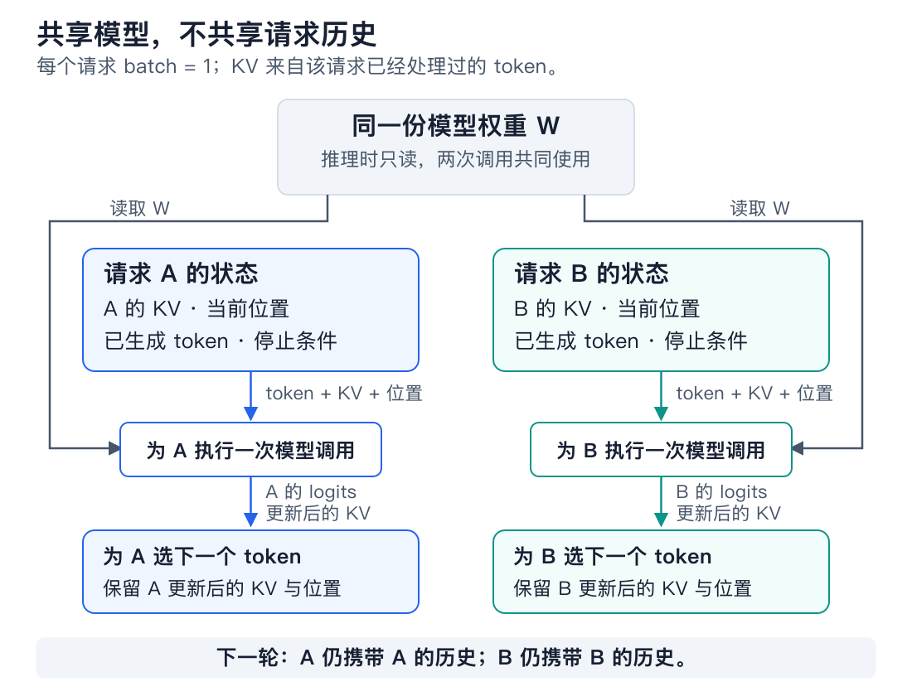
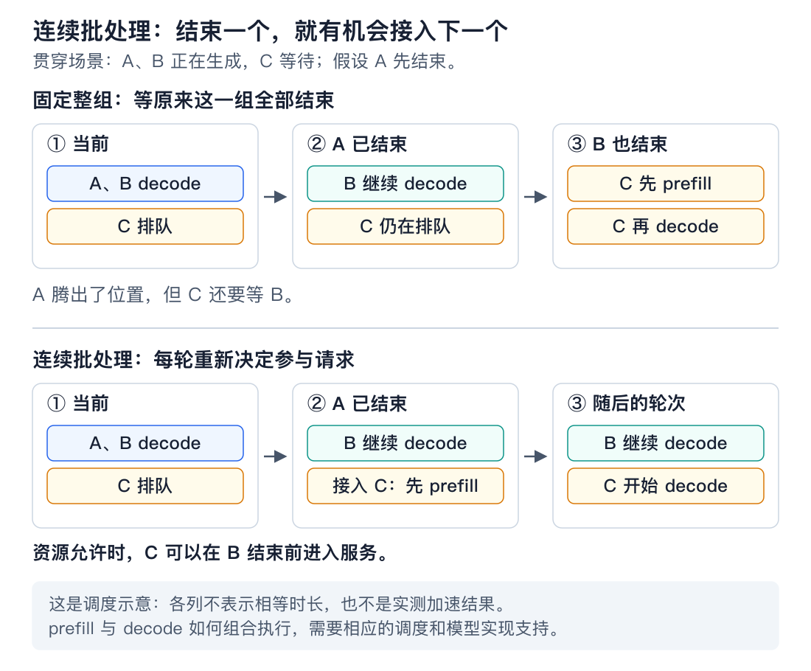
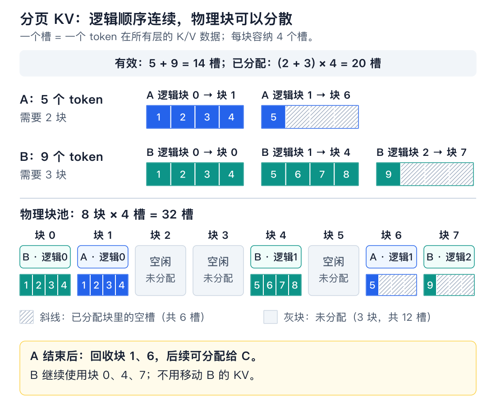
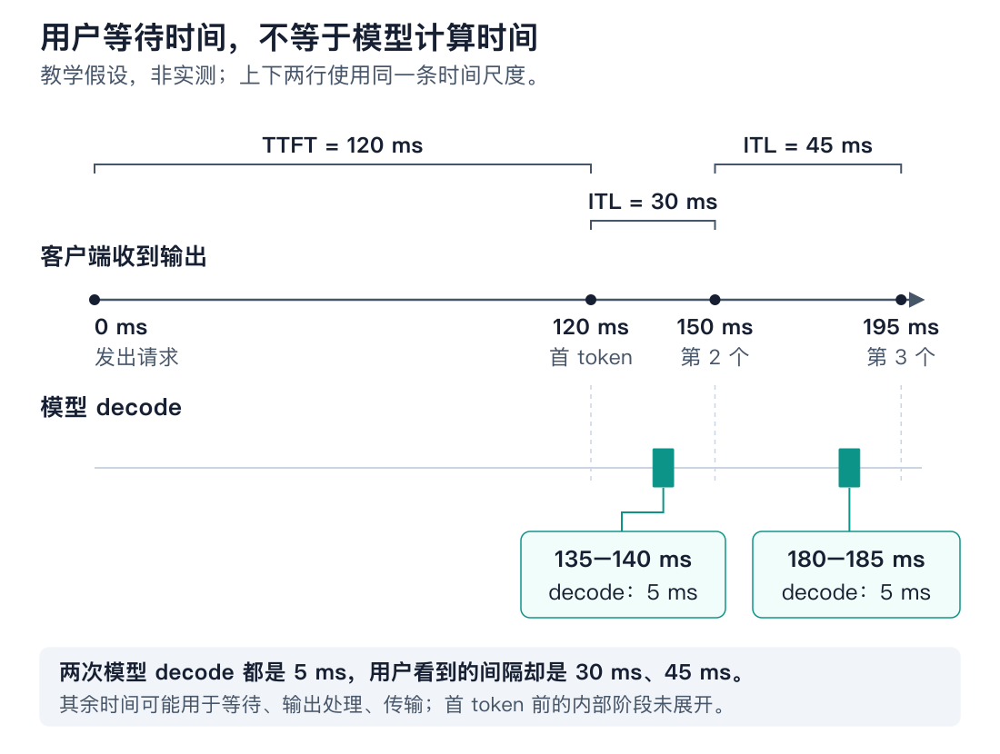

# 有状态推理与服务边界

你已经能让一个模型接收输入、建立 KV Cache，再逐个生成 token。
现在让 **A、B 两个请求共用这份模型，C 在旁边等待**：A 先结束，B 还要继续生成，
服务怎样把空出来的资源交给 C，同时保证 B 不被弄错、不被无谓地拖慢？

这一条过程就是本课的主线。读完需要能判断三件事：

- **状态归谁、何时释放**：模型可以共用，每个请求的生成进度要有明确归属。
- **资源是否够用**：结合缓存长度判断 KV 容量，而不只数请求个数。
- **优化改善了什么**：区分调度、存储和模型计算，按正确的延迟指标评价结果。

本课复用已有 KV 实现，学习范围是机制和小型验证；不要求搭建生产服务。

## 1. 共用一份模型，为什么还需要两份状态？

A、B 使用同一个模型版本，因此可以共用同一份只读权重。
但是 A 的输入和 B 不同，它们已经算出来的 K/V、当前处理位置、下一步待输入的 token 都可能不同。
**权重描述模型怎么计算，请求状态描述这一次生成走到了哪里。**



*图 1：每条调用都必须携带属于本请求的历史。图中每个请求各有一条序列，batch=1。*

例如，A 已处理 100 个 token，B 只处理了 20 个。下一次处理 A 时，模型应该接着 A 的
100 个位置计算；若传入 B 的缓存，读到的上下文和位置都会变掉。给模型调用加锁只会让
它们轮流执行，不能修正“拿错了谁的历史”。

这就是这里“有状态”的含义：**一次生成跨越多次模型调用，这些调用之间必须保留进度。**
它不等于 HTTP 接口必须永久保存用户会话；下一轮聊天也可以重新提交历史，再建立一次缓存。

对照已有代码时，只需记住这一组归属：

```python
cache_a = new_caches(model)
cache_b = new_caches(model)

logits_a = llama_model_step(model, prompt_a, cache_a)
logits_b = llama_model_step(model, prompt_b, cache_b)
logits_a_next = llama_model_step(model, next_a, cache_a)
```

这是接口示意，省略了模型和输入的构造：模型已设为评估模式，调用方已关闭求导。
`prompt_a`、`prompt_b` 是各自的输入编号，shape 分别为 `(1, T_a)`、`(1, T_b)`；
`T_a/T_b` 是各自 prompt 的 token 数。`next_a` 是从 A 的最后位置 logits 选出的下一 token，
shape 为 `(1, 1)`。这里交错调用了三次模型，还没有把不同请求合成一个计算 batch。

## 2. 一次请求怎样从进入走到结束？

先只跟着 A 看一遍。为了把“输出了什么”和“缓存了什么”分清，假设它的 prompt 有 3 个 token，
我们依次把生成出的 token 叫作 `y1`、`y2`。

| 阶段 | 此时做什么 | A 的状态怎样变化 |
|---|---|---|
| 接收、排队 | 保存输入、输出上限和请求 ID，等待资源 | 尚未计算 KV |
| prefill | 处理 3 个 prompt token，从最后位置 logits 选择 `y1` | 缓存长度为 3，`y1` 已可输出 |
| 第一次 decode | 把 `y1` 送回模型，追加它的 KV，再选择 `y2` | 缓存长度为 4，`y2` 已可输出 |
| 后续 decode | 继续输入刚选出的 token，再选择下一个 | KV 和生成进度逐步增长 |
| 结束 | 遇到结束 token 或达到输出上限 | 停止调度，释放 A 的状态 |

这里首个输出由 prefill 得到。刚选出的 token 还没有经过模型，所以尚无它自己的 KV；
如果此刻结束生成，就不必为了“补齐缓存”再跑一步。

现在 A 结束，B 仍在生成。A 的 KV 可以回收，B 的 KV 必须保留，模型权重则继续共用。
如果 A 是被用户取消的，收尾要分成两步：

1. **先停止后续调度和输出。** 已取消的 A 不应继续生成或发送新的结果。
2. **等正在使用 A 缓存的计算结束，再回收资源。** 否则 C 可能覆盖仍被 A 读取的空间。

在我们简单的 CPU 串行实验里，在一次 `step` 完成后处理取消即可；这里不展开异步调度实现。
现有 `LayerKVCache.reset()` 会清掉 K/V 引用；没有其他引用时，张量存储可以回收。
若服务使用内存池，回收通常表示空间可以交给下一请求，进程占用或设备 `reserved` 未必立刻下降。

## 3. A 结束了，C 能否不等 B 就开始？

假设一次最多安排两个请求。A、B 正在生成，C 等待。
如果规定“这一组所有请求都结束，才允许下一组进入”，那么即使 A 已完成，C 也还得等 B。
B 若继续生成很久，A 留下的名额就一直用不上。

改变规则：**每一轮计算结束后，重新选择下一轮要处理的请求。**
完成的退出，有空位和资源时，新请求就可以加入。这叫**连续批处理**；
负责选择这一轮处理谁的组件叫**调度器**。



*图 2：关注的是“何时允许 C 进入”。轮次不代表等长时间，也不是测得的加速比。
C 加入后必须先处理自己的 prompt，再逐 token decode。*

这可以更早接纳 C，也更充分地利用空出来的资源。但允许 C 进入，不等于 B 从此不会等待：
如果 C 的 prompt 很长，它的 prefill 也会占用计算资源。这个代价将在第 6 节用时间线说明。
[ORCA 的逐轮调度机制](https://www.usenix.org/conference/osdi22/presentation/yu)给出了这一思路。

> **与当前代码的边界：** `llama_model_step` 一次调用只使用一个共同的历史长度 `t`，
> 并据此产生 `t…t+n-1` 的位置。A、B 历史长度不同时，位置和可见历史也不同，
> 不能只做 `stack` 或补零就直接套用这个接口。后续可以先在 CPU 上按请求逐步调用，
> 验证调度规则；真正合批还需要按请求携带长度、位置和有效范围。

## 4. 有了空位，为什么 C 仍可能进不来？

调度器还要检查另一项资源：**C 的 KV 是否放得下。**
请求在排队时可以只保存输入；一旦开始 prefill，就要给它的历史 K/V 分配空间，后续 decode 还会增长。

对同一个全量 Attention 模型，设每个已缓存 token 的 KV 占 `k` 字节，
A、B 的实际缓存长度分别为 `t_A`、`t_B`。不做前缀共享时：

```text
A、B 的 KV 有效字节数 = k × (t_A + t_B)
```

`k` 由我们成本课已经算过的式子得到：

```text
k = 2 × 层数 × KV 头数 × 每头维度 × KV 每元素字节数
```

因此同样是两个请求，缓存长度为 `5 + 9` 和 `5000 + 9000`，KV 需求会差很多。
**并发请求数限制了“几个人在用”，缓存长度才进一步决定“它们用了多少空间”。**

举一个仅用于预算的模型配置：32 层、8 个 KV 头、每头 128 维、KV 每元素 2 字节。
每个缓存 token 需要 128 KiB；4096 个 token 需要 512 MiB，8 个这样的请求就需要 4 GiB KV。
这里 KiB/MiB/GiB 按 1024 的幂计算；这不是当前 CPU FP32 模型的实测内存。
同一模型副本的权重只算一份，工作区等额外开销也要另留容量。

C 能否进入，还不能只看它的 prompt 当前放不放得下：B、C 继续生成时，KV 都可能增长。
一种简单可验证的策略是，按各请求的最大允许缓存长度预留预算，放不下就排队。
这比较保守，但能避免只看当前占用而承诺过多请求。

**预留预算是一项记账决策，不要求现在就创建最大长度的 KV 张量。**
“允许将来用多少”“现在有效数据有多少”“现在实际分配了多少”，需要分开看。

## 5. C 持续增长时，KV 怎样分配更方便？

为了看清实际分配过程，回看 A 尚未结束时的缓存池：它占用的空间怎样交给 C，
C 后续增长时又怎样继续申请空间？

一种做法是提前分配最大长度，但短请求用不到的部分就会闲置。
我们的教学实现则用 `torch.cat` 追加，写法直接，但增长时需要新存储和历史数据复制。
这两种方式都能正确计算，只是在请求频繁进入、退出时，内存管理各有代价。

可以改成**固定大小的块，按需要逐块分配**。例如每块容纳 4 个 token 的 KV：
A 有 5 个缓存 token，需要两块；B 有 9 个，需要三块。
请求记住“第 0 个逻辑块存在哪里、第 1 个逻辑块存在哪里”，Attention 按这个映射读取历史。
这种管理方式就是**分页 KV**。



*图 3：一个格子代表一个 token 位置的 KV；为突出归属，图中把各层同一段位置的 KV 合并示意。
物理块编号表示池中的位置，实际实现可以分层组织 K/V 存储。*

读图时看三件事：

- A 的两个逻辑块可以落在物理块 1、6，逻辑顺序不要求物理连续。
- A、B 一共只有 **14 个有效 token 的 KV**，却分配了 **20 个 token 槽位**；尾块仍有空槽。
- A 安全结束后，可以撤销 A 的映射，把块 1、6 重新交给 C。C 写入自己的 KV，B 的映射和内容不变。

这里的“分页”是缓存分块及映射，不要求把数据换到磁盘。它能减少整块预留、连续空间要求和增长复制的负担，
代价是维护块表，并让 Attention 支持按块读取；仅把 Python 容器换成列表还不够。
[PagedAttention 原理说明](https://vllm.ai/blog/2023-06-20-vllm)展示了这种分配与读取方式。

两个机制到这里就接上了：**连续批处理决定 C 哪一轮参加计算，分页 KV 帮它取得和续用缓存空间。**
它们可以分别实现，也可以配合使用；分页不会减少每个 token 必需保存的 K/V，内存仍有上限。

## 6. C 更早开始了，用户一定觉得更快吗？

回到 B。即使它一次 decode 的计算仍只花 5 ms，调度器也可能先处理 C 的长 prompt，
过一会儿才再次轮到 B。于是模型计算没有变慢，B 的用户却可能感觉输出停顿。

要区分这两件事，先明确计时端点。本课采用客户端口径：
发出请求的时刻为 `t0`，收到第一个输出 token 为 `t1`，后续为 `t2`、`t3`。
为便于看图，假设每条流式消息只包含一个 token。



*图 4：这是用于解释口径的假设时序，不是性能实测。
两个小计算区间位于 135–140 ms、180–185 ms，均只有 5 ms。*

| 指标 | 图中的值 | 描述的体验或工作 |
|---|---|---|
| TTFT，首 token 延迟 | `120 − 0 = 120 ms` | 发出请求后，多久开始收到内容 |
| ITL，相邻 token 间隔 | `150 − 120 = 30 ms`、`195 − 150 = 45 ms` | 后续输出是否流畅 |
| 模型 decode 耗时 | 两次都是 `5 ms` | 对应一次模型 decode 从开始到完成 |

ITL 中除了模型计算，还可能有等待调度、其他请求占用计算资源、采样、输出处理和传输。
只看到 ITL 变大，还不能知道其中哪一项变大；要用对应阶段的时间记录继续定位。
同理，C 排队缩短可以改善它的 TTFT，而不需要 prefill 算子本身加速。

还有一个整体指标是**输出吞吐**：指定时间窗口内，所有请求交付的输出 token 总数除以窗口时长。
服务更充分地利用资源，可能提高总吞吐，同时让部分请求等得更久。
对于实时聊天，应同时检查首个响应和后续输出的等待；不能只用总吞吐判断优化效果。

实际系统的服务端 TTFT/ITL 可能采用不同起止点，一条消息也可能包含多个 token。
对照工具数据时先核对端点和事件粒度，不能直接混用客户端与引擎内部时间。
[vLLM 指标定义](https://docs.vllm.ai/en/latest/design/metrics/)提供了具体例子。

## 7. 对应到我们仓库：怎样验证这一层？

已有模型负责“给我本请求的新 token 和旧 KV，我返回 logits 并推进缓存”。
服务层在外面负责“轮到谁、状态归谁、是否结束、还有没有容量、结果何时交付”。

后续可以围绕三个接口做一个小型 CPU 模拟：

| 接口草图 | 职责 |
|---|---|
| `submit(request_id, prompt, max_new_tokens)` | 保存请求、检查预算并排队 |
| `tick()` | 选择请求，推进一轮模型计算并处理输出、完成和资源回收 |
| `cancel(request_id)` | 标记取消，由调度循环在安全位置完成清理 |

这些接口是实验草图，当前仓库没有实现。先按请求逐步调用已有模型，就能验证状态与生命周期；
这不等于已经实现异长请求合批、分页 Attention 或真实网络服务。

我们已经有 [A/B 交错及重置隔离测试](../tests/exercises/test_llama_model.py)
`test_interleaved_requests_and_reset_do_not_cross_contaminate`，沿用它此前的通过证据。
新增验证集中在服务层：A 结束或取消后，是否停止调度和输出、归还本请求的容量，
C 是否只能在资源允许时进入，以及首输出和后续输出的时间是否按同一口径记录。

固定模型与输入，使用最高 logit 选择下一 token，比较独立执行和交错执行的结果；
再加入不同 prompt 长度和输出上限观察容量变化。
若刻意插入等待来演示调度，要标注为模拟时间，不报告成真实服务性能。

这份讲义用于理解和回查，当前不要求另外实现调度器。每张图同时保留可编辑的
[SVG 源文件](assets/stateful-inference-and-serving/)，便于后续扩展实验时对照修改。
