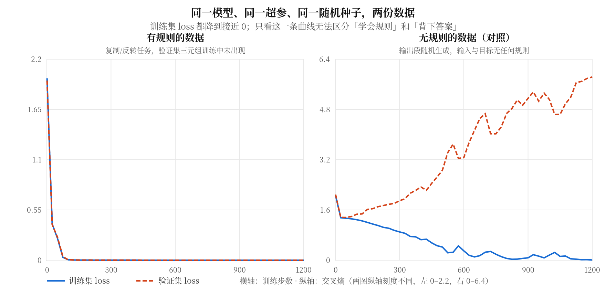

# 训练 mini-GPT：从能跑到真的学会

你的 ex009 模型现在能前向、能通过因果测试、能跑出 `(B,T,N)` 的 logits。
但它的参数还是随机初始化的值 —— 它什么都没学会。

这一课解决的是：**怎样确认一个模型真的学到了东西，而不只是 loss 数字在下降。**

用到的四件事你都写过：错位标签（ex005 的 `prepare_next_token_batch`）、
只在有效位置平均的交叉熵（`masked_cross_entropy`）、反向、参数更新。
新的只有三样：换一个优化器、把数据分成两份来看、把训练状态存下来再取回。

## 1. loss 降到 0，能说明什么？

先跑一次。任务是这样设计的：

```text
<bos> m p q r o1 o2 o3 <eos>        长度 9
m = A  →  (o1,o2,o3) = (p,q,r)      照抄
m = B  →  (o1,o2,o3) = (r,q,p)      倒过来
```

`p,q,r` 从 6 个内容 token 里任取（可重复），所以一共 `6³ × 2 = 432` 条序列。
只在输出段监督：位置 4、5、6 预测 `o1,o2,o3`，位置 7 预测 `<eos>`，
前面那段前缀不算进 loss —— 让模型去预测 `<bos>` 后面是 A 还是 B 没有意义，那纯粹是猜。

模型取 `C=64`、4 头、FFN 128、**2 层**、Pre-LN，共 68992 个参数。
Adam、`lr=3e-3`、batch 64。实跑：

| step | 训练集 loss | 训练集准确率 | 验证集 loss | 验证集准确率 |
|---|---|---|---|---|
| 0 | 2.4160 | 0.000 | 2.4257 | 0.012 |
| 50 | 0.2390 | 0.575 | 0.2515 | 0.535 |
| 100 | 0.0043 | **1.000** | 0.0043 | **1.000** |
| 400 | 0.0004 | 1.000 | 0.0004 | 1.000 |

（准确率的含义是：输出段 4 个位置**全部**预测正确才算这条对。）

100 步全对。看上去很成功。但这里有个问题：**这个结果本身，不能证明模型学会了规则。**

因为还有另一种可能 —— 它把 432 条序列逐条背下来了。68992 个参数背 432 条数据，
容量绰绰有余。训练集 loss 为 0 这一个数字，区分不了"学会"和"背下"。

要区分，必须让它面对**训练时没见过的输入**。

## 2. 划分验证集：按什么划分决定了你能看到什么

关键在于**按什么单位划分**。如果随机抽 20% 的序列做验证集，
`(c0,c1,c2)` 这个三元组很可能 A 模式的那条进了训练集、B 模式的那条进了验证集 ——
模型见过这个三元组，只是没见过它配另一个 mode。这样的"验证集"太容易了。

所以这里**按三元组划分**：先把 216 个三元组分成两堆，
验证集用到的三元组（及其两种 mode）在训练集中一条都不出现。

```text
训练集 346 条  ←  173 个三元组 × 2 种 mode
验证集  86 条  ←   43 个三元组 × 2 种 mode（这 43 个组合训练时从未出现）
```

上表的验证集准确率也是 1.000。**现在这个数字有意义了**：模型在 43 个没见过的
内容组合上全对，它学到的是"看 mode 决定顺序"这条规则，不是 346 条答案的查找表。

### 对照：把规则拿掉

为了确认上面那句话不是自我安慰，做一个只改数据、其他全部不变的对照 ——
输出段改成随机生成，与输入没有任何关系。这份数据**没有规则可学**，
唯一能降低训练 loss 的办法就是逐条记住。



同一个模型、同一个 seed、同一组超参，1200 步后：

| 数据 | 训练集 loss | 训练集准确率 | 验证集 loss | 验证集准确率 |
|---|---|---|---|---|
| 有规则 | 0.0001 | 1.000 | 0.0001 | **1.000** |
| 无规则 | 0.0074 | 0.994 | **5.8356** | **0.000** |

两份数据的训练集 loss 都降到了接近 0 —— 左图里训练曲线和验证曲线完全重合，
右图里训练曲线也一路走低。**只看训练 loss，这两次训练长得一样。**

差别全在验证集：有规则的那份，验证 loss 跟着训练 loss 一起降；
无规则的那份，验证 loss 从 1.4 一路**涨到 5.84**，准确率始终是 0。

这就是"记忆"和"泛化"的可观察区别。右图验证 loss 上升的形状，是模型在把训练集
越背越牢、同时在验证集上越错越自信 —— 交叉熵会惩罚"错得很确定"，所以它不只是不降，而是涨。

注意两张图纵轴刻度不同（左 0–2.2，右 0–6.4）。还有一点：无规则那份的训练准确率是 0.994
而不是 1.000，说明 1200 步还没完全背完；这不影响结论。

## 3. 为什么换 Adam：不是因为它"更好"

ex005 里你手写过 SGD：`p -= lr * p.grad`。它对所有参数用同一个 `lr`。

问题在于，这个模型里不同参数的梯度尺度差别很大。`token_table` 每步只有出现过的
那几行拿到梯度，`vocab_proj` 每个位置都参与，LayerNorm 的 `gamma/beta` 又是另一个量级。
一个对 `vocab_proj` 合适的 `lr`，对 `token_table` 可能太小。

Adam 给**每个参数各自**维护一个步长。它存两个与参数同形状的量：

```text
exp_avg     梯度的滑动平均        （"最近往哪个方向走"）
exp_avg_sq  梯度平方的滑动平均    （"最近这个参数的梯度有多大"）

更新量 ≈ lr × exp_avg / (sqrt(exp_avg_sq) + eps)
```

分母是梯度大小的估计，所以梯度一直很大的参数，实际步长被压小；
梯度一直很小的参数，步长被放大。**每个参数的有效步长由它自己的梯度历史决定**，
这就是它不需要你为不同参数调不同 `lr` 的原因。

那 SGD 是不是就不行？实跑对照，同一初始化、同一批次序列、400 步：

| 配置 | 训练集 loss | 训练集准确率 | 验证集 loss | 验证集准确率 |
|---|---|---|---|---|
| Adam `lr=3e-3` | 0.0004 | 1.000 | 0.0004 | 1.000 |
| SGD `lr=3e-3` | 0.7096 | 0.211 | 0.7379 | 0.221 |
| SGD `lr=0.3` | 0.0031 | **1.000** | 0.0043 | **1.000** |

SGD 不是学不会，是**同样的 `lr` 下走得太慢**。把 `lr` 放大 100 倍，它 400 步也全对了。

所以准确的说法是：Adam 让"选一个能用的 `lr`"这件事容易得多，
不是"Adam 能学会而 SGD 不能"。这个对照只覆盖了当前这个玩具任务和这组配置，
不能推广成"Adam 在任何任务上都更快"。

用法上它替换你手写的那两行：

```python
opt = torch.optim.Adam(model.parameters(), lr=3e-3)
# 训练循环里：
opt.zero_grad()      # 代替手动 p.grad = None
loss.backward()
opt.step()           # 代替手动 p -= lr * p.grad
```

`model.parameters()` 能拿到全部参数，靠的正是 ex009 里那套注册机制 ——
`nn.Parameter` 和 `nn.ModuleList`。如果当初把块放进普通 list，
这里 `opt` 就收不到它们，而训练照样会"正常"跑、loss 照样会降（因为其他参数在动）。
这是[模块组织讲义](dropout-and-module-organization.md)第 3 节那个静默故障在训练阶段的样子。

## 4. 四种不报错的训练故障

训练代码的麻烦在于，写错了通常不崩，只是学不好。下面四个都是实跑结果。

### 忘记 `opt.zero_grad()`

PyTorch 的梯度是**累加**的。不清零，第 200 步的 `.grad` 里混着前 199 步的残留。

| | 200 步后训练 loss | 训练准确率 |
|---|---|---|
| 有 `zero_grad()` | 0.0012 | 1.000 |
| 无 `zero_grad()` | 2.0566 | 0.006 |

不报错，loss 一开始甚至也会降一点，但就是学不下去。

### 初始化尺度

ex009 的构造函数里那个 `* 0.05` 不是随手写的。把 `token_table`、`position_table`、
`vocab_proj` 统一放大，其他全不变：

| 缩放 | 初始 loss | 初始 \|logits\| 最大值 | 300 步后训练准确率 | 验证准确率 |
|---|---|---|---|---|
| 0.05（原值） | 2.319 | 1.03 | 1.000 | 1.000 |
| 1.0 | 11.634 | 28.36 | 1.000 | 1.000 |
| 20.0 | 244.600 | 562.71 | 0.870 | 0.767 |
| 200.0 | 2453.882 | 5620.65 | 0.188 | 0.151 |

一个合理的起点是：初始 logits 接近 0，Softmax 后接近均匀分布，
loss 约等于 `ln(N) = ln(11) = 2.398`。上表 scale=0.05 时初始 loss 是 2.319，正好在这个位置。

初始 logits 越大，Softmax 越接近 one-hot —— 模型一开始就**非常确定**地给出随机答案。
这正是你在 Transformer Block 那一课问过的饱和：`p` 接近 0 或 1 时局部导数 `p(1-p)` 接近 0，
梯度信号变弱。scale=200 那行 300 步后 loss 还有 7.6，就是这个后果。

注意它是**渐进恶化**，不是某个阈值突然失败，而且全程不报错。

### 学习率过大

Adam、`lr=3.0`（正常值的 1000 倍），前 12 步：

```text
step  1  loss=    2.4235   grad_norm=  4.01
step  2  loss=  154.5478   grad_norm= 39.86
step  3  loss=  790.2579   grad_norm= 61.17
step  9  loss= 1882.4995   grad_norm=106.15
step 12  loss=  677.8416   grad_norm= 72.68
```

这里有个值得注意的地方：**loss 涨到 1882，但 12 步内没有出现任何 NaN**，
参数全部仍是有限值。"发散"和"出 NaN"是两回事 —— 等到出 NaN 才发现问题就太晚了。
可靠的早期信号是 loss 的走向和梯度范数，不是 `isnan` 检查。

一个实用习惯：训练刚开始时，loss 应该从 `ln(N)` 附近**单调地**往下走。
如果第 2 步就涨到三位数，立刻停下来查 `lr`，不要等它跑完。

### 梯度裁剪：它只解决一类问题

`clip_grad_norm_(params, max_norm)` 把所有参数的梯度看成一个大向量，
如果它的范数超过 `max_norm` 就整体等比例缩小。对上面那个 `lr=3.0` 的 Adam 试一下：

| | 12 步内最大 loss | 12 步后训练 loss |
|---|---|---|
| Adam `lr=3.0`，不裁剪 | 1881.17 | 731.09 |
| Adam `lr=3.0`，`clip=1.0` | 1968.80 | 649.80 |

**几乎没救回来。** 原因回到第 3 节那个公式：Adam 的更新量约等于
`lr × exp_avg / sqrt(exp_avg_sq)`，分子分母**同时**包含梯度。
把梯度整体缩小 k 倍，这个比值基本不变，步长还是由 `lr` 决定。裁剪治不了 `lr` 选错。

换成 SGD 就完全不同了 —— SGD 的步长直接正比于梯度范数：

| | 12 步内最大 loss | 12 步后训练 loss |
|---|---|---|
| SGD `lr=5.0`，不裁剪 | 5.2e16 | 4.6e17 |
| SGD `lr=5.0`，`clip=1.0` | 13.08 | 6.63 |

所以梯度裁剪的定位是：**防住偶发的异常大梯度**（某个 batch 特别难、某处数值尖峰），
不是用来兜底一个选错的学习率，对 Adam 尤其如此。

## 5. 保存与恢复：三样东西，作用不同

训练中断要能接着跑，训练完要能部署，都需要把状态存下来。要存的是三样：

```python
torch.save({
    "model": model.state_dict(),    # 参数
    "opt":   opt.state_dict(),      # 优化器状态
    "cfg":   {"N":11,"C":64,"heads":4,"ffn":128,"layers":2,"L":16},  # 配置
}, path)
```

**配置**为什么要存：`state_dict` 只是一个「参数名 → 张量」的字典，它不含结构。
恢复时你得先**按原样构造**一个模型，才能把参数装回去。层数或 `C` 记错了，
`load_state_dict` 会因为 shape 对不上而报错 —— 这个还算好的，至少它报错。

**参数**恢复的确定性，实跑验证过：

```text
训练 200 步 → 存档 → 用不同 seed(123) 新建模型 → load_state_dict → 同一批输入前向
恢复后 logits 最大绝对差: 0.0
逐位相同: True
```

用不同的 seed 新建是故意的：如果忘了 `load_state_dict`，结果就会不一样。
逐位相同说明恢复的确实是存档里的参数。（这里是 CPU、同一份 PyTorch、
关掉 Dropout 的前提；跨设备或跨版本不保证逐位相同。）

**优化器状态**是最容易漏的。`opt.state_dict()` 里每个参数存着：

```text
['step', 'exp_avg', 'exp_avg_sq']
```

就是第 3 节那两个滑动平均。不恢复它们，Adam 会从零重新估计梯度尺度。实跑对照：

| 从同一存档继续训练 30 步 | 训练 loss |
|---|---|
| 恢复优化器状态 | 0.000963 |
| 重建优化器 | 0.001070 |

这里差别很小 —— 因为模型已经收敛了，两者都在微调。
**不要从这个数字得出"优化器状态无所谓"的结论**：在训练早期或学习率有调度时，
丢掉 `exp_avg_sq` 相当于让 Adam 重新摸索一遍步长。这个玩具例子观察不到那个后果。

### 生成前必须切模式

推理前要做两件**互相独立**的事（[模块组织讲义](dropout-and-module-organization.md)第 4 节）：
`model.eval()` 关掉 Dropout 的随机失活，`torch.no_grad()` 不建计算图。

用一个 `p=0.3` 的模型实跑，忘记 `eval()` 的后果：

```text
eval() 下两次前向逐位相同:  True
train() 下两次前向逐位相同: False
```

在**充分训练**的检查点上，验证准确率两种模式都是 1.000 —— 输出变了，
但没变到让 argmax 翻转。不过 loss 是敏感的：eval 下 0.0002，train 下 5 次分别是
0.0005/0.0005/0.0006/0.0005/0.0006，**约 3.4 倍**。

换一个只训练了 60 步的检查点，argmax 就翻了：

```text
eval()  验证准确率: 0.547
train() 同一批重复 5 次: 0.581 / 0.500 / 0.581 / 0.512 / 0.535
```

同一个模型、同一批数据，跑 5 次得到 5 个不同的准确率。
这就是忘记 `eval()` 的真实症状：**结果不可复现**，而且不报错。
这个任务比较简单，所以充分训练后掩盖了问题；不能因此认为"影响不大"。

## 6. 生成：把预测接回输入

生成循环你在 ex005 写过 `greedy_generate`，逻辑不变，只是模型换成了 mini-GPT：

```text
每步：
  logits = model(ids, valid)      (1, T, N)
  next   = logits[:, -1, :].argmax(-1)    只看最后一个位置
  ids    = cat([ids, next], dim=1)        接回去，T 变成 T+1
  遇到 EOS 或到达预算就停
```

为什么只取 `[:, -1, :]`：前面每个位置的 logits 预测的是它**各自**的下一个 token，
那些位置的答案已经在输入里了，不需要再预测一遍。

用训练好的模型实跑（前缀是 `<bos> mode p q r`，后面是生成的）：

```text
A=复制  前缀 <bos> A c0 c1 c2   ->  c0 c1 c2 <eos>
A=复制  前缀 <bos> A c3 c4 c5   ->  c3 c4 c5 <eos>
B=反转  前缀 <bos> B c0 c1 c2   ->  c2 c1 c0 <eos>
B=反转  前缀 <bos> B c3 c4 c5   ->  c5 c4 c3 <eos>
```

在 86 条验证集序列（训练中从未出现的三元组）上逐条生成并整条比对：**86/86 全对**。

这比第 2 节的 teacher forcing 准确率更强一些。训练和评估时，每个位置的输入都来自
**真实序列**；生成时，第 6 个位置的输入是模型自己刚吐出来的 token。
一步错，后面就在错误的上下文上继续 —— 生成全对说明它没有依赖"输入总是正确的"。

这里用的是贪心（每步取最高分）。同一个前缀每次结果都一样。
采样策略（temperature、top-k、top-p）是 `modern.sampling` 的内容，这一课不展开。

另外，每步都把**完整前缀**重新送进模型，前面那些位置的 K/V 被反复重算了。
这正是你之前问过的 KV Cache 要解决的问题 —— 属于 G4，需要先有一个训练好、
测试通过的模型作为对照基准，也就是这一课的产物。

## 7. 两个理解检查

题面自包含。可以直接回答，也可以在后续实现中用等价实验核验。

### 检查 A：一份可疑的训练报告

同事给你看一个模型：词表 50 个 token，训练集 1000 条序列，模型有 200 万参数。
训练 loss 从 3.9 降到 0.002，训练集准确率 100%。他说模型学会了任务。

你只能问他要一个数字来判断这个结论是否成立 —— 你要哪个数字？

假设他补充说"验证集准确率也是 100%"，但他的验证集是**从那 1000 条里随机抽 200 条**
（这 200 条同时也在训练集里）。这个 100% 还能说明泛化吗？为什么？

### 检查 B：两个只差一行的训练循环

下面两段代码，其他部分完全相同，参数、数据、seed 都一样：

```python
# 甲
for step in range(N):
    loss = compute_loss(model, batch)
    opt.zero_grad()
    loss.backward()
    opt.step()

# 乙
for step in range(N):
    loss = compute_loss(model, batch)
    loss.backward()
    opt.step()
    opt.zero_grad()
```

乙把 `zero_grad()` 挪到了 `step()` 之后。这两段的训练结果会不会不同？
说明你的判断依据 —— 关键在于每次 `backward()` 被调用时，`.grad` 里装的是什么。

（提示：这和第 4 节那个"忘记 `zero_grad`"的实验不是同一回事，别直接套结论。
另外，如果你实际跑这个对照，参数不会逐位相同 —— 先想清楚这能否作为"两者不同"的证据。）

## 工程边界与后续衔接

- 本文是新准备的讲义。新内容是：Adam 及其状态、训练/验证划分与记忆-泛化对照、
  四类不报错的训练故障、三样存档内容的不同作用。错位标签、掩码交叉熵、反向、
  手写 SGD、`eval`/`no_grad` 区分、参数注册都已学过，本文只在训练语境中复用。
- 本文覆盖 `implementation.mini-gpt` 三条验收标准里的第二、三条的**讲解部分**。
  按 map 的要求，这两条需要学习者**实际跑出**训练结果、验证集对照、
  保存恢复和生成 —— 这些留给配套练习，本文不代做。
- 全部数值均为实跑结果，配置为：CPU、float32、`torch 2.14.0+cpu`、
  `C=64`/4 头/FFN 128/2 层/`L=16`、Adam `lr=3e-3`、batch 64、`torch.manual_seed(0)`。
  换配置或换种子，具体数字会变化；结论的方向（如验证 loss 在无规则数据上升）
  在本配置下稳定，但本文未做多种子重复，不声称它对任意配置成立。
- 第 4 节的四类故障是在当前玩具任务上的观察。"裁剪对 Adam 帮助有限"的解释
  基于更新量公式，SGD 对照支持这个解释；但这不是所有 Adam 场景的普适结论。
- 尚未展开：学习率调度与 warmup、权重衰减与 AdamW 的区别、多种子重复实验、
  更长序列与更深堆栈的训练行为、`systems.cost-model` 的参数与激活账本。
- 第 6 节指出的重复计算问题（KV Cache）属于 G4，先修是本课产出的已训练模型。
- 读过本文不构成任何节点的掌握证据。实际状态以 `learning/progress.json` 为准。
  本次不修改知识地图依赖，不切换 `currentNodeId`，不新增已掌握记录。
