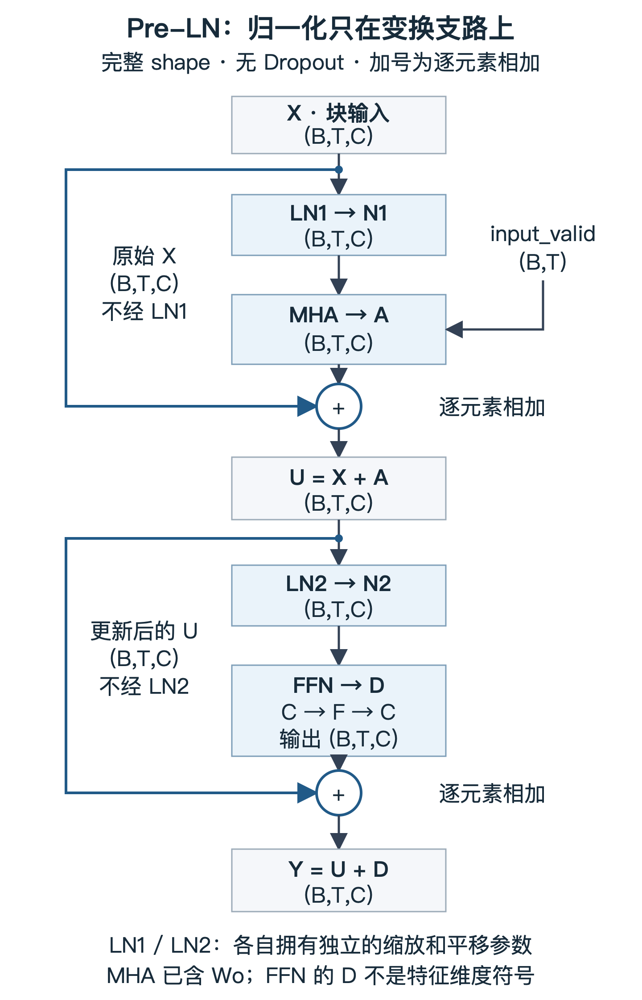

# Transformer Block 主干：残差、LayerNorm 与 FFN

把已经写好的因果多头 Attention 接成可堆叠的特征处理块。
本节选择 **Pre-LN、ReLU、无 Dropout** 的确定性主干，不是原版 Transformer 或某个 GPT 版本的完整复刻。
Dropout 是训练时随机丢弃部分中间贡献的机制；本课先不引入它。

这里是一份可直接学习的讲义，不是已经通过的能力记录。
你的 MHA 原理与实现已验收；以下残差、归一化、FFN 与块组合是新内容。

## 1. 残差：把子层输出当作一次更新

先只看一条 Attention 支路，暂时不加入归一化。对象定义如下：

| 对象 | 数据来源或含义 | shape |
|---|---|---|
| B、T、C | 样本数、token 数、每个 token 的特征宽度；都是整数 | 不是 Tensor |
| X | 进入这个块的 token 特征，可以来自输入表示或前一个块 | (B,T,C) |
| input_valid | 这些输入位置是否为真实 token，True=有效；不是 target_valid | (B,T) |
| A | 你的 multi_head_self_attention 返回的第一个结果，已包含 Wo | (B,T,C) |
| U | 这条支路更新后的表示 | (B,T,C) |

之前得到 A 后直接返回；现在定义：

```text
U = X + A
U[b,t,c] = X[b,t,c] + A[b,t,c]
```

这是**残差连接**：一条路径计算 A，另一条路径把原始 X 直接送到加法处。
这里的加法是同位置、同特征的逐元素相加，不是拼接，也不是重新做注意力读取。
本块要求两项的完整 shape 相同，不接受利用广播凑出一个“能运行”的结果。

这样，子层不必把原来的表示完整重新生成一遍，可以学习“在已有表示上加什么”。
若 A 恒等于零，U 就等于 X，而不是全零。
但它不是不可逆信息丢失的保险：若 A 恰好等于 -X，结果仍会抵消。

### 梯度为什么也多了一条路

只为说明导数，下面临时使用一个标量例子，不把 Tensor 偷换成标量：
x 是一个数，r(x) 是支路算出的一个数，y=x+r(x)，L 是最终标量损失。
记从后续计算传来的梯度 g=dL/dy。

```text
dy/dx = 1 + r'(x)
dL/dx = g + g*r'(x)
         ↑    ↑
       直接路 支路
```

没有残差时只有 g*r'(x)。加上残差以后，即使支路的局部导数很小，
还有一份 g 可以直接传回。多维 Tensor 的反向传播也会累加两条路径的贡献，
具体计算交给你已经使用的 autograd，不要求此处先学矩阵微积分。

这解释了直接路径的作用，不保证梯度永不消失或爆炸。
标量例子里若 r'(x)=-1，两条贡献仍可抵消。

## 2. LayerNorm：每个 token 用自己的特征统计量

**LayerNorm（层归一化）**在本课中指：对每个 token 的 C 个特征计算均值和方差，
先标准化，再施加可学习的逐特征缩放和平移。
它不是 Softmax，不产生概率，也不要求结果非负。

### 先固定统计对象，再写公式

输入仍是完整的 X，shape (B,T,C)。固定一个明确的样本索引 b 和 token 索引 t：

```text
x = X[b,t,:]          shape (C,)
x[c]                 是这个 token 的第 c 个特征，一个数
```

以下只对这个长度为 C 的向量计算：

```text
mu   = 所有 x[c] 的和 / C
var  = 所有 (x[c]-mu)^2 的和 / C
std  = sqrt(var)

xhat[c] = (x[c]-mu) / sqrt(var + eps)
y[c]    = gamma[c]*xhat[c] + beta[c]
```

mu 是均值；var 是偏离均值的平方的平均，即方差；std 是方差的平方根，即标准差。
eps 是人为设定的正数，本课取 1e-5，不是训练参数。
实际分母是 sqrt(var+eps)，不是严格的 std，也不是 sqrt(var)+eps。

这里分母为 **C，不是 C-1**：我们直接描述这 C 个特征的离散程度，
不是要用它们对某个未知总体做无偏方差估计。
这一运算不要求各特征统计独立。

### 一个完整的小例子

完整输入 X 的 shape 是 (1,2,4)，即一个样本、两个 token、每个 token 四个特征：

```text
X[0,0,:] = [  1,   3,   5,   7]    mu=4，   var=5
X[0,1,:] = [101, 103, 105, 107]    mu=104， var=5
```

两个 token 分别计算；第二个 token 的大数值不会参与第一个 token 的均值。
两行减掉各自均值后都是 [-3,-1,1,3]。
取 gamma=[1,1,1,1]、beta=[0,0,0,0]，两行输出均约为：

```text
[-1.341639, -0.447213, 0.447213, 1.341639]
```

这也说明 LayerNorm 不把数限制在 [-1,1]。
它消掉了这个例子中每行共同的偏移；并不是对不同位置做信息聚合。
Pre-LN 的残差路稍后会保留未经这次归一化的 X。

### 为什么还有 gamma 和 beta

gamma 和 beta 都是可训练的长度 C 的向量，shape (C,)。
gamma[c] 对第 c 个特征做缩放，beta[c] 对第 c 个特征做平移；
同一套参数共享于所有样本和 token，但不是给一整个 token 只配一个系数。
常见初始化为 gamma 全 1、beta 全 0，先从单纯标准化开始学习。

统计量 mu/var 每次根据本次输入重算；gamma/beta 则像 Wq/Wo 一样长期保存并由训练更新。
因此归一化后并非永远严格均值 0、方差 1：
eps 会使 xhat 的方差为 var/(var+eps)，而后面的 gamma/beta 还会改变统计量。

若一个 token 的特征全相同，例如 [5,5,5,5]，则 var=0、中心化后全 0；
eps 让除法有限，最后输出 beta。C=1 时也遵循同样规则。
这里只讨论适中有限数值；eps 不负责修复输入已经存在的 NaN 或无穷大。

### 把一个 token 推广回整个 Tensor

| 对象 | 完整 shape | 共享/归约含义 |
|---|---|---|
| X、中心化后的值、xhat、最终输出 | (B,T,C) | 保留每个 token 的全部特征 |
| mu、var | (B,T,1) | 每个 token 各有一份统计量 |
| gamma、beta | (C,) | 按最后的特征轴广播 |
| eps | 标量 | 本课固定为 1e-5 |

不要沿 B 轴混合样本，也不要沿 T 轴混合 token。
若先用未来 token 参与均值/方差，再去做因果 Attention，未来信息已经通过归一化进入当前表示，
之后的 Attention mask 不能撤销这次泄漏。

数学清楚后，对应到你需要的基础 PyTorch 语法：

```python
mu = X.mean(dim=-1, keepdim=True)
centered = X - mu
```

- mean 是求平均；dim=-1 表示只沿最后的 C 轴。
- keepdim=True 表示保留被归约的轴、长度变为 1，因此得到 (B,T,1) 而非 (B,T)，方便正确广播。
- `centered ** 2` 表示逐元素平方；Python 的 ** 是乘方，不是矩阵乘法。
- 若使用 torch.var，需显式选择 correction=0 才是本课的除以 C；不可依赖默认修正。
- `dim=(1,2)` 是同时归约第 1、2 轴的写法；括号中是一个 Python tuple。本课 LayerNorm 不应这样跨 T/C 统计。

后续核心实现仍由你填写；这里不直接交付完整 LayerNorm 函数。

## 3. FFN：逐位置的两层非线性特征变换

**FFN（Feed-Forward Network，前馈网络）**在这个块里对每个 token 应用相同的两层变换。
它不新建一张 token-to-token 权重表，而是在每个位置的特征向量内部做计算。

先定义这个小模块自己的接口，避免与块输入 X 混用：

| 对象 | 含义 | shape |
|---|---|---|
| R | 传给 FFN 的特征；组装块时它会来自第二次 LayerNorm | (B,T,C) |
| F | FFN 中间特征宽度，是整数；不是头数 | 无 Tensor shape |
| W1、b1 | 第一层可训练矩阵、偏置向量 | (C,F)、(F,) |
| W2、b2 | 第二层可训练矩阵、偏置向量 | (F,C)、(C,) |
| S | 第一层结果 R@W1+b1 | (B,T,F) |
| G | 对 S 逐元素施加非线性后的结果 | (B,T,F) |
| D | 第二层结果 G@W2+b2，也是 FFN 的输出 | (B,T,C) |

偏置就是加在输出特征上的可训练向量，b1/b2 不是 batch 索引。
它们沿 B/T 广播；带偏置的变换严格说是仿射变换，工程里也通常叫线性层。
F 可以比 C 大，例如 C=4、F=8；F=4*C 是常见配置，不是数学要求。

### 只乘两次矩阵，为什么还不够

假如不加入非线性：

```text
(R@W1 + b1)@W2 + b2
  = R@(W1@W2) + (b1@W2+b2)
```

右边仍是一个共享矩阵加一个共享偏置。
虽然中间变宽了，但这个支路仍可合并成一层仿射变换。
注意，这不等于说整个 Transformer 都变成线性模型：Attention 中已经有 Softmax；
这里讨论的是这条 FFN 支路自身的两层变换。

本课选择 **ReLU**：对每个数 s，正数保持原值，负数变成 0，即 max(s,0)。
这不是另一个可训练矩阵，也不改变 Tensor 的 shape。
不同输入会保留不同的中间分量，使两层不再能普遍合并成一个固定仿射变换。

一个只用标量的例子说明表达差异，不要求重复手算：

```text
输入标量 x
第一层产生 [x,-x]
ReLU 后为 [max(x,0),max(-x,0)]
第二层把两个数相加，得到 |x|
```

单个固定的 k*x+b 无法对所有正负 x 都等于 |x|，但这条两层支路可以。
ReLU 在正半轴导数为 1、负半轴为 0；零点不可导，PyTorch 在此采用梯度 0。
不要把 ReLU 的局部零梯度误解为整个带残差模块一定没有梯度。

对应的一项基础操作可以写成：

```python
G = torch.where(S > 0, S, torch.zeros_like(S))
```

zeros_like 创建 shape/dtype/device 与 S 相同的全零 Tensor；
S > 0 逐元素生成布尔条件；where 在条件为 True 的位置取 S，否则取零，
不是用一个 Python if 决定整个 Tensor 的分支。这里零点选择零分支，梯度也为零。
这是基础 Tensor 操作，不是把整个 FFN 交给高级封装。

FFN 的“逐位置”指：改动 R 的某个 token，不会改变同次 FFN 计算的其他位置。
但 R 本身可能已经包含 Attention 读来的上下文，因此不能说 FFN 的内容与上下文无关。

## 4. 现在组装：Pre-LN 的两条更新支路

**Pre-LN** 指在 Attention/FFN 变换支路的入口先做 LayerNorm，再把支路输出加回原表示。
它不是“先把原表示永久换成归一化结果，再把那个结果当残差”。

本课为因果自注意力：input_valid 的含义与 ex007 完全一致，所有 token 至少有一个可读 key。
MHA 的输出宽度配置为 C，使用你已实现的等宽版本，C 能被其头数 H 整除。

| 对象 | 来源/计算 | shape |
|---|---|---|
| X | 块输入 | (B,T,C) |
| N1 | LN1(X)，给 Attention 支路用的归一化表示 | (B,T,C) |
| A | MHA 的特征输出，输入是 N1，已包含 Wo | (B,T,C) |
| U | X+A，第一次更新后的表示 | (B,T,C) |
| N2 | LN2(U)，给 FFN 支路用的归一化表示 | (B,T,C) |
| D | FFN(N2)，内部临时宽度为 F，最终映射回 C | (B,T,C) |
| Y | U+D，整个块的输出 | (B,T,C) |

LN1 和 LN2 计算规则一样，但各自拥有独立的 gamma/beta，shape 都是 (C,)；
第二次统计量根据 U 计算，不复用第一次 X 的均值、方差。
表中的 D 是 FFN 输出 Tensor，不是特征宽度；宽度始终用 C 或 F 表示。



图中箭头传递完整 Tensor，没有省略 B/T 轴；加号表示同位置同特征的逐元素相加，不表示拼接。
input_valid 的箭头只进入 MHA；FFN 与 LayerNorm 不借此清空 PAD query 行。
图只展开块级连接，不重画已经掌握的 MHA 内部结构。
可编辑图源：[pre-ln-block.svg](assets/transformer-block/pre-ln-block.svg)。

沿图检查两个关键来源：

- 第一次相加拿的是 **X**，不是 N1。
- 第二次相加拿的是 **U**，不是 N2，也不是最初的 X。

第一次 A 读到上下文，第二次 D 对更新后的内容做逐位置非线性变换；
两次直接路径分别保留各自支路的输入。相加后的 U/Y 不保证均值 0、方差 1。

调用既有代码时，有一个接口细节值得短暂唤回：

```python
A, weights = multi_head_self_attention(
    N1, Wq, Wk, Wv, Wo, input_valid, num_heads
)
```

左边用两个变量接收函数返回的两个结果，这是 Python 的解包。
A 才是 (B,T,C) 的特征更新；weights 是 (B,H,T,T) 的权重表，不能把整个返回 tuple 与 X 相加。
块如何返回或保留 weights 以后由接口约定，数学主干中加的是 A。

完整块的函数组织与参数注册留给后续实现，不在本讲义里提前填入学习者答案。

### Pre-LN 与 Post-LN 的区别是位置，不是另一个归一化公式

下面只比较一条 Attention 支路。MHA_out 表示同一份固定参数和权限下 MHA 返回的特征结果，
LN 表示带同一组 gamma/beta 的上述 LayerNorm；X/U 都是 (B,T,C)。

```text
Pre-LN：  U = X + MHA_out(LN(X))
Post-LN： U = LN(X + MHA_out(X))
```

Post-LN 是先做支路和相加，再对相加后的结果归一化。
它与 Pre-LN 的输入、输出及梯度路径不同，不可以仅凭 shape 相同就互换。
在 Pre-LN 中，直接的 X 路不经过这次 LN；Post-LN 的相加结果还要整体经过 LN。
本课只实现主干的概念组合，不要求现在再写一个 Post-LN 版本，也不据此宣称任一种在所有任务上都更好。

## 5. 三个短检查，不重复 MHA 测验

这三题只是随讲义准备好，尚未作答；无需每读一段就答一题。
可以在看完整块后一起解释，或在后续综合实现中用等价测试验收。

### 检查 A：零更新后，原表示应该在哪里

已知 X 是任意 CPU float64 Tensor，shape (1,3,4)，各位置均有效；
LN1 的 gamma 全 1、beta 全 0、eps=1e-5，沿最后的 C=4 轴计算。
MHA_out 是你已经实现的无偏置 MHA 的第一个返回值，参数固定，
其 Wo 为全零 (4,4) 矩阵，所有中间分数有限。
因此这条 MHA 支路对所有合法输入都恒等输出零。

两种写法都能运行：

```text
N1 = LN1(X)                    (1,3,4)
A  = MHA_out(N1)               (1,3,4)

写法甲：U = X  + A
写法乙：U = N1 + A
```

哪一种保留本课要求的残差路？它们在零更新时分别返回什么？
若最终损失为 L=所有 U 元素之和，这条零更新支路是否会阻断正确写法中从 U 到 X 的梯度？
只需解释路径，不推导完整 LayerNorm 的反向公式。

### 检查 B：一个“数值没报错”的归一化错误

已知 X 为 (1,3,4)，三个 token 均有效；只考察如下标准化结果 N，
暂不添加 gamma/beta。eps=1e-5，所有数据取适中有限值。

```python
mu = X.mean(dim=(1, 2), keepdim=True)
var = ((X - mu) ** 2).mean(dim=(1, 2), keepdim=True)
N = (X - mu) / torch.sqrt(var + 1e-5)
```

这里只改变最后一个 token 的 X[0,2,:]，前两个 token 的 X 值不变。
N[0,0,:] 是否可能改变？如果之后的 MHA 使用正确的因果 mask，
是否足以排除这次泄漏？请指出归约轴应如何修正。

### 检查 C：FFN 的两层能否合并

沿用第 3 节的明确接口：R 为 (B,T,C)，W1/b1 为 (C,F)/(F,)，W2/b2 为 (F,C)/(C,)，
中间执行逐元素 ReLU，所有参数固定。
考虑一个重构建议：只把 W1@W2 和 b1@W2+b2 预先合成新参数，
删除中间的 ReLU，声称得到与本课 FFN 对所有输入完全相同的函数。
是否成立？从上面的两层计算或 |x| 例子解释即可，无须再做矩阵手算。

## 工程边界与后续衔接

- 已完成的是 ex007 的 MHA；本文块连接是新组合草图，不冒充仓库已经存在的 Transformer Block。
- 新材料覆盖残差、按轴均值/方差与 LayerNorm、ReLU 与 FFN，以及 Pre-LN 主干。
  已有 MHA、广播、共享矩阵乘法与链式法则直接复用；布局复制与 Attention 尺度统计的剩余项不在此重考。
- Dropout、nn.Module/nn.Parameter 的参数注册（让模型容器能找到其可训练 Tensor）、
  模式切换及完整模型训练尚未在本文展开。因此不因读过本文就上报 block.complete 或实现节点掌握。
- 真正实现时，核心归一化、FFN 和残差计算由学习者手写；
  之后应验证逐 token 统计、常量行、梯度、残差源与未来信息隔离，再接参数组织和模型训练。
- 本次只准备材料：不修改知识地图依赖，不切换 currentNodeId，不新增已掌握记录。
