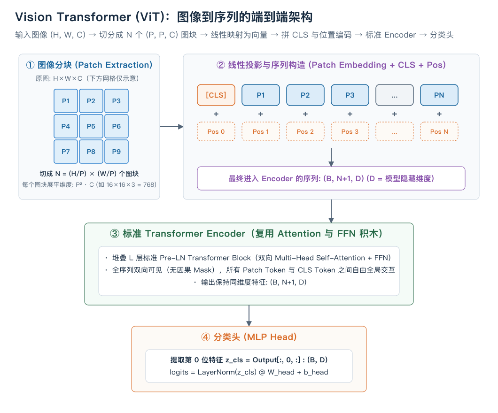
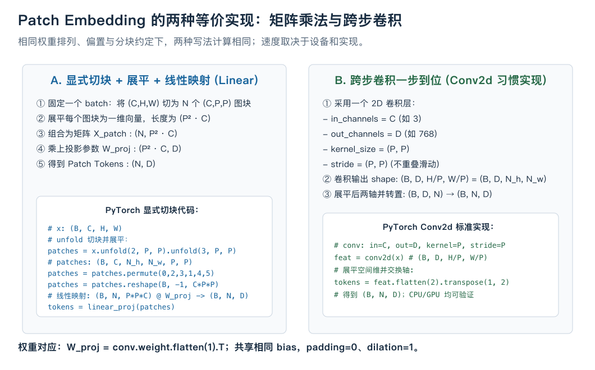

# Vision Transformer（ViT）：将图像切块并转换成向量序列

在前面的所有课程中，我们处理的都是**文本或一维离散序列**：
$$\text{文字} \xrightarrow{\text{Tokenizer}} \text{Token IDs } [x_1, x_2, \dots, x_T] \xrightarrow{\text{Embedding}} \text{向量序列 } X \in \mathbb{R}^{B \times T \times C} \xrightarrow{\text{Transformer}} \text{特征/预测}$$

而在计算机视觉（CV）领域，数字图像是像素采样组成的二维网格数据：$x \in \mathbb{R}^{H \times W \times C}$（例如一张 $224 \times 224 \times 3$ 的 RGB 图像）。长久以来，卷积神经网络（CNN，如 ResNet）利用局部连接和共享卷积核处理图像。

2020 年，Google 提出了 **Vision Transformer (ViT)**（论文《An Image is Worth 16x16 Words: Transformers for Image Recognition at Scale》）。可以把它的输入构造概括为：

把图像切成小块（patch），每块展平并映射成一个向量，再把向量序列送入 Transformer Encoder。这里每个向量表示图块，来源不是词表查表。这是对结构的概括，不是论文原文引语。[ViT 原论文](https://arxiv.org/abs/2010.11929)

本课将从图像分块（Patch Embedding）出发，拆解 CLS Token、位置编码、标准 Encoder 复用以及它与传统 CNN 的核心差异。

---

## 1. ViT 的完整数据流全景



设输入图像 $x \in \mathbb{R}^{B \times C \times H \times W}$（例如 $B=1, C=3, H=224, W=224$），模型隐藏层宽度为 $D$（如 $D=768$）。

### ViT 的四大执行步骤：
1. **图像分块（Patch Extraction）**：选定图块大小 $P \times P$（常用 $P=16$ 或 $P=14$）。将原图均匀切成：
   $$N = \frac{H}{P} \times \frac{W}{P} = \frac{224}{16} \times \frac{224}{16} = 14 \times 14 = 196 \text{ 个图块}$$
2. **线性投影（Patch Embedding）**：每个小图块展平成一维向量，长度为 $P^2 \cdot C = 16 \times 16 \times 3 = 768$。乘上可学习投影矩阵 $W_{\text{proj}} \in \mathbb{R}^{(P^2C) \times D}$，映射为 $N$ 个维度为 $D$ 的 Patch Tokens。
3. **前缀拼接与位置编码**：
   - 在序列最前方拼接一个可学习的分类标记 **`[CLS]` Token** $x_{\text{cls}} \in \mathbb{R}^{1 \times D}$，序列长度变为 $N+1 = 197$。
   - 逐元素加上可学习的一维位置编码 $E_{\text{pos}} \in \mathbb{R}^{(N+1) \times D}$。
4. **送入标准 Transformer Encoder**：
   - 堆叠 $L$ 层标准 Pre-LN Encoder Block（复用自注意力和 FFN；本例采用 Pre-LN，原版 Transformer 与 BERT 常用 Post-LN，归一化顺序不能混同）。
   - 全序列**双向可见（无因果 Mask）**，所有 Patch 之间直接进行全局自注意力（Global Self-Attention）计算。
   - 提取最终输出中第 0 个位置（`[CLS]`）的特征向量 $z_{\text{cls}} \in \mathbb{R}^{B \times D}$，经过一层 LayerNorm + 线性层输出分类类别得分。

---

## 2. 核心数学：Patch Embedding 的两种等价实现



将 $P \times P \times C$ 的局部像素块映射为 $D$ 维向量，在数学上有两种完全等价的视角：

### 视角 A：显式切块 + 展平 + 线性投影（Linear）
1. 将图像切成 $N$ 个小块，展平为矩阵 $X_{\text{patch}} \in \mathbb{R}^{B \times N \times (P^2C)}$。
2. 线性矩阵乘法：
   $$Z_0 = X_{\text{patch}} W_{\text{proj}} + b_{\text{proj}} \quad \in \mathbb{R}^{B \times N \times D}$$

### 视角 B：单层无重叠的 2D 卷积（Conv2d）—— *工程标准做法*
在 PyTorch 中，我们可以使用一个特定的 2D 卷积层直接一步完成这个过程：
- `in_channels = C`（输入图像通道数，RGB 为 3）
- `out_channels = D`（Transformer 的特征维度，如 768）
- `kernel_size = (P, P)`（卷积核大小等于 Patch 大小）
- `stride = (P, P)`（步长等于 Patch 大小，即**无重叠滑动**）

```python
# 卷积输出: (B, D, H/P, W/P) = (B, D, 14, 14)
feat = conv2d(x)
# 展平空间维并交换轴 -> (B, N, D) 其中 N = 14*14 = 196
patch_tokens = feat.flatten(2).transpose(1, 2)
```

> **数学等价性**：卷积核在每个 $P \times P$ 区域内的加权求和，本质上正是像素展平向量与卷积核权重向量的点积！两种实现必须使用匹配的权重排列、相同偏置、零 padding、dilation=1，且图像宽高能被 P 整除。实际速度取决于输入、设备与内核，需测量。

---

## 3. 为什么需要 `[CLS]` Token？

在图像分类任务中，模型最终需要输出一个整张图的类别预测（例如分类出“猫”还是“狗”）。

在切块后，我们拥有 $N$ 个对应各个局部区域的 Patch Tokens：
- 如果对这 $N$ 个 Patch 的最终输出做平均池化（Global Average Pooling, GAP），所有区域会被强制赋予相同的聚合权重。
- ViT 借鉴了 BERT 的设计，在序列最前部插入一个**独立初始化的可学习向量 `[CLS]`**。

由于 Transformer 的自注意力是全局双向的，在经过多层 Multi-Head Attention 后，`[CLS]` Token 会根据输入图像的内容，**自适应地从所有 Patch 中聚合最关键的全局判别特征**；具体学到的聚合方式由训练决定。最终取出第 0 位特征接分类头。CLS 是一种选择，也可以训练采用平均池化的模型；平均的是经过上下文计算的 patch 表示，不等于原始像素固定等权贡献。

---

## 4. ViT vs 传统 CNN：归纳偏置（Inductive Bias）的取舍

理解 ViT 必须理解它与 CNN 的哲学差异：

| 维度 | 传统卷积网络（CNN，如 ResNet） | Vision Transformer (ViT) |
| :--- | :--- | :--- |
| **局部性（Locality）** | **强**：卷积核只看临近 $3 \times 3$ 像素，逐层扩大感受野 | **无（弱）**：第一层就可以跨越整张图计算任意两个 Patch 的注意力 |
| **平移等变性（Translation Equivariance）** | 卷积共享核带来等变性质：输入平移时特征相应平移；边界和步长会影响它 | **弱**：依赖位置编码自学习空间相对关系 |
| **小数据集表现（如 CIFAR-10）** | 局部结构先验可能有帮助，仍需验证 | 更依赖训练配方、数据增强与预训练 |
| **超大数据集表现（如 JFT-300M / ImageNet-21k）** | 随架构和训练配方变化 | 原论文展示了大规模预训练的收益，不保证无限提升 |

> **总结**：归纳偏置指结构预先带入的假设。CNN 通过局部连接和共享卷积核带入图像结构；ViT 仍有局部图块划分和位置表示，但块间 Attention 可以全局连接。两者的准确率和训练效率都需要在具体条件下比较。

---

## 5. 完整自包含 PyTorch 实现

以下用 PyTorch 标准模块作结构对照，可在 CPU 上核对 shape；它不是本项目的手写核心实现验收答案。输入须与配置的方形图像尺寸一致：

```python
import torch
import torch.nn as nn
import torch.nn.functional as F

class PatchEmbedding(nn.Module):
    """将 (B, C, H, W) 图像转换为 (B, N, D) 的 Patch Tokens。"""
    def __init__(self, in_channels: int = 3, patch_size: int = 16, embed_dim: int = 768):
        super().__init__()
        self.patch_size = patch_size
        self.proj = nn.Conv2d(
            in_channels=in_channels,
            out_channels=embed_dim,
            kernel_size=patch_size,
            stride=patch_size
        )

    def forward(self, x: torch.Tensor) -> torch.Tensor:
        # x: (B, C, H, W)
        x = self.proj(x) # (B, D, H/P, W/P)
        x = x.flatten(2).transpose(1, 2) # (B, N, D)
        return x


class ViTBlock(nn.Module):
    """标准 Pre-LN 双向 Transformer Encoder Block。"""
    def __init__(self, d_model: int, nhead: int, d_ff: int):
        super().__init__()
        self.norm1 = nn.LayerNorm(d_model)
        self.attn = nn.MultiheadAttention(embed_dim=d_model, num_heads=nhead, batch_first=True)
        self.norm2 = nn.LayerNorm(d_model)
        self.ffn = nn.Sequential(
            nn.Linear(d_model, d_ff),
            nn.GELU(),
            nn.Linear(d_ff, d_model)
        )

    def forward(self, x: torch.Tensor) -> torch.Tensor:
        # 1. 自注意力分支（双向无因果 Mask）
        norm_x = self.norm1(x)
        attn_out, _ = self.attn(norm_x, norm_x, norm_x)
        x = x + attn_out

        # 2. 前馈网络分支
        x = x + self.ffn(self.norm2(x))
        return x


class VisionTransformer(nn.Module):
    """端到端 Vision Transformer 图像分类模型。"""
    def __init__(
        self,
        img_size: int = 224,
        patch_size: int = 16,
        in_channels: int = 3,
        num_classes: int = 10,
        embed_dim: int = 192,
        depth: int = 4,
        num_heads: int = 4,
        mlp_ratio: float = 4.0,
    ):
        super().__init__()
        assert img_size % patch_size == 0, "图像宽高必须能被 patch_size 整除"
        self.img_size = img_size
        self.num_patches = (img_size // patch_size) ** 2

        # 1. Patch Embedding
        self.patch_embed = PatchEmbedding(in_channels, patch_size, embed_dim)

        # 2. [CLS] Token 与位置编码
        self.cls_token = nn.Parameter(torch.zeros(1, 1, embed_dim))
        self.pos_embed = nn.Parameter(torch.zeros(1, self.num_patches + 1, embed_dim))

        # 3. 堆叠 Transformer Encoder Blocks
        d_ff = int(embed_dim * mlp_ratio)
        self.blocks = nn.ModuleList([
            ViTBlock(d_model=embed_dim, nhead=num_heads, d_ff=d_ff)
            for _ in range(depth)
        ])

        # 4. 最终归一化与分类头
        self.norm = nn.LayerNorm(embed_dim)
        self.head = nn.Linear(embed_dim, num_classes)

        # 初始化权重
        nn.init.trunc_normal_(self.pos_embed, std=0.02)
        nn.init.trunc_normal_(self.cls_token, std=0.02)

    def forward(self, x: torch.Tensor) -> torch.Tensor:
        if x.ndim != 4 or tuple(x.shape[-2:]) != (self.img_size, self.img_size):
            raise ValueError("输入空间尺寸须与模型配置一致")
        B = x.shape[0]

        # 1. 图像分块与映射 -> (B, N, D)
        x = self.patch_embed(x)

        # 2. 拼接 CLS Token -> (B, N+1, D)
        cls_tokens = self.cls_token.expand(B, -1, -1)
        x = torch.cat((cls_tokens, x), dim=1)

        # 3. 叠加位置编码
        x = x + self.pos_embed

        # 4. 通过所有 Encoder 层
        for block in self.blocks:
            x = block(x)

        x = self.norm(x)

        # 5. 提取 [CLS] 位置 (index 0) 的特征并分类
        cls_out = x[:, 0, :] # (B, D)
        logits = self.head(cls_out) # (B, num_classes)
        return logits


if __name__ == "__main__":
    # 验证小型玩具 ViT 的数据流
    model = VisionTransformer(img_size=64, patch_size=8, in_channels=3, num_classes=5, embed_dim=64, depth=2, num_heads=2)
    fake_img = torch.randn(2, 3, 64, 64)
    logits = model(fake_img)
    print("输入图像 shape:", fake_img.shape)
    print("模型输出 logits shape:", logits.shape)
    assert logits.shape == (2, 5), "输出 shape 不匹配！"
    print("ViT 前向与数据流验证通过！")
```

---

## 6. 核心要点总结

1. **统一序列接口**：ViT 证明了 Transformer 不仅能处理一维语言，通过简单的 **Patch 切块与线性投影**，图像、音频频谱图（AST）乃至视频（TimeSformer）都可以统一为序列形式。
2. **两处关键设计**：
   - 用 `[CLS]` Token 聚合全局分类特征。
   - 用 1D 位置编码标记各个 Patch 的空间顺序。
3. **与文本 Transformer 的关系**：ViT 内部的 Encoder 结构与标准文本 Transformer 没有任何差别，这也为后续多模态大模型（如 CLIP、LLaVA、GPT-4V）的跨模态特征对齐奠定了基石。
